# Cyber Security 

## Question Bank Solution

### Question 1(a): Describe CIA triad with example. (3 marks)

**Ans 1(a):**

The CIA triad is a fundamental model in information security that represents three key principles: Confidentiality, Integrity, and Availability. These principles form the core of most security programs and policies.

1. **Confidentiality:**
   - Ensures that data is kept secret from unauthorized access.
   - Only authorized individuals or systems can access the information.
   - Example: Encrypting sensitive emails to prevent unauthorized reading.

2. **Integrity:**
   - Maintains the accuracy, consistency, and trustworthiness of data.
   - Ensures that information is not tampered with during storage or transmission.
   - Example: Using digital signatures to verify that a software update hasn't been altered.

3. **Availability:**
   - Ensures that authorized users can access information when needed.
   - Systems and data should be accessible and operational when required.
   - Example: Implementing redundant servers to maintain service availability during hardware failures.

Practical example illustrating all three principles:
A bank's online banking system embodies the CIA triad:

- Confidentiality: Uses HTTPS encryption to protect customer data during transmission.
- Integrity: Employs checksums to verify that account balances haven't been tampered with.
- Availability: Utilizes load balancers and backup systems to ensure 24/7 access to banking services.

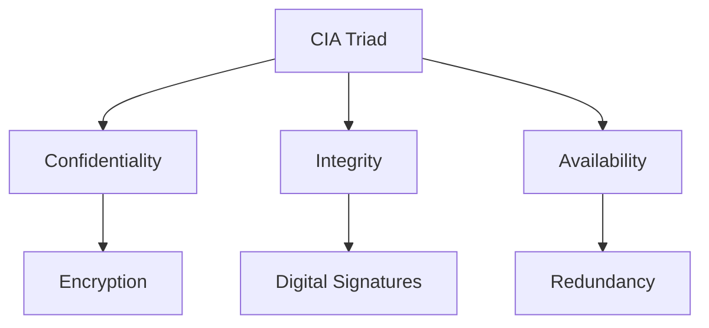

The CIA triad provides a comprehensive framework for assessing and implementing information security measures, ensuring that all crucial aspects of data protection are addressed.

### પ્રશ્ન 1(અ): ઉદાહરણ સાથે CIA ત્રિપુટીનું વર્ણન કરો. (3 ગુણ)

**જવાબ 1(અ):**

CIA ત્રિપુટી એ માહિતી સુરક્ષામાં એક મૂળભૂત મોડેલ છે જે ત્રણ મુખ્ય સિદ્ધાંતોનું પ્રતિનિધિત્વ કરે છે: Confidentiality (ગોપનીયતા), Integrity (અખંડિતતા), અને Availability (ઉપલબ્ધતા). આ સિદ્ધાંતો મોટાભાગના સુરક્ષા કાર્યક્રમો અને નીતિઓનો આધાર બને છે.

1. **Confidentiality (ગોપનીયતા):**
   - ખાતરી કરે છે કે ડેટા અનધિકૃત ઍક્સેસથી ગુપ્ત રાખવામાં આવે છે.
   - માત્ર અધિકૃત વ્યક્તિઓ અથવા સિસ્ટમ્સ જ માહિતીને ઍક્સેસ કરી શકે છે.
   - ઉદાહરણ: અનધિકૃત વાંચનને રોકવા માટે સંવેદનશીલ ઇમેઇલ્સને એન્ક્રિપ્ટ કરવા.

2. **Integrity (અખંડિતતા):**
   - ડેટાની ચોકસાઈ, સુસંગતતા અને વિશ્વસનીયતા જાળવે છે.
   - ખાતરી કરે છે કે સંગ્રહ અથવા પ્રસારણ દરમિયાન માહિતી સાથે ચેડાં કરવામાં આવ્યા નથી.
   - ઉદાહરણ: સોફ્ટવેર અપડેટમાં ફેરફાર ન થયો હોવાની ખાતરી કરવા માટે ડિજિટલ સહીનો ઉપયોગ કરવો.

3. **Availability (ઉપલબ્ધતા):**
   - ખાતરી કરે છે કે અધિકૃત વપરાશકર્તાઓ જરૂર પડ્યે માહિતીને ઍક્સેસ કરી શકે છે.
   - જ્યારે જરૂરી હોય ત્યારે સિસ્ટમ્સ અને ડેટા ઍક્સેસ યોગ્ય અને કાર્યરત હોવા જોઈએ.
   - ઉદાહરણ: હાર્ડવેર નિષ્ફળતા દરમિયાન સેવા ઉપલબ્ધતા જાળવવા માટે રિડન્ડન્ટ સર્વર્સનો અમલ કરવો.

ત્રણેય સિદ્ધાંતોને સમજાવતું વ્યવહારિક ઉદાહરણ:
બેંકની ઓનલાઇન બેંકિંગ સિસ્ટમ CIA ત્રિપુટીનું મૂર્તિમંત સ્વરૂપ છે:

- Confidentiality: પ્રસારણ દરમિયાન ગ્રાહક ડેટાની સુરક્ષા માટે HTTPS એન્ક્રિપ્શનનો ઉપયોગ કરે છે.
- Integrity: ખાતાની બેલેન્સ સાથે ચેડાં ન થયા હોવાની ખાતરી કરવા માટે checksums નો ઉપયોગ કરે છે.
- Availability: બેંકિંગ સેવાઓની 24/7 ઍક્સેસ સુનિશ્ચિત કરવા માટે લોડ બેલેન્સર્સ અને બેકઅપ સિસ્ટમ્સનો ઉપયોગ કરે છે.

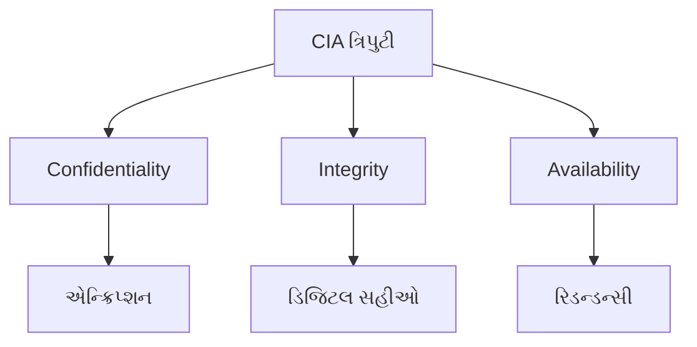

CIA ત્રિપુટી માહિતી સુરક્ષા પગલાંઓનું મૂલ્યાંકન અને અમલીકરણ માટે એક વ્યાપક માળખું પ્રદાન કરે છે, જે સુનિશ્ચિત કરે છે કે ડેટા સુરક્ષાના તમામ મહત્વપૂર્ણ પાસાઓને સંબોધિત કરવામાં આવે છે.

### Question 1(b): Explain Public key and Private Key cryptography. (4 marks)

**Ans 1(b):**

Public key and private key cryptography, also known as asymmetric cryptography, is a cryptographic system that uses pairs of keys: public keys which may be disseminated widely, and private keys which are known only to the owner. This system forms the basis for secure communication, digital signatures, and other critical security functions in modern computing.

Key aspects of public key and private key cryptography:

1. **Key Pair Generation:**
   - Each user generates two mathematically linked keys: a public key and a private key.
   - The public key is freely distributed, while the private key is kept secret.

2. **Encryption Process:**
   - Messages are encrypted using the recipient's public key.
   - Only the recipient's private key can decrypt messages encrypted with their public key.

3. **Decryption Process:**
   - The recipient uses their private key to decrypt messages encrypted with their public key.
   - This ensures that only the intended recipient can read the message.

4. **Digital Signatures:**
   - The sender can sign a message using their private key.
   - Anyone can verify the signature using the sender's public key, ensuring authenticity.

5. **Key Distribution:**
   - Public keys can be freely shared without compromising security.
   - Private keys must be kept secret and securely stored.

6. **Applications:**
   - Secure email communication (e.g., PGP)
   - SSL/TLS for secure web browsing
   - Digital signatures for document authenticity
   - Secure file transfer protocols

7. **Advantages:**
   - Solves the key distribution problem of symmetric cryptography
   - Provides a foundation for digital signatures and non-repudiation
   - Enhances security in open networks like the internet

8. **Challenges:**
   - Computationally more intensive than symmetric cryptography
   - Requires a reliable public key infrastructure (PKI) for key management

Example of public key cryptography in action:

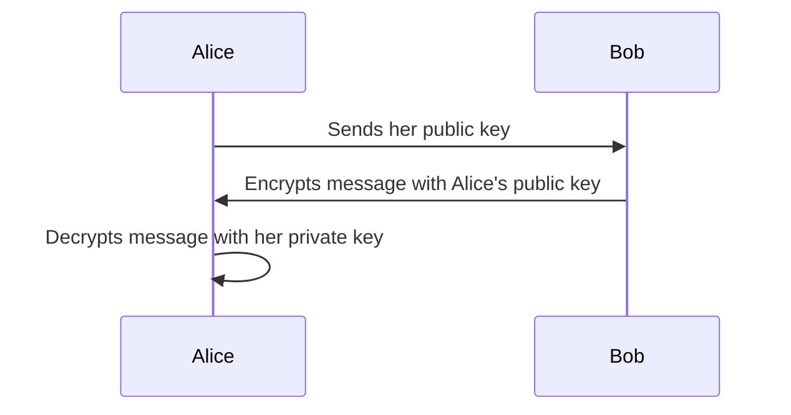

In this example, Alice can safely receive encrypted messages from Bob (or anyone else) using her public key, but only she can decrypt them with her private key.

Public key and private key cryptography revolutionized secure communication by allowing parties to establish secure channels without prior exchange of secret keys, making it a cornerstone of modern cybersecurity.

### પ્રશ્ન 1(બ): પબ્લિક કી અને પ્રાઈવેટ કી ક્રિપ્ટોગ્રાફી સમજાવો. (4 ગુણ)

**જવાબ 1(બ):**

પબ્લિક કી અને પ્રાઈવેટ કી ક્રિપ્ટોગ્રાફી, જેને અસમમિત ક્રિપ્ટોગ્રાફી તરીકે પણ ઓળખવામાં આવે છે, તે એક ક્રિપ્ટોગ્રાફિક સિસ્ટમ છે જે કી જોડીઓનો ઉપયોગ કરે છે: પબ્લિક કી જે વ્યાપકપણે પ્રસારિત કરી શકાય છે, અને પ્રાઈવેટ કી જે માત્ર માલિકને જ ખબર હોય છે. આ સિસ્ટમ આધુનિક કમ્પ્યુટિંગમાં સુરક્ષિત સંચાર, ડિજિટલ સહીઓ અને અન્ય મહત્વપૂર્ણ સુરક્ષા કાર્યો માટે આધાર બને છે.

પબ્લિક કી અને પ્રાઈવેટ કી ક્રિપ્ટોગ્રાફીના મુખ્ય પાસાઓ:

1. **કી જોડી નિર્માણ:**
   - દરેક વપરાશકર્તા બે ગાણિતિક રીતે જોડાયેલી કી જનરેટ કરે છે: એક પબ્લિક કી અને એક પ્રાઈવેટ કી.
   - પબ્લિક કી મુક્તપણે વિતરિત કરવામાં આવે છે, જ્યારે પ્રાઈવેટ કી ગુપ્ત રાખવામાં આવે છે.

2. **એન્ક્રિપ્શન પ્રક્રિયા:**
   - સંદેશાઓને પ્રાપ્તકર્તાની પબ્લિક કીનો ઉપયોગ કરીને એન્ક્રિપ્ટ કરવામાં આવે છે.
   - માત્ર પ્રાપ્તકર્તાની પ્રાઈવેટ કી જ તેમની પબ્લિક કી સાથે એન્ક્રિપ્ટ કરેલા સંદેશાઓને ડિક્રિપ્ટ કરી શકે છે.

3. **ડિક્રિપ્શન પ્રક્રિયા:**
   - પ્રાપ્તકર્તા તેમની પબ્લિક કી સાથે એન્ક્રિપ્ટ કરેલા સંદેશાઓને ડિક્રિપ્ટ કરવા માટે તેમની પ્રાઈવેટ કીનો ઉપયોગ કરે છે.
   - આ સુનિશ્ચિત કરે છે કે માત્ર ઇચ્છિત પ્રાપ્તકર્તા જ સંદેશ વાંચી શકે છે.

4. **ડિજિટલ સહીઓ:**
   - મોકલનાર તેમની પ્રાઈવેટ કીનો ઉપયોગ કરીને સંદેશ પર સહી કરી શકે છે.
   - કોઈપણ વ્યક્તિ મોકલનારની પબ્લિક કીનો ઉપયોગ કરીને સહીની ચકાસણી કરી શકે છે, જે પ્રામાણિકતા સુનિશ્ચિત કરે છે.

5. **કી વિતરણ:**
   - પબ્લિક કી સુરક્ષા સમાધાન કર્યા વિના મુક્તપણે શેર કરી શકાય છે.
   - પ્રાઈવેટ કી ગુપ્ત રાખવી જોઈએ અને સુરક્ષિત રીતે સંગ્રહિત કરવી જોઈએ.

6. **એપ્લિકેશન્સ:**
   - સુરક્ષિત ઇમેઇલ સંચાર (દા.ત., PGP)
   - સુરક્ષિત વેબ બ્રાઉઝિંગ માટે SSL/TLS
   - દસ્તાવેજ પ્રામાણિકતા માટે ડિજિટલ સહીઓ
   - સુરક્ષિત ફાઇલ ટ્રાન્સફર પ્રોટોકોલ્સ

7. **ફાયદાઓ:**
   - સમમિત ક્રિપ્ટોગ્રાફીની કી વિતરણ સમસ્યાનું નિરાકરણ કરે છે
   - ડિજિટલ સહીઓ અને નોન-રિપ્યુડિએશન માટે પાયો પૂરો પાડે છે
   - ઇન્ટરનેટ જેવા ખુલ્લા નેટવર્ક્સમાં સુરક્ષા વધારે છે

8. **પડકારો:**
   - સમમિત ક્રિપ્ટોગ્રાફી કરતાં કમ્પ્યુટેશનલ રીતે વધુ સઘન
   - કી મેનેજમેન્ટ માટે વિશ્વસનીય પબ્લિક કી ઇન્ફ્રાસ્ટ્રક્ચર (PKI) ની જરૂર પડે છે

પબ્લિક કી ક્રિપ્ટોગ્રાફીનું કાર્યરત ઉદાહરણ:

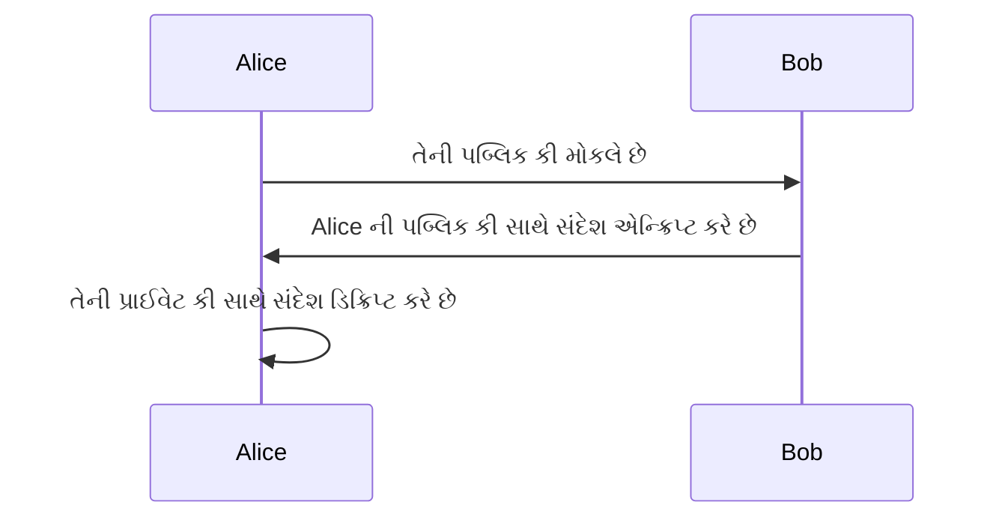

આ ઉદાહરણમાં, Alice તેની પબ્લિક કીનો ઉપયોગ કરીને Bob (અથવા અન્ય કોઈપણ) પાસેથી એન્ક્રિપ્ટ કરેલા સંદેશાઓ સુરક્ષિત રીતે પ્રાપ્ત કરી શકે છે, પરંતુ માત્ર તે જ તેની પ્રાઈવેટ કી સાથે તેમને ડિક્રિપ્ટ કરી શકે છે.

પબ્લિક કી અને પ્રાઈવેટ કી ક્રિપ્ટોગ્રાફીએ સુરક્ષિત સંચારમાં ક્રાંતિ લાવી છે કારણ કે તે પક્ષોને ગુપ્ત કી ના પૂર્વ વિનિમય વિના સુરક્ષિત ચેનલો સ્થાપિત કરવાની મંજૂરી આપે છે, જે તેને આધુનિક સાયબર સુરક્ષાનો પાયો બનાવે છે.

### Question 1(c): Explain various security attacks, mechanisms, and services associated with each layer of the OSI model. (7 marks)

**Ans 1(c):**

The OSI (Open Systems Interconnection) model is a conceptual framework used to understand network interactions. Each layer of this model faces unique security challenges and requires specific mechanisms and services to protect against various attacks. Let's explore the security aspects of each OSI layer:

1. **Physical Layer:**
   - Attacks:
     - Eavesdropping
     - Physical theft
     - Cable cutting
   - Mechanisms:
     - Secure physical access
     - Shielded cabling
   - Services:
     - Physical security measures
     - Biometric access controls

2. **Data Link Layer:**
   - Attacks:
     - ARP spoofing
     - MAC address flooding
   - Mechanisms:
     - MAC address filtering
     - Port security
   - Services:
     - Frame encryption
     - Access control lists (ACLs)

3. **Network Layer:**
   - Attacks:
     - IP spoofing
     - ICMP attacks (e.g., Ping of Death)
     - Routing attacks
   - Mechanisms:
     - Firewalls
     - Intrusion Detection Systems (IDS)
   - Services:
     - Virtual Private Networks (VPNs)
     - IPsec (Internet Protocol Security)

4. **Transport Layer:**
   - Attacks:
     - SYN flooding
     - Session hijacking
     - Port scanning
   - Mechanisms:
     - SYN cookies
     - TCP sequence number randomization
   - Services:
     - SSL/TLS encryption
     - Port authentication

5. **Session Layer:**
   - Attacks:
     - Session hijacking
     - Man-in-the-middle attacks
   - Mechanisms:
     - Session tokens
     - Timeout mechanisms
   - Services:
     - Authentication
     - Session encryption

6. **Presentation Layer:**
   - Attacks:
     - Cryptographic attacks
     - Data manipulation
   - Mechanisms:
     - Robust encryption algorithms
     - Data compression
   - Services:
     - Data encryption
     - Format conversion

7. **Application Layer:**
   - Attacks:
     - SQL injection
     - Cross-site scripting (XSS)
     - Denial of Service (DoS)
   - Mechanisms:
     - Input validation
     - Application firewalls
   - Services:
     - HTTPS
     - Secure Shell (SSH)

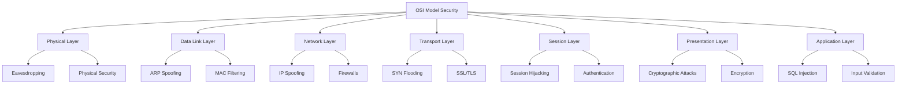

Key points to remember:

1. Security measures often overlap between layers, providing defense in depth.
2. Each layer builds upon the security of the layers below it.
3. A comprehensive security strategy addresses vulnerabilities at all layers.
4. As we move up the OSI model, attacks and defenses become more application-specific.
5. Lower layers focus on network and data transmission security, while upper layers deal with data representation and application-level security.

By understanding the security implications at each layer of the OSI model, network administrators and security professionals can implement a robust, multi-layered security approach to protect against a wide range of potential threats.

### પ્રશ્ન 1(ક): OSI મોડેલના દરેક સ્તર સાથે સંકળાયેલ વિવિધ સુરક્ષા હુમલાઓ, પદ્ધતિઓ અને સેવાઓ સમજાવો. (7 ગુણ)

**જવાબ 1(ક):**

OSI (Open Systems Interconnection) મોડેલ એ નેટવર્ક ઇન્ટરેક્શન્સને સમજવા માટે વપરાતું વૈચારિક માળખું છે. આ મોડેલના દરેક સ્તરને અનન્ય સુરક્ષા પડકારોનો સામનો કરવો પડે છે અને વિવિધ હુમલાઓ સામે રક્ષણ કરવા માટે ચોક્કસ પદ્ધતિઓ અને સેવાઓની જરૂર પડે છે. ચાલો OSI ના દરેક સ્તરના સુરક્ષા પાસાઓની તપાસ કરીએ:

1. **ફિઝિકલ લેયર:**
   - હુમલાઓ:
     - ચોરીછૂપીથી સાંભળવું (Eavesdropping)
     - ભૌતિક ચોરી
     - કેબલ કાપવું
   - પદ્ધતિઓ:
     - સુરક્ષિત ભૌતિક ઍક્સેસ
     - શીલ્ડેડ કેબલિંગ
   - સેવાઓ:
     - ભૌતિક સુરક્ષા પગલાં
     - બાયોમેટ્રિક ઍક્સેસ નિયંત્રણો

2. **ડેટા લિંક લેયર:**
   - હુમલાઓ:
     - ARP સ્પૂફિંગ
     - MAC સરનામું ફ્લડિંગ
   - પદ્ધતિઓ:
     - MAC સરનામું ફિલ્ટરિંગ
     - પોર્ટ સુરક્ષા
   - સેવાઓ:
     - ફ્રેમ એન્ક્રિપ્શન
     - ઍક્સેસ કંટ્રોલ લિસ્ટ્સ (ACLs)

3. **નેટવર્ક લેયર:**
   - હુમલાઓ:
     - IP સ્પૂફિંગ
     - ICMP હુમલાઓ (દા.ત., પિંગ ઓફ ડેથ)
     - રાઉટિંગ હુમલાઓ
   - પદ્ધતિઓ:
     - ફાયરવોલ્સ
     - ઇન્ટ્રુઝન ડિટેક્શન સિસ્ટમ્સ (IDS)
   - સેવાઓ:
     - વર્ચ્યુઅલ પ્રાઇવેટ નેટવર્ક્સ (VPNs)
     - IPsec (ઇન્ટરનેટ પ્રોટોકોલ સિક્યોરિટી)

4. **ટ્રાન્સપોર્ટ લેયર:**
   - હુમલાઓ:
     - SYN ફ્લડિંગ
     - સેશન હાઇજેકિંગ
     - પોર્ટ સ્કેનિંગ
   - પદ્ધતિઓ:
     - SYN કૂકીઝ
     - TCP સીક્વન્સ નંબર રેન્ડમાઇઝેશન
   - સેવાઓ:
     - SSL/TLS એન્ક્રિપ્શન
     - પોર્ટ પ્રમાણીકરણ

5. **સેશન લેયર:**
   - હુમલાઓ:
     - સેશન હાઇજેકિંગ
     - મેન-ઇન-ધ-મિડલ હુમલાઓ
   - પદ્ધતિઓ:
     - સેશન ટોકન્સ
     - ટાઇમઆઉટ પદ્ધતિઓ
   - સેવાઓ:
     - પ્રમાણીકરણ
     - સેશન એન્ક્રિપ્શન

6. **પ્રેઝન્ટેશન લેયર:**
   - હુમલાઓ:
     - ક્રિપ્ટોગ્રાફિક હુમલાઓ
     - ડેટા મેનિપ્યુલેશન
   - પદ્ધતિઓ:
     - મજબૂત એન્ક્રિપ્શન અલ્ગોરિધમ્સ
     - ડેટા કમ્પ્રેશન
   - સેવાઓ:
     - ડેટા એન્ક્રિપ્શન
     - ફોર્મેટ રૂપાંતર

7. **એપ્લિકેશન લેયર:**
   - હુમલાઓ:
     - SQL ઇન્જેક્શન
     - ક્રોસ-સાઇટ સ્ક્રિપ્ટિંગ (XSS)
     - ડિનાયલ ઓફ સર્વિસ (DoS)
   - પદ્ધતિઓ:
     - ઇનપુટ વેલિડેશન
     - એપ્લિકેશન ફાયરવોલ્સ
   - સેવાઓ:
     - HTTPS
     - સિક્યોર શેલ (SSH)

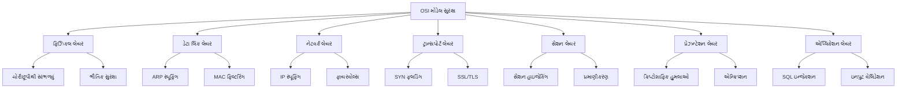

યાદ રાખવા માટે મુખ્ય મુદ્દાઓ:

1. સુરક્ષા પગલાં ઘણીવાર સ્તરો વચ્ચે ઓવરલેપ થાય છે, જે ઊંડાણમાં રક્ષણ પ્રદાન કરે છે.
2. દરેક સ્તર તેની નીચેના સ્તરોની સુરક્ષા પર આધાર રાખે છે.
3. વ્યાપક સુરક્ષા વ્યૂહરચના બધા સ્તરો પર નબળાઈઓને સંબોધિત કરે છે.
4. જેમ જેમ આપણે OSI મોડેલમાં ઉપર જઈએ છીએ, તેમ તેમ હુમલાઓ અને બચાવ વધુ એપ્લિકેશન-વિશિષ્ટ બને છે.
5. નીચલા સ્તરો નેટવર્ક અને ડેટા ટ્રાન્સમિશન સુરક્ષા પર ધ્યાન કેન્દ્રિત કરે છે, જ્યારે ઉપલા સ્તરો ડેટા રજૂઆત અને એપ્લિકેશન-સ્તરની સુરક્ષા સાથે વ્યવહાર કરે છે.

OSI મોડેલના દરેક સ્તરે સુરક્ષાના પરિણામોને સમજીને, નેટવર્ક એડમિનિસ્ટ્રેટર્સ અને સુરક્ષા વ્યાવસાયિકો સંભવિત ખતરાઓની વિશાળ શ્રેણી સામે રક્ષણ કરવા માટે મજબૂત, મલ્ટી-લેયર્ડ સુરક્ષા અભિગમ અમલમાં મૂકી શકે છે.

### Question 1(c): Explain MD5 hashing and Secure Hash Function (SHA) algorithms. (7 marks)

**Ans 1(c):**

MD5 (Message Digest algorithm 5) and SHA (Secure Hash Algorithm) are cryptographic hash functions used to generate fixed-size hash values from input data of arbitrary length. These algorithms are crucial in various security applications, including digital signatures, data integrity verification, and password storage.

**MD5 (Message Digest algorithm 5):**

MD5 is a widely used hash function that produces a 128-bit (16-byte) hash value, typically expressed as a 32-digit hexadecimal number.

Key characteristics of MD5:

1. **Fixed Output**: Always produces a 128-bit hash, regardless of input size.
2. **One-way Function**: It's computationally infeasible to reverse the hash to obtain the original input.
3. **Deterministic**: The same input always produces the same hash value.
4. **Avalanche Effect**: Small changes in input result in significantly different hash values.

MD5 Algorithm steps:

1. Pad the input message to ensure its length is divisible by 512 bits.
2. Initialize four 32-bit registers with specific values.
3. Process the input in 512-bit blocks through four rounds of operations.
4. The final state of the four registers forms the 128-bit MD5 hash.

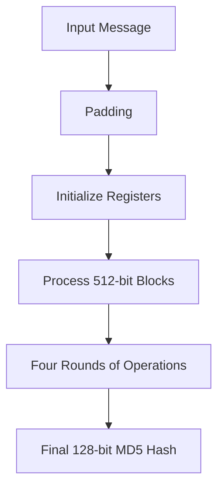

**Secure Hash Algorithm (SHA):**

SHA is a family of cryptographic hash functions designed by the U.S. National Security Agency (NSA). The most common variants are SHA-1, SHA-2, and SHA-3.

1. **SHA-1**:
   - Produces a 160-bit hash value.
   - Now considered cryptographically broken and not recommended for security-critical applications.

2. **SHA-2**:
   - Includes SHA-224, SHA-256, SHA-384, and SHA-512.
   - SHA-256 (256-bit output) is widely used and considered secure.

3. **SHA-3**:
   - The latest member of the SHA family, based on the Keccak algorithm.
   - Offers various output sizes: 224, 256, 384, and 512 bits.

SHA-256 Algorithm steps:

1. Pad the message to ensure its length is a multiple of 512 bits.
2. Parse the padded message into 512-bit blocks.
3. Initialize eight 32-bit working variables with specific constants.
4. Process each 512-bit block through 64 rounds of operations.
5. Update the working variables after processing each block.
6. Produce the final 256-bit hash value.

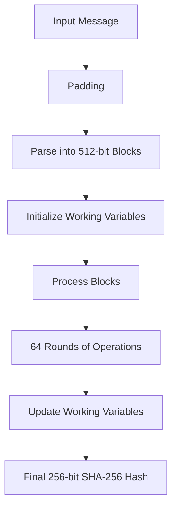

**Comparison between MD5 and SHA:**

1. **Security**:
   - MD5 is considered cryptographically broken and should not be used for security-critical applications.
   - SHA-2 and SHA-3 are currently considered secure and widely used.

2. **Performance**:
   - MD5 is generally faster than SHA algorithms but at the cost of security.
   - SHA-256 is slower but provides better security.

3. **Output Size**:
   - MD5: 128 bits
   - SHA-1: 160 bits
   - SHA-256: 256 bits
   - SHA-512: 512 bits

4. **Applications**:
   - MD5: Still used for non-cryptographic purposes like checksums.
   - SHA-2 and SHA-3: Used in digital signatures, SSL/TLS, and other security protocols.

5. **Collision Resistance**:
   - MD5: Collisions have been found, making it unsuitable for cryptographic use.
   - SHA-2 and SHA-3: No practical collisions have been found to date.

In conclusion, while MD5 was once widely used, it's now primarily of historical interest in cryptography. Modern applications should use SHA-2 or SHA-3 family algorithms for secure hashing needs. The choice between different SHA variants depends on the specific security requirements and performance considerations of the application.

### પ્રશ્ન 1(ક): MD5 હેશિંગ અને સિક્યોર હેશ ફંક્શન (SHA) અલ્ગોરિધમ સમજાવો. (7 ગુણ)

**જવાબ 1(ક):**

MD5 (Message Digest algorithm 5) અને SHA (Secure Hash Algorithm) એ ક્રિપ્ટોગ્રાફિક હેશ ફંક્શન્સ છે જે મનસ્વી લંબાઈના ઇનપુટ ડેટામાંથી નિશ્ચિત-કદના હેશ મૂલ્યો ઉત્પન્ન કરવા માટે વપરાય છે. આ અલ્ગોરિધમ્સ ડિજિટલ સહીઓ, ડેટા અખંડિતતા ચકાસણી અને પાસવર્ડ સંગ્રહ સહિતના વિવિધ સુરક્ષા એપ્લિકેશન્સમાં મહત્વપૂર્ણ છે.

**MD5 (Message Digest algorithm 5):**

MD5 એ વ્યાપકપણે ઉપયોગમાં લેવાતું હેશ ફંક્શન છે જે 128-બિટ (16-બાઇટ) હેશ મૂલ્ય ઉત્પન્ન કરે છે, જે સામાન્ય રીતે 32-અંકના હેક્સાડેસિમલ નંબર તરીકે વ્યક્ત થાય છે.

MD5 ની મુખ્ય લાક્ષણિકતાઓ:

1. **નિશ્ચિત આઉટપુટ**: ઇનપુટના કદને ધ્યાનમાં લીધા વિના હંમેશા 128-બિટ હેશ ઉત્પન્ન કરે છે.
2. **એક-માર્ગી ફંક્શન**: મૂળ ઇનપુટ મેળવવા માટે હેશને ઉલટાવવું કમ્પ્યુટેશનલ રીતે અશક્ય છે.
3. **નિર્ધારિત**: સમાન ઇનપુટ હંમેશા સમાન હેશ મૂલ્ય ઉત્પન્ન કરે છે.
4. **એવલાન્ચ ઇફેક્ટ**: ઇનપુટમાં નાના ફેરફારો નોંધપાત્ર રીતે અલગ હેશ મૂલ્યો પરિણમે છે.

MD5 અલ્ગોરિધમના પગલાં:

1. ઇનપુટ સંદેશને પેડ કરો જેથી તેની લંબાઈ 512 બિટ્સથી વિભાજ્ય હોય.
2. ચાર 32-બિટ રજિસ્ટર્સને ચોક્કસ મૂલ્યો સાથે પ્રારંભ કરો.
3. ઇનપુટને 512-બિટ બ્લોક્સમાં ચાર રાઉન્ડ ઓપરેશન્સ દ્વારા પ્રક્રિયા કરો.
4. ચાર રજિસ્ટર્સની અંતિમ સ્થિતિ 128-બિટ MD5 હેશ બનાવે છે.

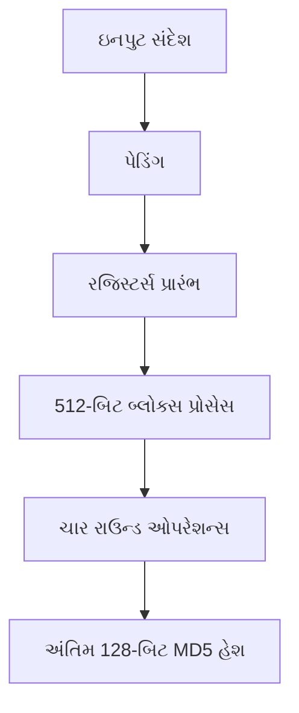

**સિક્યોર હેશ અલ્ગોરિધમ (SHA):**

SHA એ ક્રિપ્ટોગ્રાફિક હેશ ફંક્શન્સનો એક પરિવાર છે જે U.S. National Security Agency (NSA) દ્વારા ડિઝાઇન કરવામાં આવ્યો છે. સૌથી સામાન્ય પ્રકારો SHA-1, SHA-2 અને SHA-3 છે.

1. **SHA-1**:
   - 160-બિટ હેશ મૂલ્ય ઉત્પન્ન કરે છે.
   - હવે ક્રિપ્ટોગ્રાફિક રીતે તૂટેલું માનવામાં આવે છે અને સુરક્ષા-મહત્વપૂર્ણ એપ્લિકેશન્સ માટે ભલામણ કરવામાં આવતી નથી.

2. **SHA-2**:
   - SHA-224, SHA-256, SHA-384 અને SHA-512 નો સમાવેશ થાય છે.
   - SHA-256 (256-બિટ આઉટપુટ) વ્યાપકપણે ઉપયોગમાં લેવાય છે અને સુરક્ષિત માનવામાં આવે છે.

3. **SHA-3**:
   - Keccak અલ્ગોરિધમ પર આધારિત SHA પરિવારનો નવીનતમ સભ્ય.
   - વિવિધ આઉટપુટ કદ આપે છે: 224, 256, 384 અને 512 બિટ્સ.

SHA-256 અલ્ગોરિધમના પગલાં:

1. સંદેશને પેડ કરો જેથી તેની લંબાઈ 512 બિટ્સનો ગુણાંક હોય.
2. પેડ કરેલા સંદેશને 512-બિટ બ્લોક્સમાં પાર્સ કરો.
3. આઠ 32-બિટ વર્કિંગ વેરિએબલ્સને ચોક્કસ અચળાંકો સાથે પ્રારંભ કરો.
4. દરેક 512-બિટ બ્લોકને 64 રાઉન્ડ ઓપરેશન્સ દ્વારા પ્રક્રિયા કરો.
5. દરેક બ્લોકની પ્રક્રિયા કર્યા પછી વર્કિંગ વેરિએબલ્સ અપડેટ કરો.
6. અંતિમ 256-બિટ હેશ મૂલ્ય ઉત્પન્ન કરો.

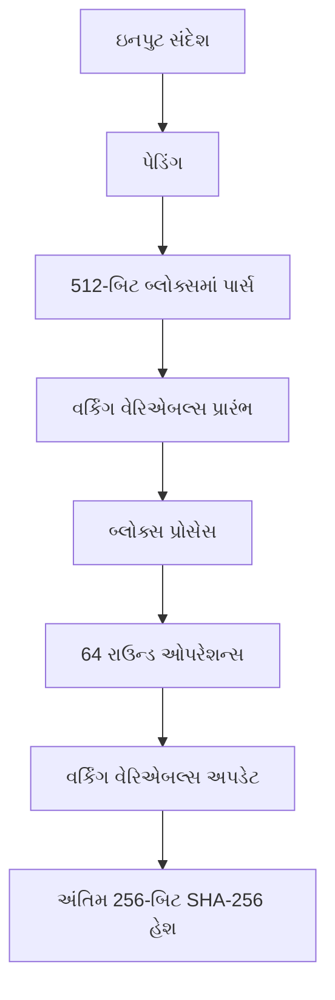

**MD5 અને SHA વચ્ચે તુલના:**

1. **સુરક્ષા**:
   - MD5 ને ક્રિપ્ટોગ્રાફિક રીતે તૂટેલું માનવામાં આવે છે અને સુરક્ષા-મહત્વપૂર્ણ એપ્લિકેશન્સ માટે ઉપયોગ કરવો જોઈએ નહીં.
   - SHA-2 અને SHA-3 હાલમાં સુરક્ષિત માનવામાં આવે છે અને વ્યાપકપણે ઉપયોગમાં લેવાય છે.

2. **કાર્યક્ષમતા**:
   - MD5 સામાન્ય રીતે SHA અલ્ગોરિધમ્સ કરતાં ઝડપી છે પરંતુ સુરક્ષાના ભોગે.
   - SHA-256 ધીમું છે પરંતુ વધુ સારી સુરક્ષા પ્રદાન કરે છે.

3. **આઉટપુટ કદ**:
   - MD5: 128 બિટ્સ
   - SHA-1: 160 બિટ્સ
   - SHA-256: 256 બિટ્સ
   - SHA-512: 512 બિટ્સ

4. **એપ્લિકેશન્સ**:
   - MD5: હજુ પણ ચેકસમ જેવા બિન-ક્રિપ્ટોગ્રાફિક હેતુઓ માટે ઉપયોગમાં લેવાય છે.
   - SHA-2 અને SHA-3: ડિજિટલ સહીઓ, SSL/TLS અને અન્ય સુરક્ષા પ્રોટોકોલ્સમાં ઉપયોગમાં લેવાય છે.

5. **કોલિઝન પ્રતિરોધ**:
   - MD5: કોલિઝન્સ મળી આવ્યા છે, જે તેને ક્રિપ્ટોગ્રાફિક ઉપયોગ માટે અયોગ્ય બનાવે છે.
   - SHA-2 અને SHA-3: આજ સુધી કોઈ વ્યવહારુ કોલિઝન્સ મળ્યા નથી.

નિષ્કર્ષમાં, જ્યારે MD5 એક સમયે વ્યાપકપણે ઉપયોગમાં લેવાતું હતું, હવે તે મુખ્યત્વે ક્રિપ્ટોગ્રાફીમાં ઐતિહાસિક રસ ધરાવે છે. આધુનિક એપ્લિકેશન્સે સુરક્ષિત હેશિંગ જરૂરિયાતો માટે SHA-2 અથવા SHA-3 પરિવારના અલ્ગોરિધમ્સનો ઉપયોગ કરવો જોઈએ. વિવિધ SHA પ્રકારો વચ્ચેની પસંદગી એપ્લિકેશનની ચોક્કસ સુરક્ષા આવશ્યકતાઓ અને કાર્યક્ષમતા ધ્યાનમાં લઈને કરવામાં આવે છે.

### Question 2(a): What is firewall? List out types of firewall. (3 marks)

**Ans 2(a):**

A firewall is a network security device that monitors and controls incoming and outgoing network traffic based on predetermined security rules. It acts as a barrier between trusted internal networks and untrusted external networks, such as the Internet.

Key functions of a firewall:

- Filters network traffic based on predefined rules
- Prevents unauthorized access to or from private networks
- Logs network activity for analysis and auditing
- Can implement network address translation (NAT)

Types of firewalls:

1. **Packet Filtering Firewall:**
   - Examines packets in isolation
   - Filters based on IP addresses, ports, and protocols
   - Stateless; doesn't keep track of connection state

2. **Stateful Inspection Firewall:**
   - Monitors the state of active connections
   - Makes decisions based on context from previous connections
   - More secure than packet filtering firewalls

3. **Application Layer Firewall:**
   - Operates at the application layer of the OSI model
   - Can understand certain applications and protocols
   - Provides deep packet inspection

4. **Next-Generation Firewall (NGFW):**
   - Combines traditional firewall with other network device filtering functions
   - Includes intrusion prevention, SSL/SSH inspection, deep-packet inspection

5. **Proxy Firewall:**
   - Acts as an intermediary between internal and external networks
   - Can provide content caching and is effective for web filtering

6. **Network Address Translation (NAT) Firewall:**
   - Hides internal IP addresses from external networks
   - Provides an additional layer of security through address translation

7. **Cloud Firewall (FWaaS - Firewall-as-a-Service):**
   - Deployed in cloud environments
   - Provides scalable, cloud-native security solutions

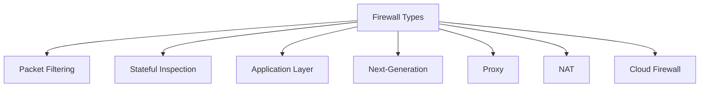

Each type of firewall has its strengths and is suited for different network security requirements. Modern network security often involves a combination of these firewall types to provide comprehensive protection.

### પ્રશ્ન 2(અ): ફાયરવોલ શું છે? તેના પ્રકારોની યાદી આપો. (3 ગુણ)

**જવાબ 2(અ):**

ફાયરવોલ એ નેટવર્ક સુરક્ષા ઉપકરણ છે જે પૂર્વનિર્ધારિત સુરક્ષા નિયમોના આધારે આવનારા અને જતા નેટવર્ક ટ્રાફિકનું નિરીક્ષણ અને નિયંત્રણ કરે છે. તે વિશ્વસનીય આંતરિક નેટવર્ક્સ અને અવિશ્વસનીય બાહ્ય નેટવર્ક્સ, જેમ કે ઇન્ટરનેટ, વચ્ચે અવરોધ તરીકે કાર્ય કરે છે.

ફાયરવોલના મુખ્ય કાર્યો:

- પૂર્વનિર્ધારિત નિયમોના આધારે નેટવર્ક ટ્રાફિકને ફિલ્ટર કરે છે
- ખાનગી નેટવર્ક્સમાં અથવા તેમાંથી અનધિકૃત ઍક્સેસને રોકે છે
- વિશ્લેષણ અને ઓડિટિંગ માટે નેટવર્ક પ્રવૃત્તિને લોગ કરે છે
- નેટવર્ક એડ્રેસ ટ્રાન્સલેશન (NAT) લાગુ કરી શકે છે

ફાયરવોલના પ્રકારો:

1. **પેકેટ ફિલ્ટરિંગ ફાયરવોલ:**
   - પેકેટ્સની અલગ તપાસ કરે છે
   - IP સરનામા, પોર્ટ્સ અને પ્રોટોકોલ્સના આધારે ફિલ્ટર કરે છે
   - સ્ટેટલેસ; કનેક્શનની સ્થિતિને ટ્રેક કરતું નથી

2. **સ્ટેટફુલ ઇન્સ્પેક્શન ફાયરવોલ:**
   - સક્રિય કનેક્શન્સની સ્થિતિનું નિરીક્ષણ કરે છે
   - અગાઉના કનેક્શન્સના સંદર્ભના આધારે નિર્ણયો લે છે
   - પેકેટ ફિલ્ટરિંગ ફાયરવોલ કરતાં વધુ સુરક્ષિત

3. **એપ્લિકેશન લેયર ફાયરવોલ:**
   - OSI મોડેલના એપ્લિકેશન લેયર પર કાર્ય કરે છે
   - ચોક્કસ એપ્લિકેશન્સ અને પ્રોટોકોલ્સને સમજી શકે છે
   - ડીપ પેકેટ ઇન્સ્પેક્શન પ્રદાન કરે છે

4. **નેક્સ્ટ-જનરેશન ફાયરવોલ (NGFW):**
   - પરંપરાગત ફાયરવોલને અન્ય નેટવર્ક ડિવાઇસ ફિલ્ટરિંગ કાર્યો સાથે જોડે છે
   - ઇન્ટ્રુઝન પ્રિવેન્શન, SSL/SSH ઇન્સ્પેક્શન, ડીપ-પેકેટ ઇન્સ્પેક્શનનો સમાવેશ કરે છે

5. **પ્રોક્સી ફાયરવોલ:**
   - આંતરિક અને બાહ્ય નેટવર્ક્સ વચ્ચે મધ્યસ્થી તરીકે કાર્ય કરે છે
   - કન્ટેન્ટ કેશિંગ પ્રદાન કરી શકે છે અને વેબ ફિલ્ટરિંગ માટે અસરકારક છે

6. **નેટવર્ક એડ્રેસ ટ્રાન્સલેશન (NAT) ફાયરવોલ:**
   - આંતરિક IP સરનામાંને બાહ્ય નેટવર્ક્સથી છુપાવે છે
   - સરનામા અનુવાદ દ્વારા વધારાનું સુરક્ષા સ્તર પ્રદાન કરે છે

7. **ક્લાઉડ ફાયરવોલ (FWaaS - Firewall-as-a-Service):**
   - ક્લાઉડ વાતાવરણમાં તૈનાત કરવામાં આવે છે
   - સ્કેલેબલ, ક્લાઉડ-નેટિવ સુરક્ષા સમાધાનો પ્રદાન કરે છે

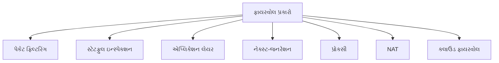

ફાયરવોલના દરેક પ્રકારની પોતાની શક્તિઓ છે અને વિવિધ નેટવર્ક સુરક્ષા આવશ્યકતાઓ માટે યોગ્ય છે. આધુનિક નેટવર્ક સુરક્ષામાં ઘણીવાર વ્યાપક સુરક્ષા પ્રદાન કરવા માટે આ ફાયરવોલ પ્રકારોનું સંયોજન સામેલ હોય છે.

### Question 2(b): Define: HTTPS and describe working of HTTPS. (4 marks)

**Ans 2(b):**

HTTPS (Hypertext Transfer Protocol Secure) is an extension of the HTTP protocol that uses encryption for secure communication over a computer network. It ensures that all data exchanged between a user's web browser and a website is encrypted and secure from eavesdropping, tampering, and forgery.

Definition:
HTTPS is a protocol for secure communication over a computer network which is widely used on the Internet. It provides authentication of the website and associated web server that one is communicating with, protecting against man-in-the-middle attacks. Additionally, it provides bidirectional encryption of communications between a client and server, protecting against eavesdropping and tampering with and/or forging the contents of the communication.

Working of HTTPS:

1. **Handshake Process:**
   - When a client (browser) connects to an HTTPS website, it initiates a TLS (Transport Layer Security) handshake.
   - The server responds with its SSL/TLS certificate.
   - The client verifies the certificate's authenticity.

2. **Certificate Verification:**
   - The client checks if the certificate is issued by a trusted Certificate Authority (CA).
   - It also verifies that the certificate is valid and matches the domain being accessed.

3. **Key Exchange:**
   - Once the certificate is verified, the client and server agree on a cipher suite.
   - They then exchange keys for symmetric encryption using asymmetric encryption.

4. **Secure Communication:**
   - With the shared secret key, all further communication is encrypted using symmetric encryption.
   - This ensures faster performance while maintaining security.

5. **Data Integrity:**
   - HTTPS also uses message authentication codes to ensure data integrity.
   - This prevents any tampering with the data during transmission.

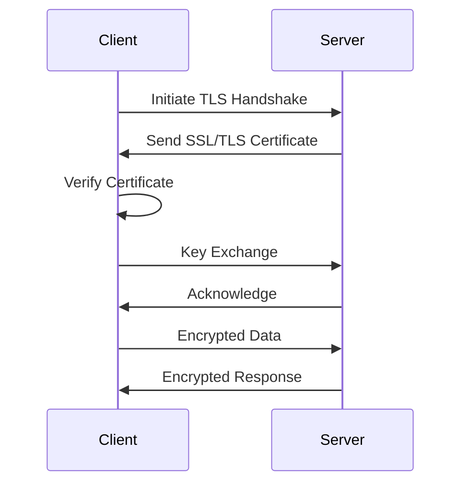

Key Benefits of HTTPS:

- Data Encryption: Protects sensitive information from interception.
- Data Integrity: Prevents modification of data in transit.
- Authentication: Verifies the identity of the website.
- SEO Advantage: Search engines prefer HTTPS websites.
- Trust: Provides visual cues (padlock icon) to users about security.

HTTPS is crucial for securing online transactions, login credentials, and any sensitive data transmitted over the internet, making it an essential component of modern web security.

### પ્રશ્ન 2(બ): વ્યાખ્યાયિત કરો: HTTPS અને HTTPS ના કાર્યનું વર્ણન કરો. (4 ગુણ)

**જવાબ 2(બ):**

HTTPS (Hypertext Transfer Protocol Secure) એ HTTP પ્રોટોકોલનું વિસ્તરણ છે જે કમ્પ્યુટર નેટવર્ક પર સુરક્ષિત સંચાર માટે એન્ક્રિપ્શનનો ઉપયોગ કરે છે. તે સુનિશ્ચિત કરે છે કે વપરાશકર્તાના વેબ બ્રાઉઝર અને વેબસાઇટ વચ્ચે વિનિમય થયેલ તમામ ડેટા એન્ક્રિપ્ટેડ છે અને ચોરીછૂપીથી સાંભળવા, છેડછાડ અને બનાવટથી સુરક્ષિત છે.

વ્યાખ્યા:
HTTPS એ કમ્પ્યુટર નેટવર્ક પર સુરક્ષિત સંચાર માટેનો પ્રોટોકોલ છે જે ઇન્ટરનેટ પર વ્યાપકપણે ઉપયોગમાં લેવાય છે. તે વેબસાઇટ અને સંકળાયેલ વેબ સર્વરની પ્રમાણભૂતતા પ્રદાન કરે છે જેની સાથે કોઈ સંચાર કરી રહ્યું છે, જે મેન-ઇન-ધ-મિડલ હુમલાઓથી રક્ષણ આપે છે. વધુમાં, તે ક્લાયન્ટ અને સર્વર વચ્ચે સંચારનું દ્વિપક્ષીય એન્ક્રિપ્શન પ્રદાન કરે છે, જે ચોરીછૂપીથી સાંભળવા અને છેડછાડ કરવા અને/અથવા સંચારની સામગ્રી બનાવટી કરવા સામે રક્ષણ આપે છે.

HTTPS નું કાર્ય:

1. **હેન્ડશેક પ્રક્રિયા:**
   - જ્યારે ક્લાયન્ટ (બ્રાઉઝર) HTTPS વેબસાઇટ સાથે જોડાય છે, ત્યારે તે TLS (Transport Layer Security) હેન્ડશેક શરૂ કરે છે.
   - સર્વર તેના SSL/TLS પ્રમાણપત્ર સાથે પ્રતિસાદ આપે છે.
   - ક્લાયન્ટ પ્રમાણપત્રની પ્રામાણિકતાની ચકાસણી કરે છે.

2. **પ્રમાણપત્ર ચકાસણી:**
   - ક્લાયન્ટ તપાસે છે કે પ્રમાણપત્ર વિશ્વસનીય પ્રમાણપત્ર અધિકારી (CA) દ્વારા જારી કરવામાં આવ્યું છે કે નહીં.
   - તે એ પણ ચકાસે છે કે પ્રમાણપત્ર માન્ય છે અને ઍક્સેસ કરવામાં આવી રહેલા ડોમેન સાથે મેળ ખાય છે.

3. **કી એક્સચેન્જ:**
   - એકવાર પ્રમાણપત્રની ચકાસણી થઈ જાય, પછી ક્લાયન્ટ અને સર્વર સાયફર સૂટ પર સંમત થાય છે.
   - પછી તેઓ અસમમિત એન્ક્રિપ્શનનો ઉપયોગ કરીને સમમિત એન્ક્રિપ્શન માટે કી એક્સચેન્જ કરે છે.

4. **સુરક્ષિત સંચાર:**
   - શેર કરેલી ગુપ્ત કી સાથે, તમામ આગળનો સંચાર સમમિત એન્ક્રિપ્શનનો ઉપયોગ કરીને એન્ક્રિપ્ટ કરવામાં આવે છે.
   - આ સુરક્ષા જાળવી રાખીને ઝડપી કાર્યક્ષમતા સુનિશ્ચિત કરે છે.

5. **ડેટા અખંડિતતા:**
   - HTTPS ડેટા અખંડિતતા સુનિશ્ચિત કરવા માટે સંદેશ પ્રમાણીકરણ કોડનો પણ ઉપયોગ કરે છે.
   - આ ટ્રાન્સમિશન દરમિયાન ડેટા સાથે કોઈપણ છેડછાડને રોકે છે.

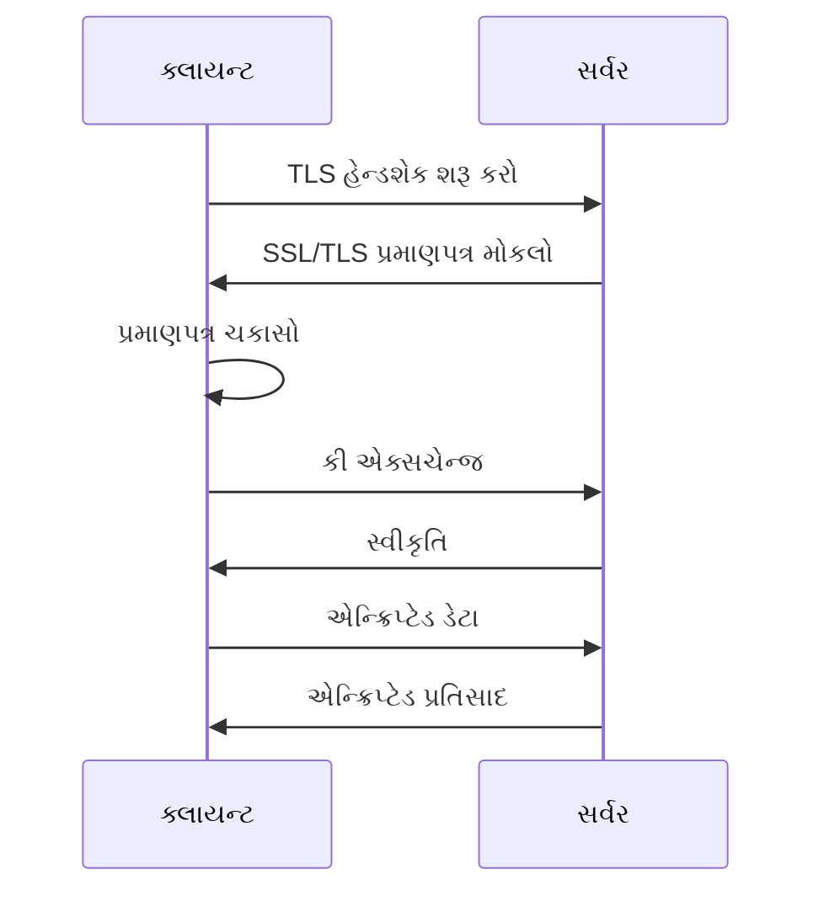

HTTPS ના મુખ્ય ફાયદાઓ:

- ડેટા એન્ક્રિપ્શન: સંવેદનશીલ માહિતીને આંતરવાથી રક્ષણ કરે છે.
- ડેટા અખંડિતતા: ટ્રાન્ઝિટમાં ડેટામાં ફેરફાર કરવાનું અટકાવે છે.
- પ્રમાણીકરણ: વેબસાઇટની ઓળખની ચકાસણી કરે છે.
- SEO ફાયદો: સર્ચ એન્જિનો HTTPS વેબસાઇટ્સને પસંદ કરે છે.
- વિશ્વાસ: વપરાશકર્તાઓને સુરક્ષા વિશે દૃશ્ય સંકેતો (પેડલોક આઇકોન) પ્રદાન કરે છે.

HTTPS ઓનલાઇન વ્યવહારો, લૉગિન ઓળખપત્રો અને ઇન્ટરનેટ પર પ્રસારિત કોઈપણ સંવેદનશીલ ડેટાને સુરક્ષિત કરવા માટે મહત્વપૂર્ણ છે, જે તેને આધુનિક વેબ સુરક્ષાનું અનિવાર્ય ઘટક બનાવે છે.

### Question 2(c): Explain different types of malicious software and their effect. (7 marks)

**Ans 2(c):**

Malicious software, often referred to as malware, is any program or file that is harmful to a computer user. Malware can take various forms, each with its own characteristics and effects. Here are the main types of malicious software and their impacts:

1. **Viruses:**
   - Definition: Self-replicating programs that attach themselves to clean files and spread throughout a computer system.
   - Effects:
     - Corrupt or delete data
     - Replicate and spread to other computers
     - Slow down system performance
     - Crash the system

2. **Worms:**
   - Definition: Standalone malware that replicates itself to spread to other computers, often via network connections.
   - Effects:
     - Consume bandwidth, slowing network speeds
     - Overload servers and networks
     - Create backdoors in system security
     - Facilitate the spread of other malware

3. **Trojans:**
   - Definition: Malware disguised as legitimate software to trick users into installing it.
   - Effects:
     - Create backdoors for attackers
     - Steal sensitive data
     - Take control of the system remotely
     - Install other types of malware

4. **Ransomware:**
   - Definition: Malware that encrypts a victim's files and demands a ransom for decryption.
   - Effects:
     - Lock users out of their systems or files
     - Cause data loss if ransom isn't paid
     - Lead to financial losses
     - Disrupt business operations

5. **Spyware:**
   - Definition: Software that secretly monitors user activity and reports it to the attacker.
   - Effects:
     - Steal personal information
     - Track browsing habits
     - Log keystrokes to capture passwords
     - Slow down system performance

6. **Adware:**
   - Definition: Software that automatically displays or downloads advertising material.
   - Effects:
     - Display unwanted ads
     - Slow down system and internet speeds
     - Track user behavior for targeted advertising
     - Sometimes act as a vector for other malware

7. **Rootkits:**
   - Definition: Stealthy software designed to hide the existence of certain processes or programs from normal detection methods.
   - Effects:
     - Conceal malicious activities
     - Provide continued privileged access to attackers
     - Difficult to detect and remove
     - Can persist even after system reinstallation

8. **Keyloggers:**
   - Definition: Programs that record every keystroke made on a computer.
   - Effects:
     - Steal passwords and sensitive information
     - Monitor all user activities
     - Compromise personal and financial data

9. **Bots:**
   - Definition: Automated programs that run automated tasks over the internet.
   - Effects:
     - Take control of computers to form botnets
     - Used for DDoS attacks
     - Spread spam and malware
     - Mine cryptocurrencies without user consent

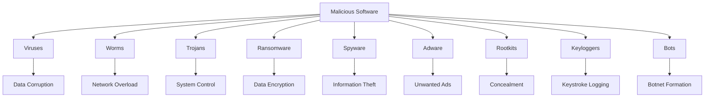

The effects of malicious software can be devastating, ranging from minor annoyances to severe financial losses and data breaches. They can compromise personal privacy, disrupt business operations, and even lead to identity theft. It's crucial to implement robust cybersecurity measures, including up-to-date antivirus software, firewalls, and regular system updates, to protect against these threats. User education about safe browsing habits and recognizing potential threats is also essential in mitigating the risks posed by malicious software.

### પ્રશ્ન 2(ક): વિવિધ પ્રકારના દુર્ભાવનાપૂર્ણ સૉફ્ટવેર અને તેમની અસર સમજાવો. (7 ગુણ)

**જવાબ 2(ક):**

દુર્ભાવનાપૂર્ણ સૉફ્ટવેર, જેને ઘણીવાર માલવેર તરીકે ઓળખવામાં આવે છે, તે કોઈપણ પ્રોગ્રામ અથવા ફાઇલ છે જે કમ્પ્યુટર વપરાશકર્તા માટે હાનિકારક છે. માલવેર વિવિધ સ્વરूપો લઈ શકે છે, દરેકની પોતાની લાક્ષણિકતાઓ અને અસરો છે. અહીં મુખ્ય પ્રકારના દુર્ભાવનાપૂર્ણ સૉફ્ટવેર અને તેમની અસરો છે:

1. **વાયરસ:**
   - વ્યાખ્યા: સ્વ-પ્રતિકૃતિ બનાવતા પ્રોગ્રામ્સ જે પોતાને ક્લીન ફાઇલો સાથે જોડે છે અને સમગ્ર કમ્પ્યુટર સિસ્ટમમાં ફેલાય છે.
   - અસરો:
     - ડેટાને ભ્રષ્ટ અથવા કાઢી નાખે છે
     - પ્રતિકૃતિ બનાવે છે અને અન્ય કમ્પ્યુટર્સમાં ફેલાય છે
     - સિસ્ટમની કામગીરી ધીમી કરે છે
     - સિસ્ટમને ક્રેશ કરે છે

2. **વર્મ્સ:**
   - વ્યાખ્યા: સ્વતંત્ર માલવેર જે અન્ય કમ્પ્યુટર્સમાં ફેલાવા માટે પોતાની પ્રતિકૃતિ બનાવે છે, ઘણીવાર નેટવર્ક કનેક્શન્સ દ્વારા.
   - અસરો:
     - બેન્ડવિડ્થનો ઉપયોગ કરે છે, નેટવર્ક સ્પીડ ધીમી કરે છે
     - સર્વર્સ અને નેટવર્ક્સને ઓવરલોડ કરે છે
     - સિસ્ટમ સુરક્ષામાં બેકડોર બનાવે છે
     - અન્ય માલવેરના ફેલાવાને સરળ બનાવે છે

3. **ટ્રોજન્સ:**
   - વ્યાખ્યા: કાયદેસર સૉફ્ટવેર તરીકે છુપાયેલું માલવેર જે વપરાશકર્તાઓને તેને ઇન્સ્ટોલ કરવા માટે છેતરે છે.
   - અસરો:
     - હુમલાખોરો માટે બેકડોર બનાવે છે
     - સંવેદનશીલ ડેટાની ચોરી કરે છે
     - સિસ્ટમને દૂરથી નિયંત્રિત કરે છે
     - અન્ય પ્રકારના માલવેર ઇન્સ્ટોલ કરે છે

4. **રેન્સમવેર:**
   - વ્યાખ્યા: માલવેર જે પીડિતની ફાઇલોને એન્ક્રિપ્ટ કરે છે અને ડિક્રિપ્શન માટે ખંડણીની માંગ કરે છે.
   - અસરો:
     - વપરાશકર્તાઓને તેમની સિસ્ટમ અથવા ફાઇલોમાંથી બહાર લૉક કરે છે
     - જો ખંડણી ચૂકવવામાં ન આવે તો ડેટા ગુમાવવાનું કારણ બને છે
     - નાણાકીય નુકસાન તરફ દોરી જાય છે
     - વ્યવસાય કામગીરીમાં વિક્ષેપ પાડે છે

5. **સ્પાયવેર:**
   - વ્યાખ્યા: સૉફ્ટવેર જે ગુપ્ત રીતે વપરાશકર્તા પ્રવૃત્તિનું નિરીક્ષણ કરે છે અને તેને હુમલાખોરને જાણ કરે છે.
   - અસરો:
     - વ્યક્તિગત માહિતીની ચોરી કરે છે
     - બ્રાઉઝિંગ આદતોને ટ્રેક કરે છે
     - પાસવર્ડ્સ કેપ્ચર કરવા માટે કીસ્ટ્રોક્સ લૉગ કરે છે
     - સિસ્ટમની કામગીરી ધીમી કરે છે

6. **એડવેર:**
   - વ્યાખ્યા: સૉફ્ટવેર જે સ્વચાલિત રીતે જાહેરાત સામગ્રી પ્રદર્શિત કરે છે અથવા ડાઉનલોડ કરે છે.
   - અસરો:
     - અવાંછિત જાહેરાતો દર્શાવે છે
     - સિસ્ટમ અને ઇન્ટરનેટ સ્પીડ ધીમી કરે છે
     - લક્ષિત જાહેરાત માટે વપરાશકર્તા વર્તણૂકને ટ્રેક કરે છે
     - ક્યારેક અન્ય માલવેર માટે વેક્ટર તરીકે કાર્ય કરે છે

7. **રૂટકિટ્સ:**
   - વ્યાખ્યા: સામાન્ય શોધ પદ્ધતિઓથી ચોક્કસ પ્રક્રિયાઓ અથવા પ્રોગ્રામ્સના અસ્તિત્વને છુપાવવા માટે રચાયેલ છુપા સૉફ્ટવેર.
   - અસરો:
     - દુર્ભાવનાપૂર્ણ પ્રવૃત્તિઓને છુપાવે છે
     - હુમલાખોરોને સતત વિશેષાધિકૃત ઍક્સેસ પ્રદાન કરે છે
     - શોધવામાં અને દૂર કરવામાં મુશ્કેલ
     - સિસ્ટમ ફરીથી ઇન્સ્ટોલ કર્યા પછી પણ ચાલુ રહી શકે છે

8. **કીલોગર્સ:**
   - વ્યાખ્યા: કમ્પ્યુટર પર કરવામાં આવેલી દરેક કીસ્ટ્રોકને રેકોર્ડ કરતા પ્રોગ્રામ્સ.
   - અસરો:
     - પાસવર્ડ્સ અને સંવેદનશીલ માહિતીની ચોરી કરે છે
     - તમામ વપરાશકર્તા પ્રવૃત્તિઓનું નિરીક્ષણ કરે છે
     - વ્યક્તિગત અને નાણાકીય ડેટાને જોખમમાં મૂકે છે

9. **બોટ્સ:**
   - વ્યાખ્યા: ઇન્ટરનેટ પર સ્વચાલિત કાર્યો ચલાવતા સ્વયંચાલિત પ્રોગ્રામ્સ.
   - અસરો:
     - બોટનેટ્સ બનાવવા માટે કમ્પ્યુટર્સને નિયંત્રણમાં લે છે
     - DDoS હુમલાઓ માટે વપરાય છે
     - સ્પામ અને માલવેર ફેલાવે છે
     - વપરાશકર્તાની સંમતિ વિના ક્રિપ્ટોકરન્સીઓનું ખનન કરે છે

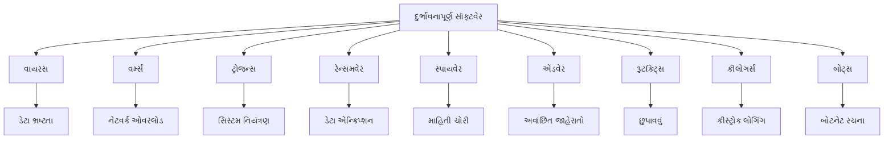

દુર્ભાવનાપૂર્ણ સૉફ્ટવેરની અસરો વિનાશક હોઈ શકે છે, જે નાની અગવડતાઓથી લઈને ગંભીર નાણાકીય નુકસાન અને ડેટા ઉલ્લંઘન સુધી હોઈ શકે છે. તે વ્યક્તિગત ગોપનીયતાને જોખમમાં મૂકી શકે છે, વ્યવસાય કામગીરીમાં વિક્ષેપ પાડી શકે છે, અને ઓળખ ચોરી તરફ પણ દોરી શકે છે. આ ખતરાઓથી રક્ષણ કરવા માટે મજબૂત સાયબર સુરક્ષા પગલાં લાગુ કરવા મહત્વપૂર્ણ છે, જેમાં અપ-ટુ-ડેટ એન્ટીવાયરસ સૉફ્ટવેર, ફાયરવોલ્સ અને નિયમિત સિસ્ટમ અપડેટ્સનો સમાવેશ થાય છે. સુરક્ષિત બ્રાઉઝિંગ આદતો અને સંભવિત ખતરાઓને ઓળખવા વિશે વપરાશકર્તા શિક્ષણ પણ દુર્ભાવનાપૂર્ણ સૉફ્ટવેર દ્વારા ઊભા થતા જોખમોને ઘટાડવામાં આવશ્યક છે.

દુર્ભાવનાપૂર્ણ સૉફ્ટવેરથી બચવા માટેના કેટલાક મહત્વપૂર્ણ સુરક્ષા પગલાં:

1. **અપ-ટુ-ડેટ એન્ટીવાયરસ સૉફ્ટવેર**: હંમેશા નવીનતમ વર્ઝન અને વાયરસ વ્યાખ્યાઓ સાથે રાખો.

2. **ફાયરવોલ**: અનધિકૃત ઍક્સેસને રોકવા માટે મજબૂત ફાયરવોલનો ઉપયોગ કરો.

3. **નિયમિત અપડેટ્સ**: ઓપરેટિંગ સિસ્ટમ અને સૉફ્ટવેરને નિયમિતપણે અપડેટ કરો.

4. **સાવધાનીપૂર્વક બ્રાઉઝિંગ**: અજાણ્યા સ્રોતોની લિંક્સ અથવા અટેચમેન્ટ્સ ખોલવાનું ટાળો.

5. **મજબૂત પાસવર્ડ્સ**: વિવિધ અને જટિલ પાસવર્ડ્સનો ઉપયોગ કરો અને તેમને નિયમિતપણે બદલો.

6. **બેકઅપ**: નિયમિતપણે મહત્વપૂર્ણ ડેટાનો બેકઅપ લો.

7. **શિક્ષણ**: કર્મચારીઓ અને વપરાશકર્તાઓને સાયબર સુરક્ષા જોખમો અને સારી પ્રથાઓ વિશે શિક્ષિત કરો.

8. **એન્ક્રિપ્શન**: સંવેદનશીલ ડેટા અને સંચારને એન્ક્રિપ્ટ કરો.

9. **ઍક્સેસ નિયંત્રણ**: યોગ્ય ઍક્સેસ નિયંત્રણો અને ઓછામાં ઓછા વિશેષાધિકારના સિદ્ધાંતોનો અમલ કરો.

10. **નેટવર્ક સુરક્ષા**: VPN અને સુરક્ષિત Wi-Fi કનેક્શન્સનો ઉપયોગ કરો.

આ પગલાંઓનું સંયોજન દુર્ભાવનાપૂર્ણ સૉફ્ટવેરના જોખમને નોંધપાત્ર રીતે ઘટાડી શકે છે અને સમગ્ર સાયબર સુરક્ષા સ્થિતિને સુધારી શકે છે.

### Question 2(a): What is authentication? Explain different methods of authentication. (3 marks)

**Ans 2(a):**

Authentication is the process of verifying the identity of a user, device, or system to ensure that they are who or what they claim to be. It is a crucial aspect of cybersecurity that helps protect sensitive information and resources from unauthorized access.

Different methods of authentication:

1. **Password-based Authentication:**
   - Users provide a username and password
   - Simple but vulnerable to various attacks

2. **Multi-Factor Authentication (MFA):**
   - Combines two or more independent credentials
   - Example: password + fingerprint + SMS code

3. **Biometric Authentication:**
   - Uses unique physical characteristics
   - Examples: fingerprints, facial recognition, iris scans

4. **Token-based Authentication:**
   - Utilizes physical or digital tokens
   - Examples: smart cards, USB tokens, or software tokens

5. **Certificate-based Authentication:**
   - Uses digital certificates to verify identity
   - Often used in secure web communications (HTTPS)

6. **Single Sign-On (SSO):**
   - Allows access to multiple systems with one set of credentials
   - Enhances user experience and simplifies management

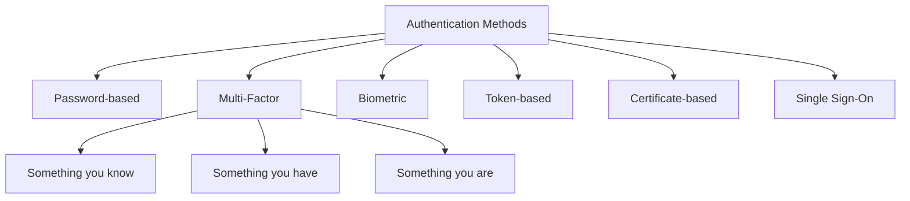

Each method has its strengths and weaknesses, and the choice depends on the required security level, user convenience, and implementation costs. Many modern systems use a combination of these methods to enhance security.

### પ્રશ્ન 2(અ): પ્રમાણીકરણ શું છે? પ્રમાણીકરણની વિવિધ પદ્ધતિઓ સમજાવો. (3 ગુણ)

**જવાબ 2(અ):**

પ્રમાણીકરણ એ વપરાશકર્તા, ઉપકરણ અથવા સિસ્ટમની ઓળખની ચકાસણી કરવાની પ્રક્રિયા છે જે સુનિશ્ચિત કરે છે કે તેઓ જે હોવાનો દાવો કરે છે તે જ છે. તે સાયબર સુરક્ષાનું એક મહત્વપૂર્ણ પાસું છે જે સંવેદનશીલ માહિતી અને સંસાધનોને અનધિકૃત ઍક્સેસથી રક્ષણ આપવામાં મદદ કરે છે.

પ્રમાણીકરણની વિવિધ પદ્ધતિઓ:

1. **પાસવર્ડ-આધારિત પ્રમાણીકરણ:**
   - વપરાશકર્તાઓ વપરાશકર્તાનામ અને પાસવર્ડ પ્રદાન કરે છે
   - સરળ પરંતુ વિવિધ હુમલાઓ માટે નબળું

2. **મલ્ટી-ફેક્ટર પ્રમાણીકરણ (MFA):**
   - બે અથવા વધુ સ્વતંત્ર ઓળખપત્રોને જોડે છે
   - ઉદાહરણ: પાસવર્ડ + ફિંગરપ્રિન્ટ + SMS કોડ

3. **બાયોમેટ્રિક પ્રમાણીકરણ:**
   - અનન્ય શારીરિક લક્ષણોનો ઉપયોગ કરે છે
   - ઉદાહરણો: ફિંગરપ્રિન્ટ્સ, ચહેરાની ઓળખ, આંખની કીકીનું સ્કેન

4. **ટોકન-આધારિત પ્રમાણીકરણ:**
   - ભૌતિક અથવા ડિજિટલ ટોકન્સનો ઉપયોગ કરે છે
   - ઉદાહરણો: સ્માર્ટ કાર્ડ્સ, USB ટોકન્સ અથવા સૉફ્ટવેર ટોકન્સ

5. **પ્રમાણપત્ર-આધારિત પ્રમાણીકરણ:**
   - ઓળખની ચકાસણી માટે ડિજિટલ પ્રમાણપત્રોનો ઉપયોગ કરે છે
   - ઘણીવાર સુરક્ષિત વેબ સંચારમાં વપરાય છે (HTTPS)

6. **સિંગલ સાઇન-ઓન (SSO):**
   - એક સેટ ઓળખપત્રો સાથે બહુવિધ સિસ્ટમ્સને ઍક્સેસ કરવાની મંજૂરી આપે છે
   - વપરાશકર્તા અનુભવ વધારે છે અને વ્યવસ્થાપનને સરળ બનાવે છે

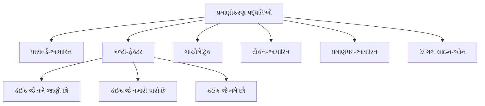

દરેક પદ્ધતિની તેની શક્તિઓ અને નબળાઈઓ છે, અને પસંદગી જરૂરી સુરક્ષા સ્તર, વપરાશકર્તા સગવડતા અને અમલીકરણ ખર્ચ પર આધાર રાખે છે. ઘણી આધુનિક સિસ્ટમ્સ સુરક્ષા વધારવા માટે આ પદ્ધતિઓના સંયોજનનો ઉપયોગ કરે છે.

### Question 2(b): Define: Trojans, Rootkit, Backdoors, Keylogger (4 marks)

**Ans 2(b):**

1. **Trojans:**
   Trojans, short for Trojan horses, are malicious programs that disguise themselves as legitimate software to trick users into installing them. Once installed, they can perform various harmful actions without the user's knowledge.

   Key characteristics:
   - Appears harmless or useful
   - Does not self-replicate like viruses
   - Can create backdoors for other malware
   - Often used to steal sensitive information

2. **Rootkit:**
   A rootkit is a collection of software tools designed to gain and maintain unauthorized access to a computer system while remaining undetected. It typically operates at a low level, often modifying the operating system itself.

   Key characteristics:
   - Conceals its presence and the presence of other malware
   - Difficult to detect and remove
   - Can survive system reboots
   - Often used to maintain long-term access to a compromised system

3. **Backdoors:**
   Backdoors are methods, often secret, of bypassing normal authentication in a computer system, securing unauthorized remote access to a computer, or obtaining access to plaintext in cryptographic systems.

   Key characteristics:
   - Provides covert access to a system
   - Can be intentionally built into software or created by malware
   - Often exploited by attackers for persistent access
   - May bypass firewalls and other security measures

4. **Keylogger:**
   A keylogger is a type of surveillance software or hardware that has the capability to record every keystroke made on a computer's keyboard.

   Key characteristics:
   - Records all keyboard input, including passwords
   - Can be software-based or hardware devices
   - Used legitimately for IT troubleshooting or parental control
   - Malicious use involves stealing sensitive information

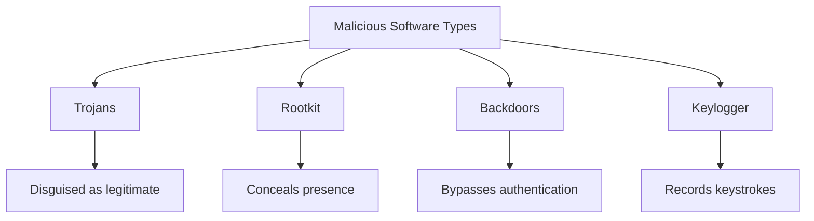

These types of malicious software often work in conjunction, creating complex threats. For example, a Trojan might install a rootkit, which in turn creates a backdoor and installs a keylogger, forming a comprehensive system compromise.

### પ્રશ્ન 2(બ): વ્યાખ્યાયિત કરો: ટ્રોજન્સ, રૂટકિટ, બેકડોર્સ, કીલોગર (4 ગુણ)

**જવાબ 2(બ):**

1. **ટ્રોજન્સ:**
   ટ્રોજન્સ, ટ્રોજન હોર્સિસ માટે ટૂંકું નામ, દુર્ભાવનાપૂર્ણ પ્રોગ્રામ્સ છે જે વપરાશકર્તાઓને તેમને ઇન્સ્ટોલ કરવા માટે છેતરવા માટે પોતાને કાયદેસર સૉફ્ટવેર તરીકે છુપાવે છે. એકવાર ઇન્સ્ટોલ થયા પછી, તેઓ વપરાશકર્તાની જાણ વિના વિવિધ હાનિકારક ક્રિયાઓ કરી શકે છે.

   મુખ્ય લક્ષણો:
   - નુકસાન રહિત અથવા ઉપયોગી દેખાય છે
   - વાયરસની જેમ સ્વ-પ્રતિકૃતિ બનાવતું નથી
   - અન્ય માલવેર માટે બેકડોર બનાવી શકે છે
   - ઘણીવાર સંવેદનશીલ માહિતી ચોરવા માટે વપરાય છે

2. **રૂટકિટ:**
   રૂટકિટ એ સૉફ્ટવેર ટૂલ્સનો સંગ્રહ છે જે શોધાયા વિના કમ્પ્યુટર સિસ્ટમમાં અનધિકૃત ઍક્સેસ મેળવવા અને જાળવી રાખવા માટે રચાયેલ છે. તે સામાન્ય રીતે નીચા સ્તરે કાર્ય કરે છે, ઘણીવાર ઓપરેટિંગ સિસ્ટમને જ સુધારે છે.

   મુખ્ય લક્ષણો:
   - તેની હાજરી અને અન્ય માલવેરની હાજરીને છુપાવે છે
   - શોધવામાં અને દૂર કરવામાં મુશ્કેલ
   - સિસ્ટમ રીબૂટ્સ પછી પણ જીવંત રહી શકે છે
   - ઘણીવાર સમાધાન કરેલ સિસ્ટમમાં લાંબા ગાળાની ઍક્સેસ જાળવવા માટે વપરાય છે

3. **બેકડોર્સ:**
   બેકડોર્સ એ પદ્ધતિઓ છે, ઘણીવાર ગુપ્ત, જે કમ્પ્યુટર સિસ્ટમમાં સામાન્ય પ્રમાણીકરણને બાયપાસ કરવાની, કમ્પ્યુટરમાં અનધિકૃત રિમોટ ઍક્સેસ સુરક્ષિત કરવાની, અથવા ક્રિપ્ટોગ્રાફિક સિસ્ટમ્સમાં સાદા ટેક્સ્ટની ઍક્સેસ મેળવવાની છે.

   મુખ્ય લક્ષણો:
   - સિસ્ટમમાં છુપી ઍક્સેસ પ્રદાન કરે છે
   - જાણીજોઈને સૉફ્ટવેરમાં બનાવી શકાય છે અથવા માલવેર દ્વારા બનાવી શકાય છે
   - ઘણીવાર હુમલાખોરો દ્વારા સતત ઍક્સેસ માટે ઉપયોગમાં લેવાય છે
   - ફાયરવોલ્સ અને અન્ય સુરક્ષા પગલાંને બાયપાસ કરી શકે છે

4. **કીલોગર:**
   કીલોગર એ દેખરેખ સૉફ્ટવેર અથવા હાર્ડવેરનો એક પ્રકાર છે જેની પાસે કમ્પ્યુટરના કીબોર્ડ પર કરવામાં આવેલી દરેક કીસ્ટ્રોકને રેકોર્ડ કરવાની ક્ષમતા છે.

   મુખ્ય લક્ષણો:
   - પાસવર્ડ્સ સહિત તમામ કીબોર્ડ ઇનપુટ રેકોર્ડ કરે છે
   - સૉફ્ટવેર-આધારિત અથવા હાર્ડવેર ઉપકરણો હોઈ શકે છે
   - IT સમસ્યા નિવારણ અથવા પેરેન્ટલ કંટ્રોલ માટે કાયદેસર રીતે ઉપયોગમાં લેવાય છે
   - દુર્ભાવનાપૂર્ણ ઉપયોગમાં સંવેદનશીલ માહિતીની ચોરી સામેલ છે

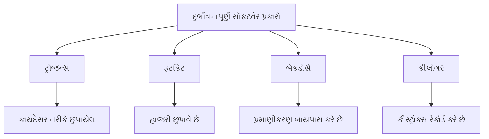

આ પ્રકારના દુર્ભાવનાપૂર્ણ સૉફ્ટવેર ઘણીવાર એકસાથે કામ કરે છે, જટિલ ખતરાઓ સર્જે છે. ઉદાહરણ તરીકે, ટ્રોજન રૂટકિટ ઇન્સ્ટોલ કરી શકે છે, જે બદલામાં બેકડોર બનાવે છે અને કીલોગર ઇન્સ્ટોલ કરે છે, જે વ્યાપક સિસ્ટમ સમાધાન બનાવે છે.

### Question 2(c): Explain Secure Socket Layer (SSL) and Transport Layer Security (TLS) protocols. (7 marks)

**Ans 2(c):**

Secure Socket Layer (SSL) and its successor, Transport Layer Security (TLS), are cryptographic protocols designed to provide secure communication over a computer network. These protocols are widely used to secure internet communications, including web browsing, email, instant messaging, and voice over IP (VoIP).

**Secure Socket Layer (SSL):**

SSL was developed by Netscape in 1995. It has three versions: SSL 1.0, 2.0, and 3.0. All versions of SSL are now considered deprecated and insecure.

Key features of SSL:

1. Provides encryption, authentication, and data integrity
2. Uses a combination of symmetric and asymmetric encryption
3. Operates between the application and transport layers

**Transport Layer Security (TLS):**

TLS is the successor to SSL, first defined in 1999. It has evolved through several versions: TLS 1.0, 1.1, 1.2, and the current 1.3. TLS 1.3, released in 2018, offers significant improvements in security and performance.

Key features of TLS:

1. Enhanced security compared to SSL
2. Faster handshakes, especially in TLS 1.3
3. Improved cipher suites and encryption algorithms

**Common aspects of SSL/TLS:**

1. **Handshake Process:**
   - Client sends "ClientHello" message
   - Server responds with "ServerHello" and its certificate
   - Key exchange occurs
   - Both parties verify the handshake

2. **Certificate Validation:**
   - Server presents its digital certificate
   - Client verifies the certificate's authenticity and validity

3. **Key Exchange:**
   - Uses asymmetric encryption to securely exchange a symmetric key
   - Subsequent communications use this symmetric key for efficiency

4. **Data Encryption:**
   - Uses agreed-upon cipher suite for encrypting data
   - Ensures confidentiality of transmitted information

5. **Data Integrity:**
   - Uses Message Authentication Codes (MACs) to detect any tampering

```mermaid
sequenceDiagram
    participant Client
    participant Server
    Client->>Server: ClientHello
    Server->>Client: ServerHello, Certificate
    Client->>Server: Key Exchange, ChangeCipherSpec
    Server->>Client: ChangeCipherSpec, Finished
    Client->>Server: Encrypted Application Data
    Server->>Client: Encrypted Application Data
```

**Differences between SSL and TLS:**

1. **Protocol Versions:**
   - SSL: 1.0, 2.0, 3.0 (all deprecated)
   - TLS: 1.0, 1.1, 1.2, 1.3 (1.3 is the latest and most secure)

2. **Security:**
   - TLS offers stronger security algorithms and has fixed various vulnerabilities present in SSL

3. **Handshake Process:**
   - TLS 1.3 significantly reduces the number of round-trips required for the handshake

4. **Cipher Suites:**
   - TLS supports more modern and secure cipher suites

5. **Alerting System:**
   - TLS has a more extensive alerting system for error handling

**Applications of SSL/TLS:**

1. Securing HTTPS connections for web browsing
2. Protecting email communication (SMTP, IMAP, POP3)
3. Securing file transfers (FTPS)
4. VPN connections
5. Instant messaging and chat applications

In conclusion, while SSL laid the groundwork for secure internet communications, TLS has taken over as the modern standard. The evolution from SSL to TLS reflects the ongoing efforts to enhance online security in the face of emerging threats and increased computational power available to potential attackers. Organizations are encouraged to use the latest version of TLS (currently 1.3) to ensure the highest level of security for their network communications.

### પ્રશ્ન 2(ક): સિક્યોર સોકેટ લેયર (SSL) અને ટ્રાન્સપોર્ટ લેયર સિક્યોરિટી (TLS) પ્રોટોકોલ સમજાવો. (7 ગુણ)

**જવાબ 2(ક):**

સિક્યોર સોકેટ લેયર (SSL) અને તેનો અનુગામી, ટ્રાન્સપોર્ટ લેયર સિક્યોરિટી (TLS), એ ક્રિપ્ટોગ્રાફિક પ્રોટોકોલ્સ છે જે કમ્પ્યુટર નેટવર્ક પર સુરક્ષિત સંચાર પ્રદાન કરવા માટે રચાયેલા છે. આ પ્રોટોકોલ્સનો વેબ બ્રાઉઝિંગ, ઇમેઇલ, ઇન્સ્ટન્ટ મેસેજિંગ અને વોઇસ ઓવર IP (VoIP) સહિતના ઇન્ટરનેટ સંચારને સુરક્ષિત કરવા માટે વ્યાપકપણે ઉપયોગ થાય છે.

**સિક્યોર સોકેટ લેયર (SSL):**

SSL ને 1995 માં Netscape દ્વારા વિકસાવવામાં આવ્યું હતું. તેના ત્રણ વર્ઝન છે: SSL 1.0, 2.0, અને 3.0. SSL ના તમામ વર્ઝન હવે અપ્રચલિત અને અસુરક્ષિત માનવામાં આવે છે.

SSL ની મુખ્ય વિશેષતાઓ:

1. એન્ક્રિપ્શન, પ્રમાણીકરણ અને ડેટા અખંડિતતા પ્રદાન કરે છે
2. સમમિત અને અસમમિત એન્ક્રિપ્શનના સંયોજનનો ઉપયોગ કરે છે
3. એપ્લિકેશન અને ટ્રાન્સપોર્ટ લેયર્સ વચ્ચે કાર્ય કરે છે

**ટ્રાન્સપોર્ટ લેયર સિક્યોરિટી (TLS):**

TLS એ SSL નો અનુગામી છે, જે 1999 માં પ્રથમ વ્યાખ્યાયિત કરવામાં આવ્યો હતો. તે ઘણા વર્ઝન્સ દ્વારા વિકસિત થયું છે: TLS 1.0, 1.1, 1.2, અને વર્તમાન 1.3. 2018 માં રિલીઝ થયેલ TLS 1.3 સુરક્ષા અને કાર્યક્ષમતામાં નોંધપાત્ર સુધારાઓ આપે છે.

TLS ની મુખ્ય વિશેષતાઓ:

1. SSL ની તુલનામાં વધુ સુરક્ષા
2. ઝડપી હેન્ડશેક, ખાસ કરીને TLS 1.3 માં
3. સુધારેલ સાયફર સૂટ્સ અને એન્ક્રિપ્શન અલ્ગોરિધમ્સ

**SSL/TLS ની સામાન્ય બાબતો:**

1. **હેન્ડશેક પ્રક્રિયા:**
   - ક્લાયન્ટ "ClientHello" સંદેશ મોકલે છે
   - સર્વર "ServerHello" અને તેના પ્રમાણપત્ર સાથે પ્રતિસાદ આપે છે
   - કી એક્સચેન્જ થાય છે
   - બંને પક્ષો હેન્ડશેકની ચકાસણી કરે છે

2. **પ્રમાણપત્ર માન્યતા:**
   - સર્વર તેનું ડિજિટલ પ્રમાણપત્ર રજૂ કરે છે
   - ક્લાયન્ટ પ્રમાણપત્રની પ્રામાણિકતા અને માન્યતાની ચકાસણી કરે છે

3. **કી એક્સચેન્જ:**
   - સમમિત કી સુરક્ષિત રીતે એક્સચેન્જ કરવા માટે અસમમિત એન્ક્રિપ્શનનો ઉપયોગ કરે છે
   - પછીના સંચાર કાર્યક્ષમતા માટે આ સમમિત કીનો ઉપયોગ કરે છે

4. **ડેટા એન્ક્રિપ્શન:**
   - ડેટા એન્ક્રિપ્ટ કરવા માટે સંમત સાયફર સૂટનો ઉપયોગ કરે છે
   - પ્રસારિત માહિતીની ગોપનીયતા સુનિશ્ચિત કરે છે

5. **ડેટા અખંડિતતા:**
   - કોઈપણ છેડછાડ શોધવા માટે સંદેશ પ્રમાણીકરણ કોડ્સ (MACs) નો ઉપયોગ કરે છે

```mermaid
sequenceDiagram
    participant ક્લાયન્ટ
    participant સર્વર
    ક્લાયન્ટ->>સર્વર: ClientHello
    સર્વર->>ક્લાયન્ટ: ServerHello, પ્રમાણપત્ર
    ક્લાયન્ટ->>સર્વર: કી એક્સચેન્જ, ChangeCipherSpec
    સર્વર->>ક્લાયન્ટ: ChangeCipherSpec, સમાપ્ત
    ક્લાયન્ટ->>સર્વર: એન્ક્રિપ્ટેડ એપ્લિકેશન ડેટા
    સર્વર->>ક્લાયન્ટ: એન્ક્રિપ્ટેડ એપ્લિકેશન ડેટા
```

**SSL અને TLS વચ્ચેના તફાવતો:**

1. **પ્રોટોકોલ વર્ઝન્સ:**
   - SSL: 1.0, 2.0, 3.0 (બધા અપ્રચલિત)
   - TLS: 1.0, 1.1, 1.2, 1.3 (1.3 નવીનતમ અને સૌથી સુરક્ષિત છે)

2. **સુરક્ષા:**
   - TLS વધુ મજબૂત સુરક્ષા અલ્ગોરિધમ્સ આપે છે અને SSL માં હાજર વિવિધ નબળાઈઓને સુધારી છે

3. **હેન્ડશેક પ્રક્રિયા:**
   - TLS 1.3 હેન્ડશેક માટે જરૂરી રાઉન્ડ-ટ્રિપ્સની સંખ્યા નોંધપાત્ર રીતે ઘટાડે છે

4. **સાયફર સૂટ્સ:**
   - TLS વધુ આધુનિક અને સુરક્ષિત સાયફર સૂટ્સને સમર્થન આપે છે

5. **એલર્ટિંગ સિસ્ટમ:**
   - TLS એરર હેન્ડલિંગ માટે વધુ વ્યાપક એલર્ટિંગ સિસ્ટમ ધરાવે છે

**SSL/TLS ના ઉપયોગો:**

1. વેબ બ્રાઉઝિંગ માટે HTTPS કનેક્શન્સ સુરક્ષિત કરવા
2. ઇમેઇલ સંચારનું રક્ષણ કરવું (SMTP, IMAP, POP3)
3. ફાઇલ ટ્રાન્સફર સુરક્ષિત કરવી (FTPS)
4. VPN કનેક્શન્સ
5. ઇન્સ્ટન્ટ મેસેજિંગ અને ચેટ એપ્લિકેશન્સ

નિષ્કર્ષમાં, જ્યારે SSL એ સુરક્ષિત ઇન્ટરનેટ સંચાર માટે પાયો નાખ્યો હતો, ત્યારે TLS એ આધુનિક ધોરણ તરીકે કબજો લીધો છે. SSL થી TLS સુધીનો વિકાસ ઉભરતા ખતરાઓ અને સંભવિત હુમલાખોરો માટે ઉપલબ્ધ વધેલી કમ્પ્યુટેશનલ શક્તિના સામનો કરવા માટે ઓનલાઇન સુરક્ષા વધારવાના સતત પ્રયાસોને પ્રતિબિંબિત કરે છે. સંસ્થાઓને તેમના નેટવર્ક સંચાર માટે ઉચ્ચતમ સ્તરની સુરક્ષા સુનિશ્ચિત કરવા માટે TLS ના નવીનતમ વર્ઝન (હાલમાં 1.3) નો ઉપયોગ કરવા માટે પ્રોત્સાહિત કરવામાં આવે છે.

### Question 3(a): Explain in detail cybercrime and cybercriminal. (3 marks)

**Ans 3(a):**

Cybercrime refers to criminal activities carried out using computers and the internet. It encompasses a wide range of illegal activities targeting individuals, businesses, and governments. Key aspects of cybercrime include:

1. **Types of cybercrimes:**
   - *Hacking*: Unauthorized access to computer systems or networks
   - *Phishing*: Deceiving users to reveal sensitive information
   - *Malware attacks*: Using malicious software to damage or gain access to systems
   - *Identity theft*: Stealing personal information for fraudulent purposes
   - *Cyberstalking*: Using technology to harass or threaten individuals

2. **Characteristics of cybercrime:**
   - *Global reach*: Can be committed from anywhere in the world
   - *Anonymity*: Criminals can hide their identities more easily
   - *Rapid evolution*: Constantly changing tactics and technologies
   - *High impact*: Can affect large numbers of victims simultaneously

A cybercriminal is an individual or group who uses technology to commit illegal activities online. Key points about cybercriminals:

1. **Motivations:**
   - *Financial gain*: Most common motive, through fraud or theft
   - *Espionage*: Stealing sensitive information for competitive advantage
   - *Ideological reasons*: Hacktivism or terrorism
   - *Personal satisfaction*: Thrill-seeking or revenge

2. **Skills and methods:**
   - *Technical expertise*: Advanced knowledge of computer systems and networks
   - *Social engineering*: Manipulating people to gain access or information
   - *Constant learning*: Adapting to new security measures and technologies

3. **Organization:**
   - *Lone actors*: Individual hackers working independently
   - *Organized crime groups*: Sophisticated networks of cybercriminals
   - *State-sponsored actors*: Hackers backed by governments for espionage or sabotage

```mermaid
graph TD
    A[Cybercrime] --> B[Types]
    A --> C[Characteristics]
    D[Cybercriminal] --> E[Motivations]
    D --> F[Skills]
    D --> G[Organization]
    B --> H[Hacking]
    B --> I[Phishing]
    B --> J[Malware]
    C --> K[Global reach]
    C --> L[Anonymity]
    E --> M[Financial gain]
    E --> N[Espionage]
    F --> O[Technical expertise]
    F --> P[Social engineering]
    G --> Q[Lone actors]
    G --> R[Organized groups]
```

### પ્રશ્ન 3(અ): સાયબર ક્રાઇમ અને સાયબરક્રિમીનલ ને વિગતવાર સમજાવો. (3 ગુણ)

**જવાબ 3(અ):**

સાયબર ક્રાઇમ એ કમ્પ્યુટર અને ઇન્ટરનેટનો ઉપયોગ કરીને કરવામાં આવતી ગુનાહિત પ્રવૃત્તિઓને સંદર્ભિત કરે છે. તે વ્યક્તિઓ, વ્યવસાયો અને સરકારોને લક્ષ્ય બનાવતી વિશાળ શ્રેણીની ગેરકાયદેસર પ્રવૃત્તિઓને આવરી લે છે. સાયબર ક્રાઇમના મુખ્ય પાસાઓમાં સામેલ છે:

1. **સાયબર ક્રાઇમના પ્રકારો:**
   - *Hacking*: કમ્પ્યુટર સિસ્ટમ્સ અથવા નેટવર્ક્સમાં અનધિકૃત પ્રવેશ
   - *Phishing*: સંવેદનશીલ માહિતી જાહેર કરવા માટે વપરાશકર્તાઓને છેતરવું
   - *Malware attacks*: સિસ્ટમ્સને નુકસાન પહોંચાડવા અથવા પ્રવેશ મેળવવા માટે દુર્ભાવનાપૂર્ણ સોફ્ટવેરનો ઉપયોગ કરવો
   - *Identity theft*: છેતરપિંડીના હેતુઓ માટે વ્યક્તિગત માહિતીની ચોરી કરવી
   - *Cyberstalking*: વ્યક્તિઓને હેરાન કરવા અથવા ધમકી આપવા માટે ટેકનોલોજીનો ઉપયોગ કરવો

2. **સાયબર ક્રાઇમની લાક્ષણિકતાઓ:**
   - *વૈશ્વિક પહોંચ*: વિશ્વના કોઈપણ સ્થળેથી કરી શકાય છે
   - *અનામીપણું*: ગુનેગારો તેમની ઓળખ વધુ સરળતાથી છુપાવી શકે છે
   - *ઝડપી વિકાસ*: સતત બદલાતી યુક્તિઓ અને ટેકનોલોજીઓ
   - *ઉચ્ચ અસર*: એક સાથે મોટી સંખ્યામાં પીડિતોને અસર કરી શકે છે

સાયબરક્રિમીનલ એ એવી વ્યક્તિ અથવા જૂથ છે જે ઓનલાઇન ગેરકાયદેસર પ્રવૃત્તિઓ કરવા માટે ટેકનોલોજીનો ઉપયોગ કરે છે. સાયબરક્રિમીનલ વિશેના મુખ્ય મુદ્દાઓ:

1. **પ્રેરણાઓ:**
   - *નાણાકીય લાભ*: છેતરપિંડી અથવા ચોરી દ્વારા સૌથી સામાન્ય હેતુ
   - *જાસૂસી*: સ્પર્ધાત્મક ફાયદા માટે સંવેદનશીલ માહિતીની ચોરી
   - *વૈચારિક કારણો*: Hacktivism અથવા આતંકવાદ
   - *વ્યક્તિગત સંતોષ*: થ્રિલ-શોધ અથવા બદલો

2. **કૌશલ્યો અને પદ્ધતિઓ:**
   - *ટેકનિકલ નિપુણતા*: કમ્પ્યુટર સિસ્ટમ્સ અને નેટવર્ક્સનું અદ્યતન જ્ઞાન
   - *Social engineering*: પ્રવેશ અથવા માહિતી મેળવવા માટે લોકોને મેનિપ્યુલેટ કરવા
   - *સતત શીખવું*: નવા સુરક્ષા પગલાં અને ટેકનોલોજીઓ સાથે અનુકૂલન

3. **સંગઠન:**
   - *એકલા કાર્યકર્તાઓ*: સ્વતંત્ર રીતે કામ કરતા વ્યક્તિગત હેકર્સ
   - *સંગઠિત ગુનાખોરી જૂથો*: સાયબરક્રિમીનલ્સના સુગઠિત નેટવર્ક્સ
   - *રાજ્ય-પ્રાયોજિત કાર્યકર્તાઓ*: જાસૂસી અથવા તોડફોડ માટે સરકારો દ્વારા સમર્થિત હેકર્સ

```mermaid
graph TD
    A[સાયબર ક્રાઇમ] --> B[પ્રકારો]
    A --> C[લાક્ષણિકતાઓ]
    D[સાયબરક્રિમીનલ] --> E[પ્રેરણાઓ]
    D --> F[કૌશલ્યો]
    D --> G[સંગઠન]
    B --> H[Hacking]
    B --> I[Phishing]
    B --> J[Malware]
    C --> K[વૈશ્વિક પહોંચ]
    C --> L[અનામીપણું]
    E --> M[નાણાકીય લાભ]
    E --> N[જાસૂસી]
    F --> O[ટેકનિકલ નિપુણતા]
    F --> P["Social engineering"]
    G --> Q[એકલા કાર્યકર્તાઓ]
    G --> R[સંગઠિત જૂથો]
```

Thank you for the reminder. I'll make sure to use bold for important keywords from now on. Here are the detailed explanations for cyber stalking and cyber bullying in English and Gujarati:

### Question 3(b): Describe cyber stalking and cyber bullying in detail. (4 marks)

**Ans 3(b):**

**Cyber stalking** is a form of online harassment where an individual or group persistently pursues, monitors, or contacts another person using digital technologies, causing fear, distress, or intimidation. Key aspects of cyber stalking include:

1. **Methods**:
   - **Constant messaging**: Sending repeated, unwanted messages through various platforms
   - **Digital surveillance**: Monitoring victim's online activities and whereabouts
   - **Identity theft**: Creating fake profiles to impersonate or gather information about the victim
   - **Doxxing**: Publishing private or identifying information about the victim online

2. **Characteristics**:
   - **Persistence**: Continuous and unwanted contact over an extended period
   - **Escalation**: May progress from online to offline stalking
   - **Psychological impact**: Causes anxiety, fear, and emotional distress in victims

3. **Legal implications**:
   - Many countries have specific laws against cyber stalking
   - Can result in restraining orders, fines, or imprisonment

**Cyber bullying** is the use of digital technologies to deliberately and repeatedly harass, threaten, or humiliate an individual or group. It often occurs among young people but can affect individuals of any age. Key aspects of cyber bullying include:

1. **Forms**:
   - **Harassment**: Sending offensive or threatening messages
   - **Denigration**: Spreading rumors or false information to damage reputation
   - **Exclusion**: Intentionally leaving someone out of online groups or activities
   - **Impersonation**: Creating fake profiles to embarrass or manipulate others

2. **Platforms**:
   - **Social media**: Facebook, Instagram, Twitter, etc.
   - **Messaging apps**: WhatsApp, Snapchat, etc.
   - **Online gaming platforms**: Xbox Live, PlayStation Network, etc.
   - **Email and text messages**

3. **Effects on victims**:
   - **Emotional distress**: Depression, anxiety, low self-esteem
   - **Academic problems**: Decreased performance, absenteeism
   - **Social isolation**: Withdrawal from friends and activities
   - **Self-harm**: In severe cases, may lead to suicidal thoughts or attempts

4. **Prevention and intervention**:
   - **Education**: Teaching digital citizenship and online etiquette
   - **Reporting mechanisms**: Implementing easy-to-use reporting tools on platforms
   - **Support systems**: Providing counseling and resources for victims
   - **Legal measures**: Enacting and enforcing anti-bullying laws

```mermaid
graph TD
    A[Online Harassment] --> B[Cyber Stalking]
    A --> C[Cyber Bullying]
    B --> D[Methods]
    B --> E[Characteristics]
    B --> F[Legal Implications]
    C --> G[Forms]
    C --> H[Platforms]
    C --> I[Effects on Victims]
    C --> J[Prevention]
    D --> K[Constant messaging]
    D --> L[Digital surveillance]
    G --> M[Harassment]
    G --> N[Denigration]
    H --> O[Social media]
    H --> P[Messaging apps]
    I --> Q[Emotional distress]
    I --> R[Academic problems]
    J --> S[Education]
    J --> T[Reporting mechanisms]
```

### પ્રશ્ન 3(બ): સાયબર સ્ટોકિંગ અને સાયબર બુલીંગ નું વર્ણન કરો. (4 ગુણ)

**જવાબ 3(બ):**

**સાયબર સ્ટોકિંગ** એ ઓનલાઇન હેરાનગતિનું એક સ્વરૂપ છે જ્યાં કોઈ વ્યક્તિ અથવા જૂથ ડિજિટલ ટેકનોલોજીઓનો ઉપયોગ કરીને અન્ય વ્યક્તિનો સતત પીછો કરે છે, દેખરેખ રાખે છે અથવા સંપર્ક કરે છે, જે ભય, તકલીફ અથવા ડર પેદા કરે છે. સાયબર સ્ટોકિંગના મુખ્ય પાસાઓમાં સામેલ છે:

1. **પદ્ધતિઓ**:
   - **સતત સંદેશા મોકલવા**: વિવિધ પ્લેટફોર્મ્સ દ્વારા વારંવાર, અનિચ્છનીય સંદેશાઓ મોકલવા
   - **ડિજિટલ નિરીક્ષણ**: પીડિતની ઓનલાઇન પ્રવૃત્તિઓ અને સ્થાનની દેખરેખ રાખવી
   - **ઓળખની ચોરી**: પીડિતની નકલ કરવા અથવા માહિતી એકત્રિત કરવા માટે નકલી પ્રોફાઇલ્સ બનાવવી
   - **Doxxing**: પીડિત વિશે ખાનગી અથવા ઓળખ આપતી માહિતી ઓનલાઇન પ્રકાશિત કરવી

2. **લાક્ષણિકતાઓ**:
   - **દૃઢતા**: લાંબા સમય સુધી સતત અને અનિચ્છનીય સંપર્ક
   - **વૃદ્ધિ**: ઓનલાઇનથી ઓફલાઇન સ્ટોકિંગ તરફ આગળ વધી શકે છે
   - **માનસિક અસર**: પીડિતોમાં ચિંતા, ભય અને ભાવનાત્મક તણાવ પેદા કરે છે

3. **કાનૂની અસરો**:
   - ઘણા દેશોમાં સાયબર સ્ટોકિંગ વિરુદ્ધ ચોક્કસ કાયદા છે
   - નિયંત્રણ આદેશો, દંડ અથવા જેલની સજા થઈ શકે છે

**સાયબર બુલીંગ** એ કોઈ વ્યક્તિ અથવા જૂથને જાણીજોઈને અને વારંવાર હેરાન કરવા, ધમકી આપવા અથવા અપમાનિત કરવા માટે ડિજિટલ ટેકનોલોજીઓનો ઉપયોગ છે. તે ઘણીવાર યુવાનો વચ્ચે થાય છે પરંતુ કોઈપણ ઉંમરના વ્યક્તિઓને અસર કરી શકે છે. સાયબર બુલીંગના મુખ્ય પાસાઓમાં સામેલ છે:

1. **સ્વરૂપો**:
   - **હેરાનગતિ**: આક્રમક અથવા ધમકીભર્યા સંદેશાઓ મોકલવા
   - **બદનામી**: પ્રતિષ્ઠાને નુકસાન પહોંચાડવા માટે અફવાઓ અથવા ખોટી માહિતી ફેલાવવી
   - **બહિષ્કાર**: જાણીજોઈને કોઈને ઓનલાઇન જૂથો અથવા પ્રવૃત્તિઓમાંથી બાકાત રાખવું
   - **નકલ**: અન્યોને શરમજનક અથવા મેનિપ્યુલેટ કરવા માટે નકલી પ્રોફાઇલ્સ બનાવવી

2. **પ્લેટફોર્મ્સ**:
   - **સોશિયલ મીડિયા**: Facebook, Instagram, Twitter, વગેરે
   - **મેસેજિંગ એપ્સ**: WhatsApp, Snapchat, વગેરે
   - **ઓનલાઇન ગેમિંગ પ્લેટફોર્મ્સ**: Xbox Live, PlayStation Network, વગેરે
   - **ઇમેઇલ અને ટેક્સ્ટ મેસેજ**

3. **પીડિતો પર અસરો**:
   - **ભાવનાત્મક તણાવ**: ડિપ્રેશન, ચિંતા, નીચી આત્મ-સન્માન
   - **શૈક્ષણિક સમસ્યાઓ**: ઘટેલી કામગીરી, ગેરહાજરી
   - **સામાજિક અલગતા**: મિત્રો અને પ્રવૃત્તિઓમાંથી પાછા ખેંચવું
   - **આત્મ-નુકસાન**: ગંભીર કિસ્સાઓમાં, આત્મહત્યાના વિચારો અથવા પ્રયાસો તરફ દોરી શકે છે

4. **નિવારણ અને હસ્તક્ષેપ**:
   - **શિક્ષણ**: ડિજિટલ નાગરિકતા અને ઓનલાઇન શિષ્ટાચાર શીખવવા
   - **રિપોર્ટિંગ મેકેનિઝમ્સ**: પ્લેટફોર્મ્સ પર સરળતાથી ઉપયોગમાં લેવાતા રિપોર્ટિંગ સાધનોનો અમલ કરવો
   - **સપોર્ટ સિસ્ટમ્સ**: પીડિતો માટે કાઉન્સેલિંગ અને સંસાધનો પ્રદાન કરવા
   - **કાનૂની પગલાં**: બુલીંગ વિરોધી કાયદાઓનો અમલ અને અમલીકરણ કરવું

```mermaid
graph TD
    A[ઓનલાઇન હેરાનગતિ] --> B[સાયબર સ્ટોકિંગ]
    A --> C[સાયબર બુલીંગ]
    B --> D[પદ્ધતિઓ]
    B --> E[લાક્ષણિકતાઓ]
    B --> F[કાનૂની અસરો]
    C --> G[સ્વરૂપો]
    C --> H[પ્લેટફોર્મ્સ]
    C --> I[પીડિતો પર અસરો]
    C --> J[નિવારણ]
    D --> K[સતત સંદેશા]
    D --> L[ડિજિટલ નિરીક્ષણ]
    G --> M[હેરાનગતિ]
    G --> N[બદનામી]
    H --> O[સોશિયલ મીડિયા]
    H --> P[મેસેજિંગ એપ્સ]
    I --> Q[ભાવનાત્મક તણાવ]
    I --> R[શૈક્ષણિક સમસ્યાઓ]
    J --> S[શિક્ષણ]
    J --> T[રિપોર્ટિંગ મેકેનિઝમ્સ]
```

### Question 3(c): Explain Property based classification in cybercrime. (7 marks)

**Ans 3(c):**

Property based classification in cybercrime categorizes offenses based on the type of property or asset targeted by cybercriminals. This classification helps in understanding the nature of cybercrimes and developing appropriate prevention and response strategies. The main categories in this classification are:

1. **Intellectual Property Crimes**:
   - **Definition**: Crimes involving the unauthorized use, reproduction, or distribution of intellectual property.
   - **Examples**:
     - **Software piracy**: Illegal copying and distribution of copyrighted software
     - **Copyright infringement**: Unauthorized sharing of copyrighted music, movies, or books
     - **Trademark violations**: Using registered trademarks without permission
   - **Impact**: Financial losses for creators and companies, stifled innovation

2. **Financial Property Crimes**:
   - **Definition**: Crimes targeting financial assets or systems.
   - **Examples**:
     - **Online fraud**: Deceptive schemes to obtain money or valuables
     - **Cybertheft**: Unauthorized access to bank accounts or financial systems
     - **Credit card fraud**: Stealing and misusing credit card information
   - **Impact**: Monetary losses for individuals and organizations, decreased trust in online transactions

3. **Data and Information Crimes**:
   - **Definition**: Crimes involving the theft, manipulation, or destruction of data and information.
   - **Examples**:
     - **Data theft**: Stealing sensitive personal or corporate data
     - **Identity theft**: Acquiring personal information for fraudulent purposes
     - **Industrial espionage**: Stealing trade secrets or proprietary information
   - **Impact**: Privacy violations, financial losses, competitive disadvantages

4. **Digital Property Crimes**:
   - **Definition**: Crimes targeting digital assets or online accounts.
   - **Examples**:
     - **Account hijacking**: Unauthorized access to social media or email accounts
     - **Virtual property theft**: Stealing in-game items or virtual currencies
     - **Domain squatting**: Registering domain names with the intent to profit from others' trademarks
   - **Impact**: Loss of digital assets, reputation damage, disruption of online presence

5. **Infrastructure and System Crimes**:
   - **Definition**: Crimes targeting critical infrastructure or computer systems.
   - **Examples**:
     - **DDoS attacks**: Overwhelming systems to make them unavailable
     - **Malware attacks**: Using viruses or ransomware to damage or control systems
     - **Cyber sabotage**: Deliberately damaging or disrupting computer systems
   - **Impact**: System downtime, data loss, potential physical damage in critical infrastructure

6. **Cryptocurrency-related Crimes**:
   - **Definition**: Crimes specifically targeting or using cryptocurrencies.
   - **Examples**:
     - **Crypto jacking**: Unauthorized use of computing resources for mining
     - **ICO fraud**: Deceptive initial coin offerings
     - **Crypto theft**: Stealing cryptocurrencies from digital wallets or exchanges
   - **Impact**: Financial losses, undermined trust in cryptocurrency systems

**Importance of Property Based Classification**:

- **Tailored security measures**: Allows organizations to implement specific protections for different types of assets
- **Legal frameworks**: Helps in developing appropriate laws and regulations for different types of cybercrimes
- **Investigative focus**: Assists law enforcement in specializing and focusing on specific types of cybercrime
- **Risk assessment**: Enables better evaluation of potential threats to different types of property
- **Insurance and liability**: Facilitates the development of cybersecurity insurance policies

```mermaid
graph TD
    A[Property Based Classification in Cybercrime] --> B[Intellectual Property Crimes]
    A --> C[Financial Property Crimes]
    A --> D[Data and Information Crimes]
    A --> E[Digital Property Crimes]
    A --> F[Infrastructure and System Crimes]
    A --> G[Cryptocurrency-related Crimes]
    B --> H[Software piracy]
    B --> I[Copyright infringement]
    C --> J[Online fraud]
    C --> K[Cybertheft]
    D --> L[Data theft]
    D --> M[Identity theft]
    E --> N[Account hijacking]
    E --> O[Virtual property theft]
    F --> P[DDoS attacks]
    F --> Q[Malware attacks]
    G --> R[Crypto jacking]
    G --> S[ICO fraud]
```

This classification system provides a comprehensive framework for understanding and addressing the diverse range of property-related cybercrimes in today's digital landscape.

### પ્રશ્ન 3(ક): સાયબર ક્રાઇમમાં પ્રોપર્ટી બેઇઝ્ડ ક્લાસિફિકેશન સમજાવો. (7 ગુણ)

**જવાબ 3(ક):**

સાયબર ક્રાઇમમાં પ્રોપર્ટી બેઇઝ્ડ ક્લાસિફિકેશન એ સાયબર ક્રિમિનલ્સ દ્વારા લક્ષ્યિત પ્રોપર્ટી અથવા અસ્કયામતના પ્રકાર પર આધારિત ગુનાઓને વર્ગીકૃત કરે છે. આ વર્ગીકરણ સાયબર ક્રાઇમની પ્રકૃતિને સમજવામાં અને યોગ્ય નિવારણ અને પ્રતિસાદ વ્યૂહરચનાઓ વિકસાવવામાં મદદ કરે છે. આ વર્ગીકરણમાં મુખ્ય શ્રેણીઓ છે:

1. **બૌદ્ધિક સંપત્તિ ગુનાઓ**:
   - **વ્યાખ્યા**: બૌદ્ધિક સંપત્તિના અનધિકૃત ઉપયોગ, પુનઃઉત્પાદન અથવા વિતરણને સમાવતા ગુનાઓ.
   - **ઉદાહરણો**:
     - **સોફ્ટવેર પાયરસી**: કોપીરાઇટ સોફ્ટવેરની ગેરકાયદેસર નકલ અને વિતરણ
     - **કોપીરાઇટ ઉલ્લંઘન**: કોપીરાઇટ સંગીત, ફિલ્મો અથવા પુસ્તકોની અનધિકૃત શેરિંગ
     - **ટ્રેડમાર્ક ઉલ્લંઘન**: પરવાનગી વિના રજિસ્ટર્ડ ટ્રેડમાર્ક્સનો ઉપયોગ
   - **અસર**: સર્જકો અને કંપનીઓ માટે નાણાકીય નુકસાન, નવીનતામાં અવરોધ

2. **નાણાકીય સંપત્તિ ગુનાઓ**:
   - **વ્યાખ્યા**: નાણાકીય સંપત્તિ અથવા સિસ્ટમ્સને લક્ષ્ય બનાવતા ગુનાઓ.
   - **ઉદાહરણો**:
     - **ઓનલાઇન છેતરપિંડી**: પૈસા અથવા કિંમતી વસ્તુઓ મેળવવા માટે છેતરામણી યોજનાઓ
     - **સાયબર ચોરી**: બેંક ખાતાઓ અથવા નાણાકીય સિસ્ટમ્સમાં અનધિકૃત પ્રવેશ
     - **ક્રેડિટ કાર્ડ છેતરપિંડી**: ક્રેડિટ કાર્ડની માહિતી ચોરી અને દુરુપયોગ
   - **અસર**: વ્યક્તિઓ અને સંસ્થાઓ માટે નાણાકીય નુકસાન, ઓનલાઇન વ્યવહારોમાં ઘટેલો વિશ્વાસ

3. **ડેટા અને માહિતી ગુનાઓ**:
   - **વ્યાખ્યા**: ડેટા અને માહિતીની ચોરી, હેરફેર અથવા વિનાશને સમાવતા ગુનાઓ.
   - **ઉદાહરણો**:
     - **ડેટા ચોરી**: સંવેદનશીલ વ્યક્તિગત અથવા કોર્પોરેટ ડેટાની ચોરી
     - **ઓળખ ચોરી**: છેતરપિંડીના હેતુઓ માટે વ્યક્તિગત માહિતી મેળવવી
     - **ઔદ્યોગિક જાસૂસી**: વ્યાપાર રહસ્યો અથવા માલિકીની માહિતીની ચોરી
   - **અસર**: ગોપનીયતાના ઉલ્લંઘન, નાણાકીય નુકસાન, સ્પર્ધાત્મક ગેરલાભ

4. **ડિજિટલ સંપત્તિ ગુનાઓ**:
   - **વ્યાખ્યા**: ડિજિટલ સંપત્તિ અથવા ઓનલાઇન એકાઉન્ટ્સને લક્ષ્ય બનાવતા ગુનાઓ.
   - **ઉદાહરણો**:
     - **એકાઉન્ટ હાઇજેકિંગ**: સોશિયલ મીડિયા અથવા ઇમેઇલ એકાઉન્ટ્સમાં અનધિકૃત પ્રવેશ
     - **વર્ચ્યુઅલ પ્રોપર્ટી થેફ્ટ**: ઇન-ગેમ આઇટમ્સ અથવા વર્ચ્યુઅલ કરન્સીની ચોરી
     - **ડોમેન સ્ક્વોટિંગ**: અન્યના ટ્રેડમાર્ક્સમાંથી નફો મેળવવાના ઇરાદા સાથે ડોમેન નામોની નોંધણી
   - **અસર**: ડિજિટલ સંપત્તિનું નુકસાન, પ્રતિષ્ઠાને નુકસાન, ઓનલાઇન હાજરીમાં વિક્ષેપ

5. **ઇન્ફ્રાસ્ટ્રક્ચર અને સિસ્ટમ ગુનાઓ**:
   - **વ્યાખ્યા**: મહત્વપૂર્ણ માળખાકીય સુવિધાઓ અથવા કમ્પ્યુટર સિસ્ટમ્સને લક્ષ્ય બનાવતા ગુનાઓ.
   - **ઉદાહરણો**:
     - **DDoS હુમલાઓ**: સિસ્ટમ્સને અનુપલબ્ધ બનાવવા માટે તેમને ઓવરવ્હેલ્મ કરવી
     - **મેલવેર હુમલાઓ**: સિસ્ટમ્સને નુકસાન પહોંચાડવા અથવા નિયંત્રિત કરવા માટે વાયરસ અથવા રેન્સમવેરનો ઉપયોગ
     - **સાયબર સેબોટેજ**: જાણીજોઈને કમ્પ્યુટર સિસ્ટમ્સને નુકસાન પહોંચાડવું અથવા વિક્ષેપ પાડવો
   - **અસર**: સિસ્ટમ ડાઉનટાઇમ, ડેટા નુકસાન, મહત્વપૂર્ણ માળખાકીય સુવિધાઓમાં સંભવિત ભૌતિક નુકસાન

6. **ક્રિપ્ટોકરન્સી-સંબંધિત ગુનાઓ**:
   - **વ્યાખ્યા**: ખાસ કરીને ક્રિપ્ટોકરન્સીને લક્ષ્ય બનાવતા અથવા તેનો ઉપયોગ કરતા ગુનાઓ.
   - **ઉદાહરણો**:
     - **ક્રિપ્ટો જેકિંગ**: માઇનિંગ માટે કમ્પ્યુટિંગ સંસાધનોનો અનધિકૃત ઉપયોગ
     - **ICO છેતરપિંડી**: છેતરામણી પ્રારંભિક સિક્કા ઓફરિંગ્સ
     - **ક્રિપ્ટો થેફ્ટ**: ડિજિટલ વોલેટ્સ અથવા એક્સચેન્જોમાંથી ક્રિપ્ટોકરન્સીની ચોરી
   - **અસર**: નાણાકીય નુકસાન, ક્રિપ્ટોકરન્સી સિસ્ટમ્સમાં ઘટેલો વિશ્વાસ

**પ્રોપર્ટી બેઇઝ્ડ ક્લાસિફિકેશનનું મહત્વ**:

- **ટેલર્ડ સુરક્ષા પગલાં**: સંસ્થાઓને વિવિધ પ્રકારની સંપત્તિઓ માટે ચોક્કસ સુરક્ષાઓ લાગુ કરવાની મંજૂરી આપે છે
- **કાનૂની માળખાં**: વિવિધ પ્રકારના સાયબર ક્રાઇમ્સ માટે યોગ્ય કાયદા અને નિયમનો વિકસાવવામાં મદદ કરે છે
- **તપાસ કેન્દ્ર**: કાયદા અમલીકરણ એજન્સીઓને ચોક્કસ પ્રકારના સાયબર ક્રાઇમમાં વિશેષતા અને ધ્યાન કેન્દ્રિત કરવામાં સહાય કરે છે
- **જોખમ આકારણી**: વિવિધ પ્રકારની સંપત્તિ માટે સંભવિત ખતરાઓની વધુ સારી મૂલ્યાંકન કરવામાં સક્ષમ બનાવે છે
- **વીમો અને જવાબદારી**: સાયબર સુરક્ષા વીમા પોલિસીઓના વિકાસને સરળ બનાવે છે

```mermaid
graph TD
    A[સાયબર ક્રાઇમમાં પ્રોપર્ટી બેઇઝ્ડ ક્લાસિફિકેશન] --> B[બૌદ્ધિક સંપત્તિ ગુનાઓ]
    A --> C[નાણાકીય સંપત્તિ ગુનાઓ]
    A --> D[ડેટા અને માહિતી ગુનાઓ]
    A --> E[ડિજિટલ સંપત્તિ ગુનાઓ]
    A --> F[ઇન્ફ્રાસ્ટ્રક્ચર અને સિસ્ટમ ગુનાઓ]
    A --> G[ક્રિપ્ટોકરન્સી-સંબંધિત ગુનાઓ]
    B --> H[સોફ્ટવેર પાયરસી]
    B --> I[કોપીરાઇટ ઉલ્લંઘન]
    C --> J[ઓનલાઇન છેતરપિંડી]
    C --> K[સાયબર ચોરી]
    D --> L[ડેટા ચોરી]
    D --> M[ઓળખ ચોરી]
    E --> N[એકાઉન્ટ હાઇજેકિંગ]
    E --> O[વર્ચ્યુઅલ પ્રોપર્ટી થેફ્ટ]
    F --> P[DDoS હુમલાઓ]
    F --> Q[મેલવેર હુમલાઓ]
    G --> R[ક્રિપ્ટો જેકિંગ]
    G --> S[ICO છેતરપિંડી]
```

આ વર્ગીકરણ પ્રણાલી આજના ડિજિટલ લેન્ડસ્કેપમાં સંપત્તિ-સંબંધિત સાયબર ક્રાઇમની વિવિધ શ્રેણીને સમજવા અને સંબોધિત કરવા માટે એક વ્યાપક માળખું પ્રદાન કરે છે. તે સાયબર સુરક્ષા વ્યવસાયિકો, કાયદા અમલીકરણ એજન્સીઓ અને નીતિ નિર્માતાઓને વિવિધ પ્રકારના ડિજિટલ ગુનાઓની જટિલતાઓ સમજવામાં અને તેમની સામે લડવા માટે વધુ અસરકારક વ્યૂહરચનાઓ વિકસાવવામાં મદદ કરે છે.

વધુમાં, આ ક્લાસિફિકેશન સિસ્ટમ સમય જતાં નવા પ્રકારના સાયબર ક્રાઇમ્સના ઉદભવ સાથે વિકસિત થઈ શકે છે. ઉદાહરણ તરીકે, આર્ટિફિશિયલ ઇન્ટેલિજન્સ અને ક્વોન્ટમ કમ્પ્યુટિંગ જેવી ઉભરતી ટેકનોલોજીઓ નવા પ્રકારના સાયબર ખતરાઓને જન્મ આપી શકે છે, જેને આ વર્ગીકરણમાં સમાવવાની જરૂર પડી શકે છે.

સંસ્થાઓ અને વ્યક્તિઓ માટે, આ વર્ગીકરણ સિસ્ટમનું જ્ઞાન તેમને તેમની ડિજિટલ સંપત્તિઓને વધુ સારી રીતે સુરક્ષિત કરવામાં મદદ કરી શકે છે. દરેક પ્રકારની સંપત્તિ સાથે સંકળાયેલા વિશિષ્ટ જોખમોને સમજીને, તેઓ તે જોખમોને ઘટાડવા માટે લક્ષિત સુરક્ષા પગલાં લાગુ કરી શકે છે. ઉદાહરણ તરીકે, બૌદ્ધિક સંપત્તિ સાથે કામ કરતી કંપની ડિજિટલ રાઇટ્સ મેનેજમેન્ટ (DRM) સિસ્ટમ્સમાં રોકાણ કરી શકે છે, જ્યારે નાણાકીય સંસ્થા મજબૂત ઓથેન્ટિકેશન પદ્ધતિઓ પર ધ્યાન કેન્દ્રિત કરી શકે છે.

અંતમાં, આ વર્ગીકરણ સિસ્ટમ સાયબર વીમા ઉદ્યોગને પણ માહિતગાર કરે છે. વીમા કંપનીઓ વિવિધ પ્રકારની ડિજિટલ સંપત્તિઓ સાથે સંકળાયેલા જોખમોને વધુ સારી રીતે સમજી શકે છે અને તે મુજબ તેમની પોલિસીઓ અને પ્રીમિયમ્સને ગોઠવી શકે છે. આ સંસ્થાઓને સાયબર હુમલાઓના નાણાકીય પ્રભાવને ઓછો કરવામાં મદદ કરી શકે છે અને સમગ્ર ડિજિટલ અર્થતંત્રમાં વધુ સ્થિતિસ્થાપકતા લાવી શકે છે.

### Question 3(a): Explain Data diddling. (3 marks)

**Ans 3(a):**

**Data diddling** is a type of cybercrime that involves the unauthorized alteration of data before or during its input into a computer system. This form of data manipulation is often subtle and can be challenging to detect. Key aspects of data diddling include:

1. **Definition**:
   - Unauthorized modification of data at various stages:
     - Before entry into a computer system
     - During input
     - During processing
     - During output

2. **Methods**:
   - **Manual alteration**: Physically changing data on input forms
   - **Input manipulation**: Altering data as it's being entered into a system
   - **Program modification**: Changing software to manipulate data during processing
   - **Output tampering**: Modifying data as it's being generated or displayed

3. **Characteristics**:
   - **Subtlety**: Often involves small, hard-to-detect changes
   - **Persistence**: Can occur repeatedly over time
   - **Insider threat**: Often perpetrated by individuals with authorized access

4. **Motivations**:
   - **Financial gain**: Altering financial records for embezzlement
   - **Sabotage**: Disrupting operations or damaging reputation
   - **Concealment**: Hiding other illegal activities or mistakes

5. **Impact**:
   - **Financial losses**: Due to fraudulent transactions or incorrect billing
   - **Data integrity issues**: Compromising the reliability of information systems
   - **Decision-making errors**: Based on manipulated data

6. **Prevention measures**:
   - **Data validation**: Implementing checks to verify data integrity
   - **Access controls**: Limiting and monitoring who can modify data
   - **Audit trails**: Keeping detailed logs of all data modifications

```mermaid
graph TD
    A[Data Diddling] --> B[Methods]
    A --> C[Characteristics]
    A --> D[Motivations]
    A --> E[Impact]
    A --> F[Prevention]
    B --> G[Manual alteration]
    B --> H[Input manipulation]
    B --> I[Program modification]
    C --> J[Subtlety]
    C --> K[Persistence]
    D --> L[Financial gain]
    D --> M[Sabotage]
    E --> N[Financial losses]
    E --> O[Data integrity issues]
    F --> P[Data validation]
    F --> Q[Access controls]
```

Data diddling poses a significant threat to organizations relying on accurate data for operations and decision-making, necessitating robust security measures and data integrity checks.

### પ્રશ્ન 3(અ): ડેટા ડિડલિંગ સમજાવો. (3 ગુણ)

**જવાબ 3(અ):**

**ડેટા ડિડલિંગ** એ સાયબર ક્રાઇમનો એક પ્રકાર છે જેમાં કમ્પ્યુટર સિસ્ટમમાં ડેટા દાખલ કરતા પહેલા અથવા દરમિયાન તેને અનધિકૃત રીતે બદલવામાં આવે છે. ડેટા હેરફેરનું આ સ્વરૂપ ઘણીવાર સૂક્ષ્મ હોય છે અને તેને શોધવું મુશ્કેલ હોઈ શકે છે. ડેટા ડિડલિંગના મુખ્ય પાસાઓમાં સામેલ છે:

1. **વ્યાખ્યા**:
   - વિવિધ તબક્કે ડેટાનું અનધિકૃત સંશોધન:
     - કમ્પ્યુટર સિસ્ટમમાં દાખલ કરતા પહેલાં
     - ઇનપુટ દરમિયાન
     - પ્રોસેસિંગ દરમિયાન
     - આઉટપુટ દરમિયાન

2. **પદ્ધતિઓ**:
   - **મેન્યુઅલ ફેરફાર**: ઇનપુટ ફોર્મ્સ પર ડેટાને શારીરિક રીતે બદલવો
   - **ઇનપુટ હેરફેર**: સિસ્ટમમાં દાખલ થતી વખતે ડેટા બદલવો
   - **પ્રોગ્રામ સંશોધન**: પ્રોસેસિંગ દરમિયાન ડેટામાં હેરફેર કરવા માટે સોફ્ટવેર બદલવું
   - **આઉટપુટ છેડછાડ**: ડેટા જનરેટ થતો હોય અથવા પ્રદર્શિત થતો હોય ત્યારે તેને બદલવો

3. **લાક્ષણિકતાઓ**:
   - **સૂક્ષ્મતા**: ઘણીવાર નાના, શોધવામાં મુશ્કેલ ફેરફારોનો સમાવેશ થાય છે
   - **સાતત્ય**: સમય જતાં વારંવાર થઈ શકે છે
   - **આંતરિક ખતરો**: ઘણીવાર અધિકૃત પ્રવેશ ધરાવતા વ્યક્તિઓ દ્વારા કરવામાં આવે છે

4. **પ્રેરણાઓ**:
   - **નાણાકીય લાભ**: આર્થિક ગબન માટે નાણાકીય રેકોર્ડ્સમાં ફેરફાર કરવો
   - **સેબોટેજ**: કામગીરીમાં વિક્ષેપ અથવા પ્રતિષ્ઠાને નુકસાન પહોંચાડવું
   - **છુપાવવું**: અન્ય ગેરકાયદેસર પ્રવૃત્તિઓ અથવા ભૂલોને છુપાવવી

5. **અસર**:
   - **નાણાકીય નુકસાન**: છેતરપિંડીના વ્યવહારો અથવા ખોટા બિલિંગને કારણે
   - **ડેટા અખંડિતતા સમસ્યાઓ**: માહિતી સિસ્ટમ્સની વિશ્વસનીયતાને જોખમમાં મૂકવી
   - **નિર્ણય લેવામાં ભૂલો**: હેરફેર કરાયેલ ડેટાના આધારે

6. **નિવારણ પગલાં**:
   - **ડેટા માન્યતા**: ડેટા અખંડિતતાની ચકાસણી કરવા માટે તપાસ લાગુ કરવી
   - **એક્સેસ નિયંત્રણો**: કોણ ડેટા સંશોધિત કરી શકે તેને મર્યાદિત અને મોનિટર કરવું
   - **ઓડિટ ટ્રેલ્સ**: તમામ ડેટા સંશોધનોની વિગતવાર લોગ્સ રાખવી

```mermaid
graph TD
    A[ડેટા ડિડલિંગ] --> B[પદ્ધતિઓ]
    A --> C[લાક્ષણિકતાઓ]
    A --> D[પ્રેરણાઓ]
    A --> E[અસર]
    A --> F[નિવારણ]
    B --> G[મેન્યુઅલ ફેરફાર]
    B --> H[ઇનપુટ હેરફેર]
    B --> I[પ્રોગ્રામ સંશોધન]
    C --> J[સૂક્ષ્મતા]
    C --> K[સાતત્ય]
    D --> L[નાણાકીય લાભ]
    D --> M[સેબોટેજ]
    E --> N[નાણાકીય નુકસાન]
    E --> O[ડેટા અખંડિતતા સમસ્યાઓ]
    F --> P[ડેટા માન્યતા]
    F --> Q[એક્સેસ નિયંત્રણો]
```

ડેટા ડિડલિંગ કામગીરી અને નિર્ણય લેવા માટે ચોક્કસ ડેટા પર આધાર રાખતી સંસ્થાઓ માટે નોંધપાત્ર ખતરો ઊભો કરે છે, જે મજબૂત સુરક્ષા પગલાં અને ડેટા અખંડિતતા તપાસની આવશ્યકતા સૂચવે છે.

### Question 3(b): Explain cyber spying and cyber terrorism. (4 marks)

**Ans 3(b):**

**Cyber Spying:**

Cyber spying, also known as **cyber espionage**, is the act of obtaining secret or confidential information from individuals, competitors, rivals, groups, governments, or enemies for competitive advantage, financial gain, or political or military advantage using illegal cyber techniques.

Key aspects of cyber spying include:

1. **Methods**:
   - **Malware infiltration**: Using trojans, spyware, or backdoors to access systems
   - **Social engineering**: Manipulating individuals to reveal sensitive information
   - **Network infiltration**: Unauthorized access to secure networks
   - **Data interception**: Capturing data in transit through man-in-the-middle attacks

2. **Targets**:
   - **Government agencies**: For political or military intelligence
   - **Corporations**: To steal trade secrets or intellectual property
   - **Research institutions**: For scientific or technological breakthroughs
   - **Critical infrastructure**: To gather strategic information

3. **Impact**:
   - **Economic losses**: Due to stolen intellectual property or trade secrets
   - **National security threats**: Compromised military or government information
   - **Competitive disadvantage**: Loss of market edge in business sectors
   - **Privacy breaches**: Exposure of personal or sensitive information

4. **Prevention measures**:
   - **Advanced threat detection systems**
   - **Employee training** on security awareness
   - **Encryption** of sensitive data
   - **Regular security audits** and penetration testing

**Cyber Terrorism:**

Cyber terrorism refers to the use of digital technologies to create large-scale disruption, fear, or physical harm to further ideological goals.

Key aspects of cyber terrorism include:

1. **Objectives**:
   - **Causing fear or panic** among the population
   - **Disrupting critical infrastructure** or services
   - **Promoting ideological or political agendas**
   - **Inflicting economic damage** on targets

2. **Tactics**:
   - **DDoS attacks** on essential services or websites
   - **Hacking** of critical infrastructure systems (e.g., power grids, water supplies)
   - **Propaganda and disinformation** campaigns on social media
   - **Cyber-physical attacks**: Manipulating systems to cause physical damage

3. **Potential targets**:
   - **Government websites** and systems
   - **Financial institutions** and stock markets
   - **Transportation systems**
   - **Healthcare facilities**
   - **Energy and utility companies**

4. **Impacts**:
   - **Public safety risks**: Disruption of emergency services or critical utilities
   - **Economic damage**: Financial losses due to service interruptions or data breaches
   - **Psychological effects**: Creating fear and uncertainty in the population
   - **Political instability**: Undermining trust in governments or institutions

5. **Countermeasures**:
   - **Enhanced cybersecurity** for critical infrastructure
   - **International cooperation** in combating cyber threats
   - **Public awareness campaigns** about cyber risks
   - **Development of cyber defense capabilities** by governments

```mermaid
graph TD
    A[Cyber Threats] --> B[Cyber Spying]
    A --> C[Cyber Terrorism]
    B --> D[Methods]
    B --> E[Targets]
    B --> F[Impact]
    C --> G[Objectives]
    C --> H[Tactics]
    C --> I[Potential Targets]
    D --> J[Malware infiltration]
    D --> K[Social engineering]
    E --> L[Government agencies]
    E --> M[Corporations]
    G --> N[Causing fear]
    G --> O[Disrupting infrastructure]
    H --> P[DDoS attacks]
    H --> Q[Hacking]
    I --> R[Government websites]
    I --> S[Financial institutions]
```

Both cyber spying and cyber terrorism represent significant threats in the digital age, requiring constant vigilance, robust security measures, and international cooperation to mitigate their risks.

### પ્રશ્ન 3(બ): સાયબર સ્પાઇંગ અને સાયબર ટેરરીઝમ સમજાવો. (4 ગુણ)

**જવાબ 3(બ):**

**સાયબર સ્પાઇંગ:**

સાયબર સ્પાઇંગ, જેને **સાયબર જાસૂસી** પણ કહેવામાં આવે છે, તે સ્પર્ધાત્મક લાભ, નાણાકીય લાભ, અથવા રાજકીય કે લશ્કરી લાભ માટે વ્યક્તિઓ, સ્પર્ધકો, હરીફો, જૂથો, સરકારો અથવા દુશ્મનો પાસેથી ગેરકાયદેસર સાયબર તકનીકોનો ઉપયોગ કરીને ગુપ્ત અથવા ગોપનીય માહિતી મેળવવાની ક્રિયા છે.

સાયબર સ્પાઇંગના મુખ્ય પાસાઓમાં સામેલ છે:

1. **પદ્ધતિઓ**:
   - **મેલવેર ઘુસણખોરી**: સિસ્ટમ્સમાં પ્રવેશ મેળવવા માટે ટ્રોજન, સ્પાયવેર અથવા બેકડોરનો ઉપયોગ કરવો
   - **સોશિયલ એન્જિનિયરિંગ**: સંવેદનશીલ માહિતી જાહેર કરવા માટે વ્યક્તિઓને મેનિપ્યુલેટ કરવા
   - **નેટવર્ક ઘુસણખોરી**: સુરક્ષિત નેટવર્ક્સમાં અનધિકૃત પ્રવેશ
   - **ડેટા અવરોધન**: મેન-ઇન-ધ-મિડલ હુમલાઓ દ્વારા પરિવહનમાં ડેટા કેપ્ચર કરવો

2. **લક્ષ્યો**:
   - **સરકારી એજન્સીઓ**: રાજકીય અથવા લશ્કરી બુદ્ધિ માટે
   - **કોર્પોરેશનો**: વેપાર રહસ્યો અથવા બૌદ્ધિક સંપદાની ચોરી કરવા માટે
   - **સંશોધન સંસ્થાઓ**: વૈજ્ઞાનિક અથવા ટેકનોલોજીકલ સફળતાઓ માટે
   - **મહત્વપૂર્ણ માળખાકીય સુવિધાઓ**: વ્યૂહાત્મક માહિતી એકત્રિત કરવા માટે

3. **અસર**:
   - **આર્થિક નુકસાન**: બૌદ્ધિક સંપદા અથવા વેપાર રહસ્યોની ચોરીને કારણે
   - **રાષ્ટ્રીય સુરક્ષા ખતરા**: સમાધાન કરાયેલ લશ્કરી અથવા સરકારી માહિતી
   - **સ્પર્ધાત્મક ગેરલાભ**: વ્યવસાય ક્ષેત્રોમાં બજાર ધારની ખોટ
   - **ગોપનીયતા ભંગ**: વ્યક્તિગત અથવા સંવેદનશીલ માહિતીનું પ્રકટીકરણ

4. **નિવારણ પગલાં**:
   - **અદ્યતન ધમકી શોધ પ્રણાલીઓ**
   - સુરક્ષા જાગૃતિ પર **કર્મચારી તાલીમ**
   - સંવેદનશીલ ડેટાનું **એન્ક્રિપ્શન**
   - નિયમિત **સુરક્ષા ઓડિટ** અને પેનિટ્રેશન ટેસ્ટિંગ

**સાયબર ટેરરીઝમ:**

સાયબર ટેરરીઝમ એ વૈચારિક લક્ષ્યોને આગળ વધારવા માટે મોટા પાયે વિક્ષેપ, ભય અથવા શારીરિક નુકસાન પેદા કરવા માટે ડિજિટલ ટેકનોલોજીઓના ઉપયોગનો સંદર્ભ આપે છે.

સાયબર ટેરરીઝમના મુખ્ય પાસાઓમાં સામેલ છે:

1. **ઉદ્દેશ્યો**:
   - વસ્તીમાં **ભય અથવા ગભરાટ પેદા કરવો**
   - મહત્વપૂર્ણ **માળખાકીય સુવિધાઓ અથવા સેવાઓમાં વિક્ષેપ પાડવો**
   - **વૈચારિક અથવા રાજકીય એજન્ડાને પ્રોત્સાહન આપવું**
   - લક્ષ્યો પર **આર્થિક નુકસાન** પહોંચાડવું

2. **વ્યૂહરચનાઓ**:
   - આવશ્યક સેવાઓ અથવા વેબસાઇટ્સ પર **DDoS હુમલાઓ**
   - મહત્વપૂર્ણ માળખાકીય પ્રણાલીઓનું **હેકિંગ** (દા.ત., પાવર ગ્રિડ્સ, પાણી પુરવઠો)
   - સોશિયલ મીડિયા પર **પ્રચાર અને ખોટી માહિતી** ઝુંબેશ
   - **સાયબર-ભૌતિક હુમલાઓ**: ભૌતિક નુકસાન પહોંચાડવા માટે સિસ્ટમ્સમાં હેરફેર કરવી

3. **સંભવિત લક્ષ્યો**:
   - **સરકારી વેબસાઇટ્સ** અને સિસ્ટમ્સ
   - **નાણાકીય સંસ્થાઓ** અને શેરબજારો
   - **પરિવહન પ્રણાલીઓ**
   - **આરોગ્યસંભાળ સુવિધાઓ**
   - **ઊર્જા અને ઉપયોગિતા કંપનીઓ**

4. **અસરો**:
   - **જાહેર સલામતી જોખમો**: કટોકટીની સેવાઓ અથવા મહત્વપૂર્ણ ઉપયોગિતાઓમાં વિક્ષેપ
   - **આર્થિક નુકસાન**: સેવા અવરોધ અથવા ડેટા ભંગને કારણે નાણાકીય નુકસાન
   - **માનસિક અસરો**: વસ્તીમાં ભય અને અનિશ્ચિતતા પેદા કરવી
   - **રાજકીય અસ્થિરતા**: સરકારો અથવા સંસ્થાઓમાં વિશ્વાસને નબળો પાડવો

5. **પ્રતિ-પગલાં**:
   - મહત્વપૂર્ણ માળખાકીય સુવિધાઓ માટે **વધારેલી સાયબર સુરક્ષા**
   - સાયબર ધમકીઓ સામે લડવામાં **આંતરરાષ્ટ્રીય સહકાર**
   - સાયબર જોખમો વિશે **જાહેર જાગૃતિ ઝુંબેશ**
   - સરકારો દ્વારા **સાયબર સંરક્ષણ ક્ષમતાઓનો વિકાસ**

```mermaid
graph TD
    A[સાયબર ધમકીઓ] --> B[સાયબર સ્પાઇંગ]
    A --> C[સાયબર ટેરરીઝમ]
    B --> D[પદ્ધતિઓ]
    B --> E[લક્ષ્યો]
    B --> F[અસર]
    C --> G[ઉદ્દેશ્યો]
    C --> H[વ્યૂહરચનાઓ]
    C --> I[સંભવિત લક્ષ્યો]
    D --> J[મેલવેર ઘુસણખોરી]
    D --> K[સોશિયલ એન્જિનિયરિંગ]
    E --> L[સરકારી એજન્સીઓ]
    E --> M[કોર્પોરેશનો]
    G --> N[ભય પેદા કરવો]
    G --> O[માળખાકીય વિક્ષેપ]
    H --> P[DDoS હુમલાઓ]
    H --> Q[હેકિંગ]
    I --> R[સરકારી વેબસાઇટ્સ]
    I --> S[નાણાકીય સંસ્થાઓ]
```

સાયબર સ્પાઇંગ અને સાયબર ટેરરીઝમ બંને ડિજિટલ યુગમાં નોંધપાત્ર ખતરાઓનું પ્રતિનિધિત્વ કરે છે, જે તેમના જોખમોને ઘટાડવા માટે સતત સાવચેતી, મજબૂત સુરક્ષા પગલાં અને આંતરરાષ્ટ્રીય સહકારની આવશ્યકતા છે.

આ બંને પ્રકારના સાયબર ખતરાઓ વચ્ચેના મુખ્ય તફાવતો નીચે મુજબ છે:

1. **હેતુ**:
   - સાયબર સ્પાઇંગ મુખ્યત્વે માહિતી એકત્રિત કરવા અને લાભ મેળવવા પર કેન્દ્રિત છે.
   - સાયબર ટેરરીઝમનો હેતુ ભય ફેલાવવાનો અને મોટા પાયે વિનાશ સર્જવાનો છે.

2. **કાર્યપદ્ધતિ**:
   - સાયબર સ્પાઇંગ સામાન્ય રીતે છુપાયેલું અને લાંબા સમય સુધી ચાલતું હોય છે.
   - સાયબર ટેરરીઝમ વધુ દૃશ્યમાન અને તાત્કાલિક અસર ધરાવતું હોય છે.

3. **લક્ષ્યો**:
   - સાયબર સ્પાઇંગ ચોક્કસ સંસ્થાઓ અથવા વ્યક્તિઓને નિશાન બનાવે છે.
   - સાયબર ટેરરીઝમ વ્યાપક જનતા અથવા મોટી પ્રણાલીઓને લક્ષ્ય બનાવે છે.

4. **કાનૂની પરિણામો**:
   - સાયબર સ્પાઇંગ ઘણીવાર આર્થિક અપરાધ અથવા રાષ્ટ્રીય સુરક્ષા ઉલ્લંઘન તરીકે ગણવામાં આવે છે.
   - સાયબર ટેરરીઝમને સામાન્ય રીતે ગંભીર આતંકવાદી કૃત્ય તરીકે ગણવામાં આવે છે.

આ બંને ધમકીઓનો સામનો કરવા માટે, સંસ્થાઓ અને સરકારોએ સંકલિત અભિગમ અપનાવવાની જરૂર છે:

1. **તકનીકી પગલાં**:
   - અદ્યતન ફાયરવોલ્સ અને એન્ટીવાયરસ સિસ્ટમ્સનો અમલ
   - નિયમિત સુરક્ષા ઑડિટ અને ભેદ્યતા મૂલ્યાંકન
   - મજબૂત એન્ક્રિપ્શન પ્રોટોકોલ્સનો ઉપયોગ

2. **માનવ-કેન્દ્રિત પગલાં**:
   - કર્મચારીઓ અને નાગરિકો માટે સાયબર સુરક્ષા જાગૃતિ તાલીમ
   - મજબૂત પાસવર્ડ નીતિઓ અને બહુવિધ પરિબળ પ્રમાણીકરણનો અમલ
   - સંભવિત ધમકીઓ વિશે રિપોર્ટિંગ માટે સ્પષ્ટ પ્રોટોકોલ્સની સ્થાપના

3. **નીતિગત પગલાં**:
   - સાયબર સુરક્ષા કાયદાઓ અને નિયમનોનું નિયમિત અપડેટ
   - આંતરરાષ્ટ્રીય સહયોગ અને માહિતી-શેરિંગ પહેલનો વિકાસ
   - સાયબર સુરક્ષા સંશોધન અને વિકાસમાં રોકાણ

4. **પ્રતિસાદ યોજનાઓ**:
   - ઘટના પ્રતિસાદ ટીમોની સ્થાપના અને તાલીમ
   - નિયમિત સાયબર આપત્તિ કવાયતોનું આયોજન અને અમલીકરણ
   - સાયબર હુમલાઓ પછી ઝડપી પુનઃપ્રાપ્તિ માટે બેકઅપ અને આપત્તિ પુનઃપ્રાપ્તિ પ્રણાલીઓનો વિકાસ

નિષ્કર્ષમાં, સાયબર સ્પાઇંગ અને સાયબર ટેરરીઝમ બંને આધુનિક ડિજિટલ વિશ્વમાં ગંભીર ખતરાઓ રજૂ કરે છે. તેમની સામે અસરકારક રીતે લડવા માટે તકનીકી નિપુણતા, માનવ જાગૃતિ, નીતિગત પહેલ અને આંતરરાષ્ટ્રીય સહયોગનું સંયોજન જરૂરી છે. સતત સાવચેતી અને અનુકूલન ક્ષમતા એ આ વિકસતા ધમકીઓ સામે સુરક્ષિત રહેવાની ચાવી છે.

### Question 3(c): Explain the role of digital signatures and digital certificates in cybersecurity. (7 marks)

**Ans 3(c):**

Digital signatures and digital certificates play crucial roles in enhancing cybersecurity by providing authentication, integrity, and non-repudiation in digital communications and transactions. Let's explore each of these technologies and their significance in cybersecurity:

**Digital Signatures:**

A digital signature is a mathematical technique used to validate the authenticity and integrity of a digital message, document, or software.

1. **Functionality**:
   - **Authentication**: Verifies the identity of the sender
   - **Integrity**: Ensures the content hasn't been altered in transit
   - **Non-repudiation**: Prevents the sender from denying they signed the document

2. **How it works**:
   - Uses public key cryptography
   - The sender uses their private key to create the signature
   - Recipients use the sender's public key to verify the signature

3. **Applications in cybersecurity**:
   - **Secure email**: Verifying the authenticity of email senders
   - **Software distribution**: Ensuring software hasn't been tampered with
   - **Financial transactions**: Authorizing and validating online payments
   - **Legal documents**: Providing legally binding electronic signatures

4. **Benefits**:
   - **Increased trust** in digital communications
   - **Reduced fraud** in online transactions
   - **Improved compliance** with regulations requiring secure signatures

**Digital Certificates:**

A digital certificate is an electronic document used to prove the ownership of a public key. It's issued by a Certificate Authority (CA) and binds a public key with an entity's identity information.

1. **Components**:
   - **Public key** of the certificate holder
   - **Identity information** (name, organization, etc.)
   - **Digital signature** of the issuing CA
   - **Expiration date**
   - **Certificate's intended use**

2. **Types**:
   - **SSL/TLS certificates**: For securing websites
   - **Code signing certificates**: For software developers
   - **Email certificates**: For secure email communication
   - **Client certificates**: For authenticating users to services

3. **Role in cybersecurity**:
   - **Authentication**: Verifies the identity of websites, servers, or individuals
   - **Encryption**: Facilitates secure communication by providing public keys
   - **Trust establishment**: Creates a chain of trust from root CAs to end-entities

4. **Benefits**:
   - **Prevents man-in-the-middle attacks**
   - **Establishes trusted connections** between parties
   - **Enables secure online transactions** and communications

**Interplay between Digital Signatures and Certificates:**

1. **Certificate-based signatures**:
   - Digital certificates often contain the public key used to verify digital signatures
   - This links the signature to a verified identity

2. **PKI (Public Key Infrastructure)**:
   - Digital certificates are a key component of PKI
   - PKI provides the framework for creating, distributing, and managing digital certificates

3. **Enhanced security**:
   - Together, they provide a robust system for secure, authenticated, and non-repudiable digital interactions

**Challenges and Considerations:**

1. **Certificate management**:
   - Ensuring timely renewal and revocation of certificates
   - Protecting private keys associated with certificates

2. **Trust issues**:
   - Compromised CAs can undermine the entire system
   - Need for constant vigilance and auditing of CAs

3. **Computational overhead**:
   - Signature creation and verification can be resource-intensive
   - Balancing security with performance requirements

4. **User education**:
   - Ensuring users understand the importance of protecting private keys
   - Training on recognizing valid certificates and signatures

```mermaid
graph TD
    A[Cybersecurity] --> B[Digital Signatures]
    A --> C[Digital Certificates]
    B --> D[Authentication]
    B --> E[Integrity]
    B --> F[Non-repudiation]
    C --> G[Identity Verification]
    C --> H[Secure Communication]
    C --> I[Trust Establishment]
    B --> J[Applications]
    C --> K[Types]
    J --> L[Secure Email]
    J --> M[Software Distribution]
    K --> N[SSL/TLS Certificates]
    K --> O[Code Signing Certificates]
    A --> P[Public Key Infrastructure PKI]
    P --> B
    P --> C
```

In conclusion, digital signatures and digital certificates are fundamental technologies in modern cybersecurity. They provide the necessary trust, authentication, and integrity checks that enable secure digital communications and transactions in an increasingly interconnected world. As cyber threats continue to evolve, these technologies will remain critical in maintaining the security and reliability of digital systems.

### પ્રશ્ન 3(ક): સાયબર સુરક્ષામાં ડિજિટલ સહીઓ અને ડિજિટલ પ્રમાણપત્રોની ભૂમિકા સમજાવો. (7 ગુણ)

**જવાબ 3(ક):**

ડિજિટલ સહીઓ અને ડિજિટલ પ્રમાણપત્રો ડિજિટલ સંચાર અને વ્યવહારોમાં પ્રમાણીકરણ, અખંડિતતા અને અસ્વીકાર્યતા પ્રદાન કરીને સાયબર સુરક્ષા વધારવામાં મહત્વપૂર્ણ ભૂમિકા ભજવે છે. આ ટેકનોલોજીઓ અને સાયબર સુરક્ષામાં તેમનું મહત્વ સમજીએ:

**ડિજિટલ સહીઓ:**

ડિજિટલ સહી એ ડિજિટલ સંદેશ, દસ્તાવેજ અથવા સોફ્ટવેરની પ્રામાણિકતા અને અખંડિતતાને માન્ય કરવા માટે વપરાતી ગાણિતિક તકનીક છે.

1. **કાર્યક્ષમતા**:
   - **પ્રમાણીકરણ**: મોકલનારની ઓળખની ચકાસણી કરે છે
   - **અખંડિતતા**: સામગ્રી પરિવહનમાં બદલાઈ નથી તેની ખાતરી કરે છે
   - **અસ્વીકાર્યતા**: મોકલનારને દસ્તાવેજ પર સહી કર્યાનો ઇનકાર કરતા અટકાવે છે

2. **તે કેવી રીતે કામ કરે છે**:
   - જાહેર કી ક્રિપ્ટોગ્રાફીનો ઉપયોગ કરે છે
   - મોકલનાર સહી બનાવવા માટે તેમની ખાનગી કી વાપરે છે
   - પ્રાપ્તકર્તાઓ સહીની ચકાસણી કરવા માટે મોકલનારની જાહેર કીનો ઉપયોગ કરે છે

3. **સાયબર સુરક્ષામાં ઉપયોગો**:
   - **સુરક્ષિત ઇમેઇલ**: ઇમેઇલ મોકલનારાઓની પ્રામાણિકતાની ચકાસણી કરવી
   - **સોફ્ટવેર વિતરણ**: સોફ્ટવેર સાથે ચેડાં કરવામાં આવ્યા નથી તેની ખાતરી કરવી
   - **નાણાકીય વ્યવહારો**: ઓનલાઇન ચુકવણીઓને અધિકૃત અને માન્ય કરવી
   - **કાનૂની દસ્તાવેજો**: કાનૂની રીતે બંધનકર્તા ઇલેક્ટ્રોનિક સહીઓ પ્રદાન કરવી

4. **ફાયદા**:
   - ડિજિટલ સંચારમાં **વધેલો વિશ્વાસ**
   - ઓનલાઇન વ્યવહારોમાં **ઘટેલી છેતરપિંડી**
   - સુરક્ષિત સહીઓની આવશ્યકતા ધરાવતા નિયમોનું **વધુ સારું પાલન**

**ડિજિટલ પ્રમાણપત્રો:**

ડિજિટલ પ્રમાણપત્ર એ જાહેર કીની માલિકી સાબિત કરવા માટે વપરાતો ઇલેક્ટ્રોનિક દસ્તાવેજ છે. તે પ્રમાણપત્ર અધિકારી (CA) દ્વારા જારી કરવામાં આવે છે અને જાહેર કીને સંસ્થાની ઓળખ માહિતી સાથે જોડે છે.

1. **ઘટકો**:
   - પ્રમાણપત્ર ધારકની **જાહેર કી**
   - **ઓળખ માહિતી** (નામ, સંસ્થા, વગેરે)
   - જારી કરનાર CA ની **ડિજિટલ સહી**
   - **સમાપ્તિ તારીખ**
   - પ્રમાણપત્રનો **ઇચ્છિત ઉપયોગ**

2. **પ્રકારો**:
   - **SSL/TLS પ્રમાણપત્રો**: વેબસાઇટ્સને સુરક્ષિત કરવા માટે
   - **કોડ સાઇનિંગ પ્રમાણપત્રો**: સોફ્ટવેર ડેવલપર્સ માટે
   - **ઇમેઇલ પ્રમાણપત્રો**: સુરક્ષિત ઇમેઇલ સંચાર માટે
   - **ક્લાયન્ટ પ્રમાણપત્રો**: વપરાશકર્તાઓને સેવાઓ માટે પ્રમાણિત કરવા માટે

3. **સાયબર સુરક્ષામાં ભૂમિકા**:
   - **પ્રમાણીકરણ**: વેબસાઇટ્સ, સર્વર્સ અથવા વ્યક્તિઓની ઓળખની ચકાસણી કરે છે
   - **એન્ક્રિપ્શન**: જાહેર કી પ્રદાન કરીને સુરક્ષિત સંચારની સુવિધા આપે છે
   - **વિશ્વાસની સ્થાપના**: રૂટ CAs થી અંતિમ-સંસ્થાઓ સુધી વિશ્વાસની શ્રૃંખલા બનાવે છે

4. **ફાયદા**:
   - **મેન-ઇન-ધ-મિડલ હુમલાઓને અટકાવે છે**
   - પક્ષો વચ્ચે **વિશ્વસનીય જોડાણો સ્થાપિત કરે છે**
   - સુરક્ષિત ઓનલાઇન વ્યવહારો અને સંચાર **સક્ષમ કરે છે**

**ડિજિટલ સહીઓ અને પ્રમાણપત્રો વચ્ચેની આંતરક્રિયા:**

1. **પ્રમાણપત્ર-આધારિત સહીઓ**:
   - ડિજિટલ પ્રમાણપત્રોમાં ઘણીવાર ડિજિટલ સહીઓની ચકાસણી માટે વપરાતી જાહેર કી હોય છે
   - આ સહીને ચકાસાયેલી ઓળખ સાથે જોડે છે

2. **PKI (પબ્લિક કી ઇન્ફ્રાસ્ટ્રક્ચર)**:
   - ડિજિટલ પ્રમાણપત્રો PKI નું મુખ્ય ઘટક છે
   - PKI ડિજિટલ પ્રમાણપત્રો બનાવવા, વિતરિત કરવા અને સંચાલિત કરવા માટેનું માળખું પ્રદાન કરે છે

3. **વધારેલી સુરક્ષા**:
   - સાથે મળીને, તેઓ સુરક્ષિત, પ્રમાણિત અને અસ્વીકાર્ય ડિજિટલ આંતરક્રિયાઓ માટે એક મજબૂત સિસ્ટમ પ્રદાન કરે છે

**પડકારો અને ધ્યાનમાં લેવાની બાબતો:**

1. **પ્રમાણપત્ર સંચાલન**:
   - પ્રમાણપત્રોનું સમયસર નવીનીકરણ અને રદ્દીકરણ સુનિશ્ચિત કરવું
   - પ્રમાણપત્રો સાથે સંકળાયેલી ખાનગી કીઓનું રક્ષણ કરવું

2. **વિશ્વાસના મુદ્દાઓ**:
   - સમાધાન થયેલ CAs સમગ્ર સિસ્ટમને નબળી પાડી શકે છે
   - CAs ની સતત દેખરેખ અને ઑડિટની જરૂર

3. **કમ્પ્યુટેશનલ ઓવરહેડ**:
   - સહી બનાવવી અને ચકાસણી સંસાધન-સઘન હોઈ શકે છે
   - સુરક્ષા અને કાર્યક્ષમતા આવશ્યકતાઓ વચ્ચે સમતોલન જાળવવું

4. **વપરાશકર્તા શિક્ષણ**:
   - વપરાશકર્તાઓ ખાનગી કીઓના રક્ષણનું મહત્વ સમજે તેની ખાતરી કરવી
   - માન્ય પ્રમાણપત્રો અને સહીઓને ઓળખવા પર તાલીમ આપવી

```mermaid
graph TD
    A[સાયબર સુરક્ષા] --> B[ડિજિટલ સહીઓ]
    A --> C[ડિજિટલ પ્રમાણપત્રો]
    B --> D[પ્રમાણીકરણ]
    B --> E[અખંડિતતા]
    B --> F[અસ્વીકાર્યતા]
    C --> G[ઓળખ ચકાસણી]
    C --> H[સુરક્ષિત સંચાર]
    C --> I[વિશ્વાસ સ્થાપના]
    B --> J[ઉપયોગો]
    C --> K[પ્રકારો]
    J --> L[સુરક્ષિત ઇમેઇલ]
    J --> M[સોફ્ટવેર વિતરણ]
    K --> N[SSL/TLS પ્રમાણપત્રો]
    K --> O[કોડ સાઇનિંગ પ્રમાણપત્રો]
    A --> P[પબ્લિક કી ઇન્ફ્રાસ્ટ્રક્ચર PKI]
    P --> B
    P --> C
```

નિષ્કર્ષમાં, ડિજિટલ સહીઓ અને ડિજિટલ પ્રમાણપત્રો આધુનિક સાયબર સુરક્ષામાં મૂળભૂત ટેકનોલોજીઓ છે. તેઓ વધતા જતા આંતરજોડાયેલા વિશ્વમાં સુરક્ષિત ડિજિટલ સંચાર અને વ્યવહારોને સક્ષમ કરતા આવશ્યક વિશ્વાસ, પ્રમાણીકરણ અને અખંડિતતા તપાસ પ્રદાન કરે છે. આ ટેકનોલોજીઓનું મહત્વ નીચેના મુદ્દાઓ દ્વારા વધુ સ્પષ્ટ થાય છે:

1. **ઓનલાઇન વ્યવહારોમાં વિશ્વાસ**:
   - ડિજિટલ સહીઓ અને પ્રમાણપત્રો ઇ-કોમર્સ, ઓનલાઇન બેન્કિંગ અને ડિજિટલ સરકારી સેવાઓ જેવા ક્ષેત્રોમાં વિશ્વાસ સ્થાપિત કરવામાં મદદ કરે છે.
   - તેઓ ગ્રાહકોને ખાતરી આપે છે કે તેઓ જેની સાથે વ્યવહાર કરી રહ્યા છે તે વાસ્તવિક અને પ્રમાણિત છે.

2. **ડેટા ગોપનીયતા અને અખંડિતતાનું રક્ષણ**:
   - એન્ક્રિપ્શન સાથે વપરાતી આ ટેકનોલોજીઓ સંવેદનશીલ માહિતીને અનધિકૃત એક્સેસ અને ફેરફારથી સુરક્ષિત રાખે છે.
   - તેઓ ડેટા ગોપનીયતા કાયદાઓ અને નિયમોનું પાલન સુનિશ્ચિત કરવામાં મદદ કરે છે.

3. **સાયબર હુમલાઓની રોકથામ**:
   - ડિજિટલ સહીઓ અને પ્રમાણપત્રો ફિશિંગ, મેન-ઇન-ધ-મિડલ હુમલાઓ અને ડેટા તોડફોડ જેવા સામાન્ય સાયબર હુમલાઓને અટકાવવામાં મદદ કરે છે.
   - તેઓ હેકર્સને વૈધ વેબસાઇટ્સ અથવા સેવાઓની નકલ કરવાનું વધુ મુશ્કેલ બનાવે છે.

4. **કાનૂની માન્યતા**:
   - ઘણા દેશોમાં, ડિજિટલ સહીઓને હસ્તલિખિત સહીઓના સમકક્ષ કાનૂની દરજ્જો આપવામાં આવ્યો છે.
   - આ ઇલેક્ટ્રોનિક કરારો અને દસ્તાવેજોને કાનૂની રીતે બાધ્ય બનાવે છે, જે ડિજિટલ વ્યવસાયને સરળ બનાવે છે.

5. **વૈશ્વિક ડિજિટલ અર્થતંત્રને સક્ષમ કરવું**:
   - આ ટેકનોલોજીઓ વિવિધ ભૌગોલિક સ્થાનો અને કાનૂની અધિકારક્ષેત્રોમાં સુરક્ષિત, વિશ્વસનીય ડિજિટલ વ્યવહારોને સક્ષમ કરે છે.
   - તેઓ આંતરરાષ્ટ્રીય વ્યાપાર અને સહયોગમાં મહત્વપૂર્ણ ભૂમિકા ભજવે છે.

6. **ઉભરતી ટેકનોલોજીઓમાં ઉપયોગ**:
   - બ્લોકચેન, IoT (ઇન્ટરનેટ ઓફ થિંગ્સ) અને AI (આર્ટિફિશિયલ ઇન્ટેલિજન્સ) જેવી ઉભરતી ટેકનોલોજીઓ ડિજિટલ સહીઓ અને પ્રમાણપત્રો પર આધાર રાખે છે.
   - તેઓ આ નવી ટેકનોલોજીઓમાં સુરક્ષા અને વિશ્વાસ સુનિશ્ચિત કરવામાં મહત્વપૂર્ણ ભૂમિકા ભજવે છે.

જેમ જેમ સાયબર ધમકીઓ વિકસિત થતી જાય છે, તેમ તેમ આ ટેકનોલોજીઓ ડિજિટલ સિસ્ટમ્સની સુરક્ષા અને વિશ્વસનીયતા જાળવવામાં નિર્ણાયક રહેશે. સંસ્થાઓ અને વ્યક્તિઓએ આ સુરક્ષા સાધનોનું મહત્વ સમજવું અને તેમનો અસરકારક રીતે ઉપયોગ કરવો મહત્વપૂર્ણ છે. સાથે જ, નિયમનકારો અને ટેકનોલોજી પ્રદાતાઓએ આ ટેકનોલોજીઓને વધુ મજબૂત, સુલભ અને વ્યાપકપણે અપનાવવા યોગ્ય બનાવવા માટે સતત કામ કરવું જોઈએ. આમ કરવાથી, આપણે વધુ સુરક્ષિત અને વિશ્વસનીય ડિજિટલ ભવિષ્યનું નિર્માણ કરી શકીશું.

### Question 4(a): What is Hacking? List out types of Hackers. (3 marks)

**Ans 4(a):**

**Hacking** is the practice of modifying or exploiting computer systems, networks, or software to gain unauthorized access or achieve goals beyond the original purpose or permissions of the system. It involves identifying weaknesses in digital systems and using various techniques to manipulate or access them.

Key aspects of hacking include:

- **Technical skill**: Requires in-depth knowledge of computer systems and networks
- **Creativity**: Often involves finding novel ways to bypass security measures
- **Persistence**: May require multiple attempts and approaches to succeed
- **Ethical considerations**: Can be used for both beneficial and malicious purposes

**Types of Hackers:**

1. **White Hat Hackers**:
   - Also known as **ethical hackers**
   - Work to improve security by finding and reporting vulnerabilities
   - Often employed by organizations or work as security consultants

2. **Black Hat Hackers**:
   - Malicious hackers who breach systems for personal gain or malicious intent
   - Engage in illegal activities such as theft, fraud, or system damage

3. **Gray Hat Hackers**:
   - Operate in the moral gray area between white and black hat hackers
   - May find vulnerabilities without permission but often report them to owners

4. **Script Kiddies**:
   - Inexperienced hackers who use existing scripts or tools without understanding them
   - Often motivated by thrill-seeking or desire for notoriety

5. **Hacktivists**:
   - Use hacking skills for political or social causes
   - Aim to promote ideologies or protest against organizations or governments

6. **State-Sponsored Hackers**:
   - Employed by governments for espionage, sabotage, or cyber warfare
   - Often have significant resources and advanced capabilities

7. **Blue Hat Hackers**:
   - External security professionals invited by organizations to test systems
   - Similar to white hat hackers but work on a contract basis

8. **Red Hat Hackers**:
   - Aggressively stop black hat hackers, often using controversial methods
   - May use their skills to attack or sabotage malicious hackers' systems

```mermaid
graph TD
    A[Types of Hackers] --> B[White Hat]
    A --> C[Black Hat]
    A --> D[Gray Hat]
    A --> E[Script Kiddies]
    A --> F[Hacktivists]
    A --> G[State-Sponsored]
    A --> H[Blue Hat]
    A --> I[Red Hat]
    B --> J[Ethical]
    C --> K[Malicious]
    D --> L[Moral Gray Area]
    E --> M[Inexperienced]
    F --> N[Political/Social Causes]
    G --> O[Government Employed]
    H --> P[External Testers]
    I --> Q[Aggressive Defense]
```

Understanding these different types of hackers is crucial for developing comprehensive cybersecurity strategies and recognizing the diverse motivations and methods in the hacking landscape.

### પ્રશ્ન 4(અ): હેકિંગ શું છે? હેકર્સના પ્રકારોની યાદી બનાવો. (3 ગુણ)

**જવાબ 4(અ):**

**હેકિંગ** એ કમ્પ્યુટર સિસ્ટમ્સ, નેટવર્ક્સ અથવા સોફ્ટવેરને અનધિકૃત પ્રવેશ મેળવવા અથવા સિસ્ટમના મૂળ હેતુ કે પરવાનગીઓથી આગળના લક્ષ્યો હાંસલ કરવા માટે સુધારવાની અથવા તેનો લાભ લેવાની પ્રથા છે. તેમાં ડિજિટલ સિસ્ટમ્સમાં નબળાઈઓ ઓળખવી અને તેમને હેરફેર કરવા અથવા એક્સેસ કરવા માટે વિવિધ તકનીકોનો ઉપયોગ કરવાનો સમાવેશ થાય છે.

હેકિંગના મુખ્ય પાસાઓમાં સામેલ છે:

- **તકનીકી કૌશલ્ય**: કમ્પ્યુટર સિસ્ટમ્સ અને નેટવર્ક્સનું ઊંડું જ્ઞાન જરૂરી છે
- **રચનાત્મકતા**: ઘણીવાર સુરક્ષા પગલાંને બાયપાસ કરવાની નવીન રીતો શોધવાનો સમાવેશ થાય છે
- **દૃઢતા**: સફળ થવા માટે એકાધિક પ્રયાસો અને અભિગમોની જરૂર પડી શકે છે
- **નૈતિક વિચારણાઓ**: લાભદાયક અને દુર્ભાવનાપૂર્ણ બંને હેતુઓ માટે વાપરી શકાય છે

**હેકર્સના પ્રકારો:**

1. **વ્હાઇટ હેટ હેકર્સ**:
   - **નૈતિક હેકર્સ** તરીકે પણ ઓળખાય છે
   - નબળાઈઓ શોધીને અને જાણ કરીને સુરક્ષા સુધારવા માટે કામ કરે છે
   - ઘણીવાર સંસ્થાઓ દ્વારા નિયુક્ત કરવામાં આવે છે અથવા સુરક્ષા સલાહકાર તરીકે કામ કરે છે

2. **બ્લેક હેટ હેકર્સ**:
   - વ્યક્તિગત લાભ અથવા દુર્ભાવનાપૂર્ણ ઇરાદા માટે સિસ્ટમ્સમાં ઘુસણખોરી કરતા દુર્ભાવનાપૂર્ણ હેકર્સ
   - ચોરી, છેતરપિંડી અથવા સિસ્ટમ નુકસાન જેવી ગેરકાયદેસર પ્રવૃત્તિઓમાં સામેલ થાય છે

3. **ગ્રે હેટ હેકર્સ**:
   - વ્હાઇટ અને બ્લેક હેટ હેકર્સ વચ્ચેના નૈતિક ગ્રે એરિયામાં કામ કરે છે
   - પરવાનગી વિના નબળાઈઓ શોધી શકે છે પરંતુ ઘણીવાર તેમને માલિકોને જાણ કરે છે

4. **સ્ક્રિપ્ટ કિડીઝ**:
   - અનુભવ વગરના હેકર્સ જે હાલની સ્ક્રિપ્ટ્સ અથવા ટૂલ્સનો ઉપયોગ તેમને સમજ્યા વિના કરે છે
   - ઘણીવાર થ્રિલ-સીકિંગ અથવા કુખ્યાતિની ઇચ્છાથી પ્રેરિત હોય છે

5. **હેક્ટિવિસ્ટ્સ**:
   - રાજકીય અથવા સામાજિક કારણો માટે હેકિંગ કૌશલ્યનો ઉપયોગ કરે છે
   - વિચારધારાઓને પ્રોત્સાહન આપવા અથવા સંસ્થાઓ કે સરકારો સામે વિરોધ કરવાનો હેતુ રાખે છે

6. **રાજ્ય-પ્રાયોજિત હેકર્સ**:
   - જાસૂસી, સેબોટેજ અથવા સાયબર યુદ્ધ માટે સરકારો દ્વારા નિયુક્ત
   - ઘણીવાર નોંધપાત્ર સંસાધનો અને અદ્યતન ક્ષમતાઓ ધરાવે છે

7. **બ્લૂ હેટ હેકર્સ**:
   - સિસ્ટમ્સનું પરીક્ષણ કરવા માટે સંસ્થાઓ દ્વારા આમંત્રિત બાહ્ય સુરક્ષા વ્યાવસાયિકો
   - વ્હાઇટ હેટ હેકર્સ જેવા જ પરંતુ કરાર આધારે કામ કરે છે

8. **રેડ હેટ હેકર્સ**:
   - આક્રમકતાથી બ્લેક હેટ હેકર્સને રોકે છે, ઘણીવાર વિવાદાસ્પદ પદ્ધતિઓનો ઉપયોગ કરે છે
   - દુર્ભાવનાપૂર્ણ હેકર્સની સિસ્ટમ્સ પર હુમલો કરવા અથવા સેબોટેજ કરવા માટે તેમના કૌશલ્યનો ઉપયોગ કરી શકે છે

```mermaid
graph TD
    A[હેકર્સના પ્રકારો] --> B[વ્હાઇટ હેટ]
    A --> C[બ્લેક હેટ]
    A --> D[ગ્રે હેટ]
    A --> E[સ્ક્રિપ્ટ કિડીઝ]
    A --> F[હેક્ટિવિસ્ટ્સ]
    A --> G[રાજ્ય-પ્રાયોજિત]
    A --> H[બ્લૂ હેટ]
    A --> I[રેડ હેટ]
    B --> J[નૈતિક]
    C --> K[દુર્ભાવનાપૂર્ણ]
    D --> L[નૈતિક ગ્રે એરિયા]
    E --> M[અનુભવ વગરના]
    F --> N[રાજકીય/સામાજિક કારણો]
    G --> O[સરકાર દ્વારા નિયુક્ત]
    H --> P[બાહ્ય પરીક્ષકો]
    I --> Q[આક્રમક સંરક્ષણ]
```

હેકર્સના આ વિવિધ પ્રકારોને સમજવું વ્યાપક સાયબર સુરક્ષા વ્યૂહરચનાઓ વિકસાવવા અને હેકિંગ લેન્ડસ્કેપમાં વિવિધ પ્રેરણાઓ અને પદ્ધતિઓને ઓળખવા માટે મહત્વપૂર્ણ છે.

### Question 4(b): Explain Vulnerability and 0-Day terminology of Hacking. (4 marks)

**Ans 4(b):**

**Vulnerability:**

A vulnerability in the context of cybersecurity refers to a weakness or flaw in a system, network, or software that can be exploited by attackers to compromise security. Key aspects of vulnerabilities include:

1. **Definition**:
   - A security weakness that allows an attacker to reduce a system's information assurance
   - Can exist in various components: software, hardware, or even organizational processes

2. **Characteristics**:
   - **Exploitability**: The ease with which an attacker can take advantage of the vulnerability
   - **Severity**: The potential impact if the vulnerability is successfully exploited
   - **Persistence**: How long the vulnerability exists before being patched

3. **Types of Vulnerabilities**:
   - **Software bugs**: Coding errors that create security holes
   - **Misconfigurations**: Improperly set up systems or networks
   - **Design flaws**: Fundamental issues in how a system is architected
   - **Human factors**: Vulnerabilities arising from user behavior or social engineering

4. **Vulnerability Management**:
   - **Discovery**: Through security audits, penetration testing, or bug bounty programs
   - **Assessment**: Evaluating the risk posed by each vulnerability
   - **Remediation**: Applying patches, updates, or configuration changes to fix vulnerabilities
   - **Monitoring**: Continuous scanning for new vulnerabilities

**0-Day (Zero-Day):**

A 0-Day vulnerability is a previously unknown security flaw in software or hardware that is discovered by attackers before the vendor becomes aware of it. Key aspects of 0-Day vulnerabilities include:

1. **Definition**:
   - A vulnerability that is unknown to the software vendor and has no available fix or patch
   - "Zero days" refers to the amount of time the vendor has had to address the vulnerability

2. **Characteristics**:
   - **High value**: Extremely valuable to attackers due to their unknown status
   - **Time-sensitive**: The window of opportunity closes once the vulnerability is discovered and patched
   - **Potential for widespread impact**: Can affect many systems before a fix is available

3. **Lifecycle of a 0-Day**:
   - **Discovery**: Found by researchers, hackers, or through active exploitation
   - **Exploitation**: Attackers create and use exploits before the vulnerability is known
   - **Disclosure**: The vulnerability is reported to the vendor or made public
   - **Patching**: The vendor develops and releases a fix

4. **Implications**:
   - **Security risk**: Systems are vulnerable until a patch is developed and applied
   - **Cyber warfare**: Often used in state-sponsored cyber attacks
   - **Black market**: 0-Day exploits are bought and sold in underground markets

5. **Mitigation strategies**:
   - **Defense-in-depth**: Implementing multiple layers of security
   - **Behavior-based detection**: Using AI and machine learning to detect unusual activity
   - **Rapid response**: Having incident response plans ready for quick action

```mermaid
graph TD
    A[Hacking Terminology] --> B[Vulnerability]
    A --> C[0-Day]
    B --> D[Types]
    B --> E[Management]
    C --> F[Characteristics]
    C --> G[Lifecycle]
    D --> H[Software bugs]
    D --> I[Misconfigurations]
    E --> J[Discovery]
    E --> K[Assessment]
    F --> L[High value]
    F --> M[Time-sensitive]
    G --> N[Discovery]
    G --> O[Exploitation]
    G --> P[Disclosure]
    G --> Q[Patching]
```

Understanding vulnerabilities and 0-Day exploits is crucial for organizations to develop robust cybersecurity strategies and stay ahead of potential threats in the ever-evolving landscape of digital security.

### પ્રશ્ન 4(બ): હેકિંગની વલ્નરેબિલિટી અને 0-દિવસની પરિભાષા સમજાવો. (4 ગુણ)

**જવાબ 4(બ):**

**વલ્નરેબિલિટી (Vulnerability):**

સાયબર સુરક્ષાના સંદર્ભમાં વલ્નરેબિલિટી એ સિસ્ટમ, નેટવર્ક અથવા સોફ્ટવેરમાં રહેલી નબળાઈ અથવા ખામી છે જેનો ઉપયોગ હુમલાખોરો દ્વારા સુરક્ષાને જોખમમાં મૂકવા માટે કરી શકાય છે. વલ્નરેબિલિટીના મુખ્ય પાસાઓમાં સામેલ છે:

1. **વ્યાખ્યા**:
   - એક સુરક્ષા નબળાઈ જે હુમલાખોરને સિસ્ટમની માહિતી ખાતરીને ઘટાડવાની મંજૂરી આપે છે
   - વિવિધ ઘટકોમાં અસ્તિત્વમાં હોઈ શકે છે: સોફ્ટવેર, હાર્ડવેર અથવા સંસ્થાકીય પ્રક્રિયાઓમાં પણ

2. **લાક્ષણિકતાઓ**:
   - **શોષણક્ષમતા**: હુમલાખોર વલ્નરેબિલિટીનો લાભ લઈ શકે તેની સરળતા
   - **ગંભીરતા**: જો વલ્નરેબિલિટીનો સફળતાપૂર્વક ઉપયોગ થાય તો સંભવિત અસર
   - **સાતત્ય**: પેચ લાગુ થતા પહેલાં વલ્નરેબિલિટી કેટલા સમય સુધી અસ્તિત્વમાં રહે છે

3. **વલ્નરેબિલિટીના પ્રકારો**:
   - **સોફ્ટવેર બગ્સ**: સુરક્ષા છિદ્રો બનાવતી કોડિંગ ભૂલો
   - **ખોટી રચના**: અયોગ્ય રીતે સેટ કરેલી સિસ્ટમ્સ અથવા નેટવર્ક્સ
   - **ડિઝાઇન ખામીઓ**: સિસ્ટમની રચના કેવી રીતે કરવામાં આવે છે તેમાં મૂળભૂત સમસ્યાઓ
   - **માનવીય પરિબળો**: વપરાશકર્તા વર્તણૂક અથવા સામાજિક એન્જિનિયરિંગમાંથી ઉદ્ભવતી નબળાઈઓ

4. **વલ્નરેબિલિટી મેનેજમેન્ટ**:
   - **શોધ**: સુરક્ષા ઑડિટ, પેનિટ્રેશન ટેસ્ટિંગ અથવા બગ બાઉન્ટી પ્રોગ્રામ્સ દ્વારા
   - **મૂલ્યાંકન**: દરેક વલ્નરેબિલિટી દ્વારા ઊભા થતા જોખમનું મૂલ્યાંકન કરવું
   - **નિવારણ**: વલ્નરેબિલિટીને ઠીક કરવા માટે પેચ, અપડેટ્સ અથવા કોન્ફિગરેશન ફેરફારો લાગુ કરવા
   - **નિરીક્ષણ**: નવી વલ્નરેબિલિટી માટે સતત સ્કેનિંગ

**0-દિવસ (Zero-Day):**

0-દિવસની વલ્નરેબિલિટી એ સોફ્ટવેર અથવા હાર્ડવેરમાં અગાઉ અજ્ઞાત સુરક્ષા ખામી છે જે વેન્ડર તેનાથી વાકેફ થાય તે પહેલાં હુમલાખોરો દ્વારા શોધવામાં આવે છે. 0-દિવસની વલ્નરેબિલિટીના મુખ્ય પાસાઓમાં સામેલ છે:

1. **વ્યાખ્યા**:
   - એક વલ્નરેબિલિટી જે સોફ્ટવેર વેન્ડરને અજ્ઞાત છે અને તેના માટે કોઈ ઉપલબ્ધ ફિક્સ અથવા પેચ નથી
   - "શૂન્ય દિવસો" એ વેન્ડરને વલ્નરેબિલિટીને સંબોધવા માટે મળેલા સમયનો સંદર્ભ આપે છે

2. **લાક્ષણિકતાઓ**:
   - **ઉચ્ચ મૂલ્ય**: તેમની અજ્ઞાત સ્થિતિને કારણે હુમલાખોરો માટે અત્યંત મૂલ્યવાન
   - **સમય-સંવેદનશીલ**: વલ્નરેબિલિટી શોધાય અને પેચ લાગે પછી તકની વિન્ડો બંધ થાય છે
   - **વ્યાપક અસરની સંભાવના**: ફિક્સ ઉપલબ્ધ થાય તે પહેલાં ઘણી સિસ્ટમ્સને અસર કરી શકે છે

3. **0-દિવસનું જીવનચક્ર**:
   - **શોધ**: સંશોધકો, હેકર્સ દ્વારા અથવા સક્રિય શોષણ દ્વારા મળી આવે છે
   - **શોષણ**: વલ્નરેબિલિટી જાણીતી થાય તે પહેલાં હુમલાખોરો એક્સપ્લોઇટ્સ બનાવે અને વાપરે છે
   - **જાહેરાત**: વલ્નરેબિલિટીની જાણ વેન્ડરને કરવામાં આવે છે અથવા જાહેર કરવામાં આવે છે
   - **પેચિંગ**: વેન્ડર ફિક્સ વિકસાવે છે અને રિલીઝ કરે છે

4. **પરિણામો**:
   - **સુરક્ષા જોખમ**: પેચ વિકસાવવામાં અને લાગુ કરવામાં આવે ત્યાં સુધી સિસ્ટમ્સ નબળી રહે છે
   - **સાયબર યુદ્ધ**: ઘણીવાર રાજ્ય-પ્રાયોજિત સાયબર હુમલાઓમાં વપરાય છે
   - **કાળા બજાર**: 0-દિવસના એક્સપ્લોઇટ્સ અંડરગ્રાઉન્ડ માર્કેટમાં ખરીદવામાં અને વેચવામાં આવે છે

5. **શમન વ્યૂહરચનાઓ**:
   - **ડિફેન્સ-ઇન-ડેપ્થ**: સુરક્ષાના બહુવિધ સ્તરોનો અમલ કરવો
   - **વર્તણૂક-આધારિત શોધ**: અસામાન્ય પ્રવૃત્તિને શોધવા માટે AI અને મશીન લર્નિંગનો ઉપયોગ કરવો
   - **ઝડપી પ્રતિસાદ**: ઝડપી કાર્યવાહી માટે ઘટના પ્રતિસાદ યોજનાઓ તૈયાર રાખવી

```mermaid
graph TD
    A[હેકિંગ પરિભાષા] --> B[વલ્નરેબિલિટી]
    A --> C[0-દિવસ]
    B --> D[પ્રકારો]
    B --> E[મેનેજમેન્ટ]
    C --> F[લાક્ષણિકતાઓ]
    C --> G[જીવનચક્ર]
    D --> H[સોફ્ટવેર બગ્સ]
    D --> I[ખોટી રચના]
    E --> J[શોધ]
    E --> K[મૂલ્યાંકન]
    F --> L[ઉચ્ચ મૂલ્ય]
    F --> M[સમય-સંવેદનશીલ]
    G --> N[શોધ]
    G --> O[શોષણ]
    G --> P[જાહેરાત]
    G --> Q[પેચિંગ]
```

વલ્નરેબિલિટી અને 0-દિવસના એક્સપ્લોઇટ્સને સમજવું સંસ્થાઓ માટે મજબૂત સાયબર સુરક્ષા વ્યૂહરચનાઓ વિકસાવવા અને ડિજિટલ સુરક્ષાના સતત વિકસતા લેન્ડસ્કેપમાં સંભવિત ખતરાઓથી આગળ રહેવા માટે મહત્વપૂર્ણ છે.

### Question 4(c): Explain Five Steps of Hacking. (7 marks)

**Ans 4(c):**

The five steps of hacking, also known as the **Five Phases of Ethical Hacking** or the **Hacking Lifecycle**, provide a structured approach to understanding and performing penetration testing. These steps are:

1. **Reconnaissance**
   - Also known as the **Information Gathering** phase
   - Involves collecting information about the target system or network
   - Types of reconnaissance:
     - **Passive**: Gathering information without directly interacting with the target (e.g., using search engines, social media)
     - **Active**: Directly interacting with the target to gather information (e.g., port scanning, DNS queries)
   - Tools used: Google dorking, Shodan, Maltego, Nmap

2. **Scanning**
   - Involves probing the target system to discover vulnerabilities
   - Types of scanning:
     - **Port scanning**: Identifying open ports and services
     - **Vulnerability scanning**: Detecting known vulnerabilities in systems and applications
     - **Network mapping**: Creating a map of the target network's structure
   - Tools used: Nessus, OpenVAS, Acunetix, Qualys

3. **Gaining Access**
   - Also known as the **Exploitation** phase
   - Involves exploiting discovered vulnerabilities to gain unauthorized access
   - Methods include:
     - **Password attacks**: Brute force, dictionary attacks
     - **Buffer overflow exploits**
     - **Social engineering**: Phishing, pretexting
     - **Web application attacks**: SQL injection, cross-site scripting (XSS)
   - Tools used: Metasploit, Burp Suite, John the Ripper, Social-Engineer Toolkit (SET)

4. **Maintaining Access**
   - Focuses on preserving the attacker's presence in the compromised system
   - Techniques include:
     - **Privilege escalation**: Gaining higher-level access rights
     - **Backdoors**: Creating hidden entry points for future access
     - **Rootkits**: Concealing malicious activities from detection
     - **Trojans**: Disguising malware as legitimate software
   - Tools used: Netcat, Meterpreter, Armitage

5. **Covering Tracks**
   - Involves hiding evidence of the intrusion and maintaining anonymity
   - Activities include:
     - **Log manipulation**: Erasing or modifying system logs
     - **Steganography**: Hiding data within other files
     - **Tunneling**: Using encrypted communication channels
     - **Disabling security software**
   - Tools used: CCleaner, Metasploit (for log manipulation), OpenStego

```mermaid
graph TD
    A[Five Steps of Hacking] --> B[Reconnaissance]
    A --> C[Scanning]
    A --> D[Gaining Access]
    A --> E[Maintaining Access]
    A --> F[Covering Tracks]
    B --> G[Passive]
    B --> H[Active]
    C --> I[Port Scanning]
    C --> J[Vulnerability Scanning]
    C --> K[Network Mapping]
    D --> L[Password Attacks]
    D --> M[Buffer Overflow]
    D --> N[Social Engineering]
    E --> O[Privilege Escalation]
    E --> P[Backdoors]
    E --> Q[Rootkits]
    F --> R[Log Manipulation]
    F --> S[Steganography]
    F --> T[Tunneling]
```

It's important to note that these steps are typically used in **ethical hacking** and **penetration testing** to identify and address vulnerabilities before malicious hackers can exploit them. Ethical hackers follow a strict code of conduct and obtain proper authorization before performing any testing.

Understanding these steps helps cybersecurity professionals:

- Develop more effective defense strategies
- Conduct thorough security assessments
- Implement proactive security measures
- Train security teams in threat detection and response

By following this systematic approach, organizations can better protect their systems and networks from potential cyber attacks.

### પ્રશ્ન 4(ક): હેકિંગના પાંચ સ્ટેપ્સ સમજાવો. (7 ગુણ)

**જવાબ 4(ક):**

હેકિંગના પાંચ પગલાં, જેને **એથિકલ હેકિંગના પાંચ તબક્કા** અથવા **હેકિંગ જીવનચક્ર** તરીકે પણ ઓળખવામાં આવે છે, તે પેનેટ્રેશન ટેસ્ટિંગને સમજવા અને કરવા માટે એક સંરચિત અભિગમ પ્રદાન કરે છે. આ પગલાં છે:

1. **રીકોનાઇસન્સ (Reconnaissance)**
   - **માહિતી એકત્રીકરણ** તબક્કા તરીકે પણ ઓળખાય છે
   - લક્ષ્ય સિસ્ટમ અથવા નેટવર્ક વિશે માહિતી એકત્રિત કરવાનો સમાવેશ થાય છે
   - રીકોનાઇસન્સના પ્રકારો:
     - **પેસિવ**: લક્ષ્ય સાથે સીધી વાતચીત કર્યા વિના માહિતી એકત્રિત કરવી (દા.ત., સર્ચ એન્જિન્સ, સોશિયલ મીડિયાનો ઉપયોગ)
     - **એક્ટિવ**: માહિતી એકત્રિત કરવા માટે લક્ષ્ય સાથે સીધી વાતચીત કરવી (દા.ત., પોર્ટ સ્કેનિંગ, DNS queries)
   - વપરાયેલા ટૂલ્સ: Google dorking, Shodan, Maltego, Nmap

2. **સ્કેનિંગ (Scanning)**
   - વલ્નરેબિલિટીઝની શોધ કરવા માટે લક્ષ્ય સિસ્ટમની તપાસ કરવાનો સમાવેશ થાય છે
   - સ્કેનિંગના પ્રકારો:
     - **પોર્ટ સ્કેનિંગ**: ખુલ્લા પોર્ટ્સ અને સેવાઓની ઓળખ કરવી
     - **વલ્નરેબિલિટી સ્કેનિંગ**: સિસ્ટમ્સ અને એપ્લિકેશન્સમાં જાણીતી વલ્નરેબિલિટીઝની શોધ કરવી
     - **નેટવર્ક મેપિંગ**: લક્ષ્ય નેટવર્કની રચનાનો નકશો બનાવવો
   - વપરાયેલા ટૂલ્સ: Nessus, OpenVAS, Acunetix, Qualys

3. **એક્સેસ મેળવવી (Gaining Access)**
   - **એક્સપ્લોઇટેશન** તબક્કા તરીકે પણ ઓળખાય છે
   - અનધિકૃત એક્સેસ મેળવવા માટે શોધાયેલી વલ્નરેબિલિટીઝનો ઉપયોગ કરવાનો સમાવેશ થાય છે
   - પદ્ધતિઓમાં સામેલ છે:
     - **પાસવર્ડ એટેક**: Brute force, dictionary attacks
     - **Buffer overflow એક્સપ્લોઇટ્સ**
     - **સોશિયલ એન્જિનીયરિંગ**: Phishing, pretexting
     - **વેબ એપ્લિકેશન એટેક**: SQL injection, cross-site scripting (XSS)
   - વપરાયેલા ટૂલ્સ: Metasploit, Burp Suite, John the Ripper, Social-Engineer Toolkit (SET)

4. **એક્સેસ જાળવવી (Maintaining Access)**
   - સમાધાન કરાયેલ સિસ્ટમમાં હુમલાખોરની હાજરી જાળવવા પર ધ્યાન કેન્દ્રિત કરે છે
   - તકનીકોમાં સામેલ છે:
     - **પ્રિવિલેજ એસ્કેલેશન**: ઉચ્ચ-સ્તરના એક્સેસ અધિકારો મેળવવા
     - **બેકડોર**: ભવિષ્યના એક્સેસ માટે છુપાયેલા પ્રવેશ બિંદુઓ બનાવવા
     - **રૂટકિટ્સ**: દુર્ભાવનાપૂર્ણ પ્રવૃત્તિઓને શોધથી છુપાવવી
     - **ટ્રોજન**: કાયદેસર સોફ્ટવેર તરીકે માલવેરને છુપાવવું
   - વપરાયેલા ટૂલ્સ: Netcat, Meterpreter, Armitage

5. **પગલાં છુપાવવા (Covering Tracks)**
   - ઘૂસણખોરીના પુરાવાને છુપાવવા અને અનામિતા જાળવવાનો સમાવેશ થાય છે
   - પ્રવૃત્તિઓમાં સામેલ છે:
     - **લોગ હેરફેર**: સિસ્ટમ લોગ્સને ભૂંસવા અથવા સુધારવા
     - **સ્ટેગાનોગ્રાફી**: અન્ય ફાઇલોમાં ડેટા છુપાવવો
     - **ટનલિંગ**: એન્ક્રિપ્ટેડ કમ્યુનિકેશન ચેનલ્સનો ઉપયોગ કરવો
     - **સુરક્ષા સોફ્ટવેરને અક્ષમ કરવું**
   - વપરાયેલા ટૂલ્સ: CCleaner, Metasploit (લોગ હેરફેર માટે), OpenStego

```mermaid
graph TD
    A[હેકિંગના પાંચ પગલાં] --> B[રીકોનાઇસન્સ]
    A --> C[સ્કેનિંગ]
    A --> D["એક્સેસ મેળવવી"]
    A --> E["એક્સેસ જાળવવી"]
    A --> F["પગલાં છુપાવવા"]
    B --> G[પેસિવ]
    B --> H[એક્ટિવ]
    C --> I[પોર્ટ સ્કેનિંગ]
    C --> J[વલ્નરેબિલિટી સ્કેનિંગ]
    C --> K[નેટવર્ક મેપિંગ]
    D --> L[પાસવર્ડ એટેક]
    D --> M[Buffer Overflow]
    D --> N[સોશિયલ એન્જિનીયરિંગ]
    E --> O[પ્રિવિલેજ એસ્કેલેશન]
    E --> P[બેકડોર]
    E --> Q[રૂટકિટ્સ]
    F --> R[લોગ હેરફેર]
    F --> S[સ્ટેગાનોગ્રાફી]
    F --> T[ટનલિંગ]
```

એ નોંધવું મહત્વપૂર્ણ છે કે આ પગલાંનો ઉપયોગ સામાન્ય રીતે **એથિકલ હેકિંગ** અને **પેનેટ્રેશન ટેસ્ટિંગ**માં દુર્ભાવનાપૂર્ણ હેકર્સ દ્વારા તેમનો ઉપયોગ કરવામાં આવે તે પહેલાં વલ્નરેબિલિટીઝની ઓળખ કરવા અને તેને સંબોધવા માટે કરવામાં આવે છે. એથિકલ હેકર્સ આચારસંહિતાનું કડક પાલન કરે છે અને કોઈપણ પરીક્ષણ કરતા પહેલાં યોગ્ય અધિકૃતતા મેળવે છે.

આ પગલાંને સમજવાથી સાયબર સુરક્ષા વ્યાવસાયિકોને મદદ મળે છે:

- વધુ અસરકારક સંરક્ષણ વ્યૂહરચનાઓ વિકસાવવી
- સંપૂર્ણ સુરક્ષા મૂલ્યાંકન કરવું
- સક્રિય સુરક્ષા પગલાં લાગુ કરવા
- ધમકી શોધ અને પ્રતિસાદમાં સુરક્ષા ટીમોને તાલીમ આપવી

આ વ્યવસ્થિત અભિગમને અનુસરીને, સંસ્થાઓ સંભવિત સાયબર હુમલાઓથી તેમની સિસ્ટમ્સ અને નેટવર્ક્સને વધુ સારી રીતે સુરક્ષિત કરી શકે છે.

Here are the explanations for three basic commands of Kali Linux with suitable examples:

### Question 4(a): Explain any three basic commands of Kali Linux with suitable example. (3 marks)

**Ans 4(a):**

Kali Linux is a popular distribution for cybersecurity professionals and ethical hackers. Here are three basic commands commonly used in Kali Linux:

1. **ls (List)**
   - Purpose: Lists files and directories in the current directory
   - Syntax: `ls [options] [directory]`
   - Options:
     - `-l`: Long format, showing detailed information
     - `-a`: Shows hidden files (those starting with a dot)
     - `-h`: Human-readable file sizes

   Example:

   ```bash
   $ ls -lah /home/user
   total 32K
   drwxr-xr-x 4 user user 4.0K Apr 15 10:30 .
   drwxr-xr-x 3 root root 4.0K Apr 10 09:15 ..
   -rw------- 1 user user  220 Apr 10 09:15 .bash_history
   -rw-r--r-- 1 user user 3.5K Apr 10 09:15 .bashrc
   drwxr-xr-x 2 user user 4.0K Apr 15 10:30 Documents
   -rw-r--r-- 1 user user  655 Apr 10 09:15 .profile
   ```

2. **cd (Change Directory)**
   - Purpose: Changes the current working directory
   - Syntax: `cd [directory]`
   - Special directories:
     - `..`: Parent directory
     - `.`: Current directory
     - `~`: Home directory

   Example:

   ```bash
   $ pwd
   /home/user
   $ cd Documents
   $ pwd
   /home/user/Documents
   $ cd ..
   $ pwd
   /home/user
   ```

3. **grep (Global Regular Expression Print)**
   - Purpose: Searches for patterns in files or command output
   - Syntax: `grep [options] pattern [file...]`
   - Options:
     - `-i`: Case-insensitive search
     - `-r`: Recursive search in directories
     - `-n`: Show line numbers

   Example:

   ```bash
   $ grep -in "password" /etc/ssh/sshd_config
   46:#PermitEmptyPasswords no
   62:# PasswordAuthentication.  Depending on your PAM configuration,
   63:# PAM authentication, then enable this but set PasswordAuthentication
   65:PasswordAuthentication yes
   ```

```mermaid
graph TD
    A[Kali Linux Basic Commands] --> B[ls]
    A --> C[cd]
    A --> D[grep]
    B --> E[List files and directories]
    C --> F[Change current directory]
    D --> G[Search for patterns]
    E --> H[ls -lah]
    F --> I[cd Documents]
    G --> J[grep -in pattern file]
```

These commands are fundamental for navigating the file system, listing contents, and searching for specific information in Kali Linux, which are essential skills for cybersecurity professionals and ethical hackers.

### પ્રશ્ન 4(અ): કાલી લિનક્સના કોઈપણ ત્રણ બેઝિક કમાન્ડ યોગ્ય ઉદાહરણ સાથે સમજાવો. (3 ગુણ)

**જવાબ 4(અ):**

કાલી લિનક્સ એ સાયબર સુરક્ષા વ્યાવસાયિકો અને એથિકલ હેકર્સ માટે લોકપ્રિય વિતરણ છે. અહીં કાલી લિનક્સમાં સામાન્યપણે ઉપયોગમાં લેવાતા ત્રણ મૂળભૂત કમાન્ડ્સ છે:

1. **ls (List)**
   - હેતુ: વર્તમાન ડિરેક્ટરીમાં ફાઇલો અને ડિરેક્ટરીઓની યાદી બનાવે છે
   - સિન્ટેક્સ: `ls [વિકલ્પો] [ડિરેક્ટરી]`
   - વિકલ્પો:
     - `-l`: લાંબા ફોર્મેટ, વિગતવાર માહિતી બતાવે છે
     - `-a`: છુપાયેલી ફાઇલો બતાવે છે (ડોટથી શરૂ થતી)
     - `-h`: માનવ-વાંચી શકાય તેવા ફાઇલ કદ

   ઉદાહરણ:

   ```bash
   $ ls -lah /home/user
   total 32K
   drwxr-xr-x 4 user user 4.0K Apr 15 10:30 .
   drwxr-xr-x 3 root root 4.0K Apr 10 09:15 ..
   -rw------- 1 user user  220 Apr 10 09:15 .bash_history
   -rw-r--r-- 1 user user 3.5K Apr 10 09:15 .bashrc
   drwxr-xr-x 2 user user 4.0K Apr 15 10:30 Documents
   -rw-r--r-- 1 user user  655 Apr 10 09:15 .profile
   ```

2. **cd (Change Directory)**
   - હેતુ: વર્તમાન કાર્યકારી ડિરેક્ટરી બદલે છે
   - સિન્ટેક્સ: `cd [ડિરેક્ટરી]`
   - વિશેષ ડિરેક્ટરીઓ:
     - `..`: પેરેન્ટ ડિરેક્ટરી
     - `.`: વર્તમાન ડિરેક્ટરી
     - `~`: હોમ ડિરેક્ટરી

   ઉદાહરણ:

   ```bash
   $ pwd
   /home/user
   $ cd Documents
   $ pwd
   /home/user/Documents
   $ cd ..
   $ pwd
   /home/user
   ```

3. **grep (Global Regular Expression Print)**
   - હેતુ: ફાઇલો અથવા કમાન્ડ આઉટપુટમાં પેટર્ન્સ શોધે છે
   - સિન્ટેક્સ: `grep [વિકલ્પો] પેટર્ન [ફાઇલ...]`
   - વિકલ્પો:
     - `-i`: કેસ-અસંવેદનશીલ શોધ
     - `-r`: ડિરેક્ટરીઓમાં પુનરાવર્તી શોધ
     - `-n`: લાઇન નંબર બતાવો

   ઉદાહરણ:

   ```bash
   $ grep -in "password" /etc/ssh/sshd_config
   46:#PermitEmptyPasswords no
   62:# PasswordAuthentication.  Depending on your PAM configuration,
   63:# PAM authentication, then enable this but set PasswordAuthentication
   65:PasswordAuthentication yes
   ```

```mermaid
graph TD
    A[કાલી લિનક્સ બેઝિક કમાન્ડ્સ] --> B[ls]
    A --> C[cd]
    A --> D[grep]
    B --> E[ફાઇલો અને ડિરેક્ટરીઓની યાદી]
    C --> F[વર્તમાન ડિરેક્ટરી બદલો]
    D --> G[પેટર્ન્સ માટે શોધ]
    E --> H[ls -lah]
    F --> I[cd Documents]
    G --> J[grep -in પેટર્ન ફાઇલ]
```

આ કમાન્ડ્સ ફાઇલ સિસ્ટમમાં નેવિગેટ કરવા, સામગ્રીની યાદી બનાવવા અને કાલી લિનક્સમાં ચોક્કસ માહિતી શોધવા માટે મૂળભૂત છે, જે સાયબર સુરક્ષા વ્યાવસાયિકો અને એથિકલ હેકર્સ માટે આવશ્યક કુશળતા છે.

Here's a detailed description of Session Hijacking in both English and Gujarati:

### Question 4(b): Describe Session Hijacking in detail. (4 marks)

**Ans 4(b):**

**Session Hijacking** is a cyber attack where an attacker takes control of a valid user session to gain unauthorized access to information or services in a computer system. This attack exploits the web session control mechanism that is used to maintain the state of an authenticated user.

**Key aspects of Session Hijacking:**

1. **Definition**:
   - The unauthorized takeover of a legitimate user's session after the user has successfully authenticated with the server.

2. **Types of Session Hijacking**:
   - **Active Hijacking**: The attacker finds an active session and takes over.
   - **Passive Hijacking**: The attacker monitors the traffic between client and server without interfering.
   - **Hybrid Hijacking**: Combines both active and passive techniques.

3. **Methods of Session Hijacking**:
   - **Session Sniffing**: Intercepting network traffic to steal session tokens.
   - **Man-in-the-Middle (MITM) Attack**: Intercepting communication between client and server.
   - **Cross-Site Scripting (XSS)**: Injecting malicious scripts to steal session cookies.
   - **Session Fixation**: Forcing a user to use a known session ID.

4. **Stages of Session Hijacking**:
   1. **Tracking the Connection**: Monitoring network traffic.
   2. **Desynchronizing the Connection**: Disrupting communication between client and server.
   3. **Injecting the Attacker's Packet**: Inserting malicious data into the communication.

5. **Tools Used in Session Hijacking**:
   - Wireshark: For network traffic analysis
   - Burp Suite: For web application testing
   - Firesheep: Browser extension for session hijacking demonstrations

6. **Prevention Techniques**:
   - Use of HTTPS (SSL/TLS) for encrypted communication
   - Implementing secure session management practices
   - Regular session expiration and regeneration
   - Use of tokens or session IDs that are difficult to guess
   - Implementing IP-based session tracking

7. **Impact of Session Hijacking**:
   - Unauthorized access to user accounts
   - Data theft and manipulation
   - Identity theft
   - Financial fraud

```mermaid
graph TD
    A[Session Hijacking] --> B[Types]
    A --> C[Methods]
    A --> D[Stages]
    A --> E[Prevention]
    B --> F[Active]
    B --> G[Passive]
    B --> H[Hybrid]
    C --> I[Session Sniffing]
    C --> J[MITM Attack]
    C --> K[XSS]
    C --> L[Session Fixation]
    D --> M[Tracking]
    D --> N[Desynchronizing]
    D --> O[Injecting]
    E --> P[HTTPS]
    E --> Q[Secure Session Management]
    E --> R[Session Expiration]
```

Understanding session hijacking is crucial for cybersecurity professionals to implement effective countermeasures and protect web applications from unauthorized access and data breaches.

### પ્રશ્ન 4(બ): સેશન હાઇજેકિંગનું વિગતવાર વર્ણન કરો. (4 ગુણ)

**જવાબ 4(બ):**

**સેશન હાઇજેકિંગ** એ એક સાયબર હુમલો છે જ્યાં હુમલાખોર કમ્પ્યુટર સિસ્ટમમાં માહિતી અથવા સેવાઓની અનધિકૃત એક્સેસ મેળવવા માટે માન્ય વપરાશકર્તા સેશનનું નિયંત્રણ લે છે. આ હુમલો વેબ સેશન નિયંત્રણ પદ્ધતિનો ગેરલાભ લે છે જેનો ઉપયોગ પ્રમાણિત વપરાશકર્તાની સ્થિતિ જાળવવા માટે થાય છે.

**સેશન હાઇજેકિંગના મુખ્ય પાસાઓ:**

1. **વ્યાખ્યા**:
   - વપરાશકર્તા સર્વર સાથે સફળતાપૂર્વક પ્રમાણિત થયા પછી કાયદેસર વપરાશકર્તાના સેશનનો અનધિકૃત કબજો.

2. **સેશન હાઇજેકિંગના પ્રકારો**:
   - **સક્રિય હાઇજેકિંગ**: હુમલાખોર સક્રિય સેશન શોધે છે અને તેનો કબજો લે છે.
   - **નિષ્ક્રિય હાઇજેકિંગ**: હુમલાખોર દખલ કર્યા વિના ક્લાયન્ટ અને સર્વર વચ્ચેના ટ્રાફિકનું નિરીક્ષણ કરે છે.
   - **હાઇબ્રિડ હાઇજેકિંગ**: સક્રિય અને નિષ્ક્રિય બંને તકનીકોનું સંયોજન.

3. **સેશન હાઇજેકિંગની પદ્ધતિઓ**:
   - **સેશન સ્નિફિંગ**: સેશન ટોકન્સ ચોરવા માટે નેટવર્ક ટ્રાફિકને અવરોધવું.
   - **મેન-ઇન-ધ-મિડલ (MITM) એટેક**: ક્લાયન્ટ અને સર્વર વચ્ચેના સંચારને અવરોધવું.
   - **ક્રોસ-સાઇટ સ્ક્રિપ્ટિંગ (XSS)**: સેશન કૂકીઝ ચોરવા માટે દુર્ભાવનાપૂર્ણ સ્ક્રિપ્ટ્સ ઇન્જેક્ટ કરવી.
   - **સેશન ફિક્સેશન**: વપરાશકર્તાને જાણીતા સેશન ID નો ઉપયોગ કરવા માટે મજબૂર કરવું.

4. **સેશન હાઇજેકિંગના તબક્કાઓ**:
   1. **કનેક્શનને ટ્રેક કરવું**: નેટવર્ક ટ્રાફિકનું નિરીક્ષણ કરવું.
   2. **કનેક્શનને ડિસિન્ક્રોનાઇઝ કરવું**: ક્લાયન્ટ અને સર્વર વચ્ચેના સંચારમાં વિક્ષેપ પાડવો.
   3. **હુમલાખોરના પેકેટને ઇન્જેક્ટ કરવું**: સંચારમાં દુર્ભાવનાપૂર્ણ ડેટા દાખલ કરવો.

5. **સેશન હાઇજેકિંગમાં વપરાતા સાધનો**:
   - Wireshark: નેટવર્ક ટ્રાફિક વિશ્લેષણ માટે
   - Burp Suite: વેબ એપ્લિકેશન પરીક્ષણ માટે
   - Firesheep: સેશન હાઇજેકિંગ નિદર્શનો માટે બ્રાઉઝર એક્સ્ટેન્શન

6. **નિવારણ તકનીકો**:
   - એન્ક્રિપ્ટેડ સંચાર માટે HTTPS (SSL/TLS) નો ઉપયોગ
   - સુરક્ષિત સેશન મેનેજમેન્ટ પ્રથાઓનો અમલ
   - નિયમિત સેશન સમાપ્તિ અને પુનર્જનન
   - ટોકન્સ અથવા સેશન ID નો ઉપયોગ જે અનુમાન કરવા મુશ્કેલ છે
   - IP-આધારિત સેશન ટ્રેકિંગનો અમલ

7. **સેશન હાઇજેકિંગની અસર**:
   - વપરાશકર્તા એકાઉન્ટ્સની અનધિકૃત એક્સેસ
   - ડેટા ચોરી અને હેરફેર
   - ઓળખની ચોરી
   - આર્થિક છેતરપિંડી

```mermaid
graph TD
    A[સેશન હાઇજેકિંગ] --> B[પ્રકારો]
    A --> C[પદ્ધતિઓ]
    A --> D[તબક્કાઓ]
    A --> E[નિવારણ]
    B --> F[સક્રિય]
    B --> G[નિષ્ક્રિય]
    B --> H[હાઇબ્રિડ]
    C --> I[સેશન સ્નિફિંગ]
    C --> J[MITM એટેક]
    C --> K[XSS]
    C --> L[સેશન ફિક્સેશન]
    D --> M[ટ્રેકિંગ]
    D --> N[ડિસિન્ક્રોનાઇઝિંગ]
    D --> O[ઇન્જેક્ટિંગ]
    E --> P[HTTPS]
    E --> Q[સુરક્ષિત સેશન મેનેજમેન્ટ]
    E --> R[સેશન સમાપ્તિ]
```

સેશન હાઇજેકિંગને સમજવું સાયબર સુરક્ષા વ્યાવસાયિકો માટે અસરકારક પ્રતિ-પગલાં લાગુ કરવા અને વેબ એપ્લિકેશન્સને અનધિકૃત એક્સેસ અને ડેટા ભંગથી સુરક્ષિત કરવા માટે મહત્વપૂર્ણ છે.

### Question 4(c): Explain how Virtual Private Networks (VPNs) create secure, encrypted connections over public networks. (7 marks)

**Ans 4(c):**

Virtual Private Networks (VPNs) create secure, encrypted connections over public networks by establishing a tunnel between the user's device and a VPN server. This process involves several key components and technologies:

1. **Tunneling Protocols**
   - VPNs use tunneling protocols to encapsulate data packets within other packets.
   - Common protocols include:
     - **OpenVPN**: Open-source protocol known for its flexibility and security
     - **IPSec (Internet Protocol Security)**: Provides authentication and encryption at the IP layer
     - **L2TP/IPSec**: Layer 2 Tunneling Protocol combined with IPSec for added security
     - **WireGuard**: A newer, faster protocol gaining popularity

2. **Encryption**
   - VPNs encrypt data before transmission to ensure confidentiality.
   - Common encryption algorithms include:
     - **AES (Advanced Encryption Standard)**: Widely used, with 128-bit, 192-bit, or 256-bit key lengths
     - **ChaCha20**: A newer algorithm, particularly efficient on mobile devices

3. **Authentication**
   - VPNs use various methods to authenticate users and devices:
     - **Username and password**: Basic authentication method
     - **Digital certificates**: Provides stronger authentication
     - **Two-factor authentication (2FA)**: Adds an extra layer of security

4. **Key Exchange**
   - Secure key exchange is crucial for establishing encrypted connections.
   - Methods include:
     - **Diffie-Hellman key exchange**: Allows two parties to establish a shared secret over an insecure channel
     - **RSA**: Used for both encryption and digital signatures

5. **VPN Server**
   - Acts as an intermediary between the user and the internet.
   - Hides the user's real IP address and replaces it with one from the VPN server.

6. **VPN Client**
   - Software on the user's device that initiates and maintains the VPN connection.
   - Handles encryption and decryption of data on the client-side.

7. **NAT (Network Address Translation)**
   - Used to map private IP addresses to a public IP address, enhancing privacy.

8. **Split Tunneling**
   - Allows users to route some traffic through the VPN while other traffic goes directly to the internet.

**VPN Connection Process**:

1. User initiates connection through VPN client.
2. VPN client authenticates with the VPN server.
3. Key exchange occurs to establish encrypted channel.
4. Secure tunnel is created using chosen protocol.
5. Data is encrypted and sent through the tunnel.
6. VPN server decrypts data and forwards it to the destination.
7. Return traffic follows the reverse process.

```mermaid
graph TD
    A[User Device] -->|1. Initiate Connection| B[VPN Client]
    B -->|2. Authenticate| C[VPN Server]
    B <-->|3. Key Exchange| C
    B <-->|4. Create Secure Tunnel| C
    A -->|5. Send Encrypted Data| B
    B -->|6. Tunnel| C
    C -->|7. Decrypt and Forward| D[Internet]
    D -->|8. Return Data| C
    C -->|9. Encrypt and Tunnel| B
    B -->|10. Decrypt| A
```

**Benefits of VPNs**:

- Enhanced privacy and anonymity
- Secure access to corporate networks
- Bypass geographical restrictions
- Protection on public Wi-Fi networks

**Limitations**:

- Potential decrease in internet speed
- Dependence on VPN provider's security practices
- Some websites may block VPN traffic

By understanding how VPNs work, users and organizations can leverage this technology to enhance their online security and privacy, especially when using public networks.

### પ્રશ્ન 4(ક): વર્ચ્યુઅલ પ્રાઇવેટ નેટવર્ક્સ (VPNs) જાહેર નેટવર્ક્સ પર કેવી રીતે સુરક્ષિત, એન્ક્રિપ્ટેડ કનેક્શન્સ બનાવે છે તે સમજાવો. (7 ગુણ)

**જવાબ 4(ક):**

વર્ચ્યુઅલ પ્રાઇવેટ નેટવર્ક્સ (VPNs) વપરાશકર્તાના ઉપકરણ અને VPN સર્વર વચ્ચે એક ટનલ સ્થાપિત કરીને જાહેર નેટવર્ક્સ પર સુરક્ષિત, એન્ક્રિપ્ટેડ કનેક્શન્સ બનાવે છે. આ પ્રક્રિયામાં કેટલાક મુખ્ય ઘટકો અને તકનીકોનો સમાવેશ થાય છે:

1. **ટનલિંગ પ્રોટોકોલ્સ**
   - VPNs ડેટા પેકેટ્સને અન્ય પેકેટ્સમાં એનકેપ્સ્યુલેટ કરવા માટે ટનલિંગ પ્રોટોકોલ્સનો ઉપયોગ કરે છે.
   - સામાન્ય પ્રોટોકોલ્સમાં સામેલ છે:
     - **OpenVPN**: તેની લવચીકતા અને સુરક્ષા માટે જાણીતું ઓપન-સોર્સ પ્રોટોકોલ
     - **IPSec (Internet Protocol Security)**: IP સ્તરે પ્રમાણીકરણ અને એન્ક્રિપ્શન પ્રદાન કરે છે
     - **L2TP/IPSec**: વધારાની સુરક્ષા માટે IPSec સાથે જોડાયેલ લેયર 2 ટનલિંગ પ્રોટોકોલ
     - **WireGuard**: એક નવું, ઝડપી પ્રોટોકોલ જે લોકપ્રિયતા મેળવી રહ્યું છે

2. **એન્ક્રિપ્શન**
   - VPNs ગોપનીયતા સુનિશ્ચિત કરવા માટે ટ્રાન્સમિશન પહેલાં ડેટાને એન્ક્રિપ્ટ કરે છે.
   - સામાન્ય એન્ક્રિપ્શન એલ્ગોરિધમ્સમાં સામેલ છે:
     - **AES (Advanced Encryption Standard)**: વ્યાપકપણે ઉપયોગમાં લેવાતું, 128-બિટ, 192-બિટ અથવા 256-બિટ કી લંબાઈ સાથે
     - **ChaCha20**: એક નવું એલ્ગોરિધમ, ખાસ કરીને મોબાઇલ ઉપકરણો પર કાર્યક્ષમ

3. **પ્રમાણીકરણ**
   - VPNs વપરાશકર્તાઓ અને ઉપકરણોને પ્રમાણિત કરવા માટે વિવિધ પદ્ધતિઓનો ઉપયોગ કરે છે:
     - **વપરાશકર્તાનામ અને પાસવર્ડ**: મૂળભૂત પ્રમાણીકરણ પદ્ધતિ
     - **ડિજિટલ પ્રમાણપત્રો**: મજબૂત પ્રમાણીકરણ પ્રદાન કરે છે
     - **ટુ-ફેક્ટર ઓથેન્ટિકેશન (2FA)**: સુરક્ષાનું વધારાનું સ્તર ઉમેરે છે

4. **કી એક્સચેન્જ**
   - એન્ક્રિપ્ટેડ કનેક્શન્સ સ્થાપિત કરવા માટે સુરક્ષિત કી એક્સચેન્જ મહત્વપૂર્ણ છે.
   - પદ્ધતિઓમાં સામેલ છે:
     - **Diffie-Hellman કી એક્સચેન્જ**: બે પક્ષોને અસુરક્ષિત ચેનલ પર શેર્ડ સિક્રેટ સ્થાપિત કરવાની મંજૂરી આપે છે
     - **RSA**: એન્ક્રિપ્શન અને ડિજિટલ સહીઓ બંને માટે વપરાય છે

5. **VPN સર્વર**
   - વપરાશકર્તા અને ઇન્ટરનેટ વચ્ચે મધ્યસ્થી તરીકે કાર્ય કરે છે.
   - વપરાશકર્તાના વાસ્તવિક IP સરનામાંને છુપાવે છે અને તેને VPN સર્વરમાંથી એક સાથે બદલે છે.

6. **VPN ક્લાયન્ટ**
   - વપરાશકર્તાના ઉપકરણ પરનું સોફ્ટવેર જે VPN કનેક્શન શરૂ કરે છે અને જાળવે છે.
   - ક્લાયન્ટ-સાઇડ પર ડેટાના એન્ક્રિપ્શન અને ડિક્રિપ્શનને સંભાળે છે.

7. **NAT (Network Address Translation)**
   - ખાનગી IP સરનામાંને જાહેર IP સરનામાં સાથે મેપ કરવા માટે વપરાય છે, જે ગોપનીયતા વધારે છે.

8. **સ્પ્લિટ ટનલિંગ**
   - વપરાશકર્તાઓને કેટલાક ટ્રાફિકને VPN મારફતે રાઉટ કરવાની મંજૂરી આપે છે જ્યારે અન્ય ટ્રાફિક સીધા ઇન્ટરનેટ પર જાય છે.

**VPN કનેક્શન પ્રક્રિયા**:

1. વપરાશકર્તા VPN ક્લાયન્ટ દ્વારા કનેક્શન શરૂ કરે છે.
2. VPN ક્લાયન્ટ VPN સર્વર સાથે પ્રમાણિત થાય છે.
3. એન્ક્રિપ્ટેડ ચેનલ સ્થાપિત કરવા માટે કી એક્સચેન્જ થાય છે.
4. પસંદ કરેલા પ્રોટોકોલનો ઉપયોગ કરીને સુરક્ષિત ટનલ બનાવવામાં આવે છે.
5. ડેટા એન્ક્રિપ્ટ કરવામાં આવે છે અને ટનલ દ્વારા મોકલવામાં આવે છે.
6. VPN સર્વર ડેટાને ડિક્રિપ્ટ કરે છે અને તેને ગંતવ્ય સ્થાન પર ફોરવર્ડ કરે છે.
7. રિટર્ન ટ્રાફિક વિપરીત પ્રક્રિયાને અનુસરે છે.

```mermaid
graph TD
    A[વપરાશકર્તા ઉપકરણ] -->|1. કનેક્શન શરૂ કરો| B[VPN ક્લાયન્ટ]
    B -->|2. પ્રમાણિત કરો| C[VPN સર્વર]
    B <-->|3. કી એક્સચેન્જ| C
    B <-->|4. સુરક્ષિત ટનલ બનાવો| C
    A -->|5. એન્ક્રિપ્ટેડ ડેટા મોકલો| B
    B -->|6. ટનલ| C
    C -->|7. ડિક્રિપ્ટ અને ફોરવર્ડ| D[ઇન્ટરનેટ]
    D -->|8. ડેટા પાછો| C
    C -->|9. એન્ક્રિપ્ટ અને ટનલ| B
    B -->|10. ડિક્રિપ્ટ| A
```

**VPNs ના લાભો**:

- વધારેલી ગોપનીયતા અને અનામિતા
- કોર્પોરેટ નેટવર્ક્સની સુરક્ષિત એક્સેસ
- ભૌગોલિક પ્રતિબંધોને બાયપાસ કરવા
- જાહેર Wi-Fi નેટવર્ક્સ પર સુરક્ષા

**મર્યાદાઓ**:

- ઇન્ટરનેટ ઝડપમાં સંભવિત ઘટાડો
- VPN પ્રદાતાની સુરક્ષા પ્રથાઓ પર આધાર
- કેટલીક વેબસાઇટ્સ VPN ટ્રાફિકને અવરોધિત કરી શકે છે

VPNs કેવી રીતે કામ કરે છે તે સમજીને, વપરાશકર્તાઓ અને સંસ્થાઓ જાહેર નેટવર્ક્સનો ઉપયોગ કરતી વખતે તેમની ઓનલાઇન સુરક્ષા અને ગોપનીયતા વધારવા માટે આ તકનીકનો લાભ લઈ શકે છે.

**VPN ટેકનોલોજીની વધારાની વિગતો:**

1. **IP મેસ્કિંગ**:
   - VPN વપરાશકર્તાના વાસ્તવિક IP સરનામાંને છુપાવે છે.
   - VPN સર્વરનું IP સરનામું વપરાશકર્તાના સ્થાને દેખાય છે.
   - આ ઓનલાઇન ગતિવિધિઓને ટ્રેક કરવાનું મુશ્કેલ બનાવે છે.

2. **ડેટા પેકેટ એનકેપ્સુલેશન**:
   - મૂળ ડેટા પેકેટ્સને વધારાના હેડર્સ સાથે એનકેપ્સુલેટ કરવામાં આવે છે.
   - આ એનકેપ્સુલેશન ડેટાને વધારાનું રક્ષણ પ્રદાન કરે છે.

3. **એન્ડ-ટુ-એન્ડ એન્ક્રિપ્શન**:
   - ડેટા સ્રોતથી ગંતવ્ય સુધી એન્ક્રિપ્ટ કરવામાં આવે છે.
   - આ વચગાળાના પોઇન્ટ્સ પર ડેટા અવરોધન અને ચેડાંને અટકાવે છે.

4. **મલ્ટિપલ VPN પ્રોટોકોલ્સ**:
   - વિવિધ જરૂરિયાતો માટે અલગ-અલગ પ્રોટોકોલ્સનો ઉપયોગ થાય છે.
   - દા.ત., PPTP ઝડપ માટે, OpenVPN સુરક્ષા માટે.

5. **ફાયરવોલ ઇન્ટિગ્રેશન**:
   - ઘણા VPNs આંતરિક ફાયરવોલ્સ સાથે આવે છે.
   - આ વધારાનું સુરક્ષા સ્તર પ્રદાન કરે છે.

6. **DNS લીક પ્રોટેક્શન**:
   - VPNs DNS requests ને પણ એન્ક્રિપ્ટ કરે છે.
   - આ ISPs દ્વારા બ્રાઉઝિંગ ઇતિહાસની જાસૂસીને રોકે છે.

7. **કિલ સ્વિચ**:
   - VPN કનેક્શન ડ્રોપ થાય ત્યારે ઇન્ટરનેટ ટ્રાફિકને અટકાવે છે.
   - આ અનિચ્છનીય ડેટા લીકેજને રોકે છે.

```mermaid
graph TD
    A[VPN ટેકનોલોજી] --> B[IP મેસ્કિંગ]
    A --> C[ડેટા એનકેપ્સુલેશન]
    A --> D[એન્ડ-ટુ-એન્ડ એન્ક્રિપ્શન]
    A --> E[મલ્ટિપલ પ્રોટોકોલ્સ]
    A --> F[ફાયરવોલ ઇન્ટિગ્રેશન]
    A --> G[DNS લીક પ્રોટેક્શન]
    A --> H[કિલ સ્વિચ]
    B --> I[ગોપનીયતા વધારે]
    C --> J[સુરક્ષા વધારે]
    D --> K[ડેટા સંરક્ષણ]
    E --> L[વિવિધ ઉપયોગો]
    F --> M[વધારાનું રક્ષણ]
    G --> N[ISP જાસૂસી રોકે]
    H --> O[ડેટા લીકેજ રોકે]
```

VPN ટેકનોલોજી સતત વિકસિત થઈ રહી છે, જે વધુ મજબૂત સુરક્ષા અને ઝડપી કનેક્શન્સ પ્રદાન કરે છે. સાયબર સુરક્ષા વ્યાવસાયિકોએ આ વિકાસને ટ્રેક કરવું જોઈએ અને તેમના સંગઠનો અને ગ્રાહકો માટે શ્રેષ્ઠ VPN સમાધાનો લાગુ કરવા જોઈએ.

### Question 5(a): Explain Network forensics. (3 marks)

**Ans 5(a):**

Network forensics is a branch of digital forensics that focuses on capturing, recording, and analyzing network traffic and events for the purpose of detecting and investigating cybersecurity incidents. It involves the examination of both live network data and stored network logs to uncover evidence of malicious activities, security breaches, or policy violations.

Key aspects of network forensics include:

1. **Data Collection**:
   - Capturing network traffic using packet sniffers and network taps
   - Collecting logs from firewalls, intrusion detection systems (IDS), and other network devices

2. **Data Analysis**:
   - Examining packet-level details to reconstruct network events
   - Identifying patterns and anomalies in network traffic

3. **Evidence Preservation**:
   - Ensuring the integrity of collected data for legal purposes
   - Creating forensically sound copies of network logs and traffic captures

4. **Incident Response**:
   - Supporting real-time analysis during active security incidents
   - Helping to determine the scope and impact of a breach

5. **Tools and Techniques**:
   - Using specialized software like Wireshark, NetworkMiner, and Snort
   - Applying techniques such as flow analysis and protocol analysis

```mermaid
graph TD
    A[Network Forensics] --> B[Data Collection]
    A --> C[Data Analysis]
    A --> D[Evidence Preservation]
    A --> E[Incident Response]
    A --> F[Tools and Techniques]
    B --> G[Packet Capture]
    B --> H[Log Collection]
    C --> I[Packet Analysis]
    C --> J[Traffic Pattern Analysis]
    D --> K[Data Integrity]
    D --> L[Forensic Copies]
    E --> M[Real-time Analysis]
    E --> N[Breach Assessment]
    F --> O[Specialized Software]
    F --> P[Analysis Methods]
```

Network forensics plays a crucial role in cybersecurity by providing insights into network-based attacks, helping organizations improve their security posture, and supporting legal proceedings in cases of cybercrime.

### પ્રશ્ન 5(અ): નેટવર્ક ફોરેન્સિક્સ સમજાવો. (3 ગુણ)

**જવાબ 5(અ):**

નેટવર્ક ફોરેન્સિક્સ એ ડિજિટલ ફોરેન્સિક્સની એક શાખા છે જે સાયબર સુરક્ષા ઘટનાઓને શોધવા અને તપાસ કરવાના હેતુથી નેટવર્ક ટ્રાફિક અને ઘટનાઓને કેપ્ચર કરવા, રેકોર્ડ કરવા અને વિશ્લેષણ કરવા પર ધ્યાન કેન્દ્રિત કરે છે. તેમાં દુર્ભાવનાપૂર્ણ પ્રવૃત્તિઓ, સુરક્ષા ભંગ અથવા નીતિ ઉલ્લંઘનના પુરાવા શોધવા માટે લાઇવ નેટવર્ક ડેટા અને સંગ્રહિત નેટવર્ક લોગ્સ બંનેની તપાસનો સમાવેશ થાય છે.

નેટવર્ક ફોરેન્સિક્સના મુખ્ય પાસાઓમાં સામેલ છે:

1. **ડેટા સંગ્રહ**:
   - પેકેટ સ્નિફર્સ અને નેટવર્ક ટેપ્સનો ઉપયોગ કરીને નેટવર્ક ટ્રાફિક કેપ્ચર કરવો
   - ફાયરવોલ્સ, ઇન્ટ્રુઝન ડિટેક્શન સિસ્ટમ્સ (IDS) અને અન્ય નેટવર્ક ડિવાઇસમાંથી લોગ્સ એકત્રિત કરવા

2. **ડેટા વિશ્લેષણ**:
   - નેટવર્ક ઘટનાઓનું પુનર્નિર્માણ કરવા માટે પેકેટ-સ્તરની વિગતોની તપાસ કરવી
   - નેટવર્ક ટ્રાફિકમાં પેટર્ન અને વિસંગતતાઓ ઓળખવી

3. **પુરાવા સંરક્ષણ**:
   - કાનૂની હેતુઓ માટે એકત્રિત ડેટાની અખંડિતતા સુનિશ્ચિત કરવી
   - નેટવર્ક લોગ્સ અને ટ્રાફિક કેપ્ચર્સની ફોરેન્સિક રીતે સાઉન્ડ નકલો બનાવવી

4. **ઘટના પ્રતિસાદ**:
   - સક્રિય સુરક્ષા ઘટનાઓ દરમિયાન રીયલ-ટાઇમ વિશ્લેષણને સમર્થન આપવું
   - ભંગની વ્યાપ્તિ અને અસર નક્કી કરવામાં મદદ કરવી

5. **સાધનો અને તકનીકો**:
   - Wireshark, NetworkMiner અને Snort જેવા વિશિષ્ટ સોફ્ટવેરનો ઉપયોગ કરવો
   - ફ્લો એનાલિસિસ અને પ્રોટોકોલ એનાલિસિસ જેવી તકનીકો લાગુ કરવી

```mermaid
graph TD
    A[નેટવર્ક ફોરેન્સિક્સ] --> B[ડેટા સંગ્રહ]
    A --> C[ડેટા વિશ્લેષણ]
    A --> D[પુરાવા સંરક્ષણ]
    A --> E[ઘટના પ્રતિસાદ]
    A --> F[સાધનો અને તકનીકો]
    B --> G[પેકેટ કેપ્ચર]
    B --> H[લોગ સંગ્રહ]
    C --> I[પેકેટ વિશ્લેષણ]
    C --> J[ટ્રાફિક પેટર્ન વિશ્લેષણ]
    D --> K[ડેટા અખંડિતતા]
    D --> L[ફોરેન્સિક નકલો]
    E --> M[રીયલ-ટાઇમ વિશ્લેષણ]
    E --> N[ભંગ મૂલ્યાંકન]
    F --> O[વિશિષ્ટ સોફ્ટવેર]
    F --> P[વિશ્લેષણ પદ્ધતિઓ]
```

નેટવર્ક-આધારિત હુમલાઓમાં અંતર્દૃષ્ટિ પ્રદાન કરીને, સંસ્થાઓને તેમની સુરક્ષા સ્થિતિ સુધારવામાં મદદ કરીને અને સાયબર ક્રાઇમના કિસ્સાઓમાં કાનૂની કાર્યવાહીને સમર્થન આપીને નેટવર્ક ફોરેન્સિક્સ સાયબર સુરક્ષામાં મહત્વપૂર્ણ ભૂમિકા ભજવે છે.

### Question 5(b): Explain why CCTV plays an important role as evidence in digital forensics investigations. (4 marks)

**Ans 5(b):**

Closed-Circuit Television (CCTV) systems play a crucial role in digital forensics investigations due to their ability to provide visual evidence of events. Here are the key reasons why CCTV is important in digital forensics:

1. **Visual Documentation**:
   - CCTV provides real-time, visual records of events as they unfold.
   - It captures actions, movements, and interactions that may be relevant to an investigation.

2. **Timestamp Information**:
   - CCTV footage usually includes date and time stamps.
   - This helps in establishing timelines and corroborating other evidence.

3. **Identification of Suspects**:
   - CCTV can help identify individuals involved in incidents.
   - It provides visual details like physical appearance, clothing, and distinguishing features.

4. **Reconstruction of Events**:
   - Investigators can use CCTV footage to reconstruct the sequence of events.
   - This is particularly useful in complex cases involving multiple actors or locations.

5. **Objective Evidence**:
   - CCTV footage is generally considered unbiased and objective.
   - It can support or refute witness testimonies and other forms of evidence.

6. **Digital Nature**:
   - Modern CCTV systems store footage digitally, making it easy to integrate with other digital forensics tools.
   - Digital footage can be enhanced, analyzed, and shared more easily than analog recordings.

7. **Continuous Monitoring**:
   - CCTV systems often operate 24/7, potentially capturing crucial evidence at any time.
   - This continuous monitoring can reveal patterns or activities that might otherwise go unnoticed.

```mermaid
graph TD
    A[CCTV in Digital Forensics] --> B[Visual Documentation]
    A --> C[Timestamp Information]
    A --> D[Suspect Identification]
    A --> E[Event Reconstruction]
    A --> F[Objective Evidence]
    A --> G[Digital Nature]
    A --> H[Continuous Monitoring]
    B --> I[Real-time Records]
    C --> J[Timeline Establishment]
    D --> K[Physical Characteristics]
    E --> L[Sequence Analysis]
    F --> M[Corroboration]
    G --> N[Enhanced Analysis]
    H --> O[24/7 Coverage]
```

The integration of CCTV evidence in digital forensics investigations enhances the overall quality and reliability of the investigative process, providing crucial visual context to digital evidence and helping to build a more comprehensive understanding of incidents under investigation.

### પ્રશ્ન 5(બ): ડિજિટલ ફોરેન્સિક તપાસમાં પુરાવા તરીકે CCTV શા માટે મહત્વની ભૂમિકા ભજવે છે તે સમજાવો. (4 ગુણ)

**જવાબ 5(બ):**

ક્લોઝ્ડ-સર્કિટ ટેલિવિઝન (CCTV) સિસ્ટમ્સ ઘટનાઓના દૃશ્ય પુરાવા પ્રદાન કરવાની તેમની ક્ષમતાને કારણે ડિજિટલ ફોરેન્સિક તપાસમાં મહત્વપૂર્ણ ભૂમિકા ભજવે છે. અહીં CCTV ડિજિટલ ફોરેન્સિક્સમાં મહત્વપૂર્ણ હોવાના મુખ્ય કારણો છે:

1. **દૃશ્ય દસ્તાવેજીકરણ**:
   - CCTV ઘટનાઓના વાસ્તવિક સમયના, દૃશ્ય રેકોર્ડ્સ પ્રદાન કરે છે.
   - તે ક્રિયાઓ, હલનચલન અને આંતરક્રિયાઓને કેપ્ચર કરે છે જે તપાસ માટે સંબંધિત હોઈ શકે છે.

2. **ટાઇમસ્ટેમ્પ માહિતી**:
   - CCTV ફૂટેજમાં સામાન્ય રીતે તારીખ અને સમયના સ્ટેમ્પ્સનો સમાવેશ થાય છે.
   - આ સમયરેખા સ્થાપિત કરવામાં અને અન્ય પુરાવાઓને સમર્થન આપવામાં મદદ કરે છે.

3. **શંકાસ્પદોની ઓળખ**:
   - CCTV ઘટનાઓમાં સામેલ વ્યક્તિઓને ઓળખવામાં મદદ કરી શકે છે.
   - તે શારીરિક દેખાવ, કપડાં અને વિશિષ્ટ લક્ષણો જેવી દૃશ્ય વિગતો પ્રદાન કરે છે.

4. **ઘટનાઓનું પુનર્નિર્માણ**:
   - તપાસકર્તાઓ ઘટનાઓના ક્રમને પુનર્નિર્માણ કરવા માટે CCTV ફૂટેજનો ઉપયોગ કરી શકે છે.
   - આ ખાસ કરીને બહુવિધ અભિનેતાઓ અથવા સ્થાનોને સમાવતા જટિલ કેસોમાં ઉપયોગી છે.

5. **વસ્તુલક્ષી પુરાવા**:
   - CCTV ફૂટેજ સામાન્ય રીતે નિષ્પક્ષ અને વસ્તુલક્ષી માનવામાં આવે છે.
   - તે સાક્ષીઓની જુબાની અને અન્ય પ્રકારના પુરાવાઓને સમર્થન આપી શકે છે અથવા નકારી શકે છે.

6. **ડિજિટલ પ્રકૃતિ**:
   - આધુનિક CCTV સિસ્ટમ્સ ફૂટેજને ડિજિટલ રીતે સંગ્રહિત કરે છે, જે તેને અન્ય ડિજિટલ ફોરેન્સિક સાધનો સાથે એકીકૃત કરવાનું સરળ બનાવે છે.
   - ડિજિટલ ફૂટેજને એનાલોગ રેકોર્ડિંગ્સ કરતાં વધુ સરળતાથી વધારી, વિશ્લેષણ કરી અને શેર કરી શકાય છે.

7. **સતત નિરીક્ષણ**:
   - CCTV સિસ્ટમ્સ ઘણીવાર 24/7 કાર્યરત હોય છે, કોઈપણ સમયે મહત્વપૂર્ણ પુરાવા કેપ્ચર કરી શકે છે.
   - આ સતત નિરીક્ષણ એવા પેટર્ન્સ અથવા પ્રવૃત્તિઓને પ્રગટ કરી શકે છે જે અન્યથા ધ્યાનમાં ન આવી શકે.

```mermaid
graph TD
    A[ડિજિટલ ફોરેન્સિક્સમાં CCTV] --> B[દૃશ્ય દસ્તાવેજીકરણ]
    A --> C[ટાઇમસ્ટેમ્પ માહિતી]
    A --> D[શંકાસ્પદોની ઓળખ]
    A --> E[ઘટના પુનર્નિર્માણ]
    A --> F[વસ્તુલક્ષી પુરાવા]
    A --> G[ડિજિટલ પ્રકૃતિ]
    A --> H[સતત નિરીક્ષણ]
    B --> I[વાસ્તવિક સમય રેકોર્ડ્સ]
    C --> J[સમયરેખા સ્થાપના]
    D --> K[શારીરિક લક્ષણો]
    E --> L[ક્રમ વિશ્લેષણ]
    F --> M[સમર્થન]
    G --> N[વધારેલું વિશ્લેષણ]
    H --> O[24/7 કવરેજ]
```

ડિજિટલ ફોરેન્સિક તપાસમાં CCTV પુરાવાનું એકીકરણ તપાસ પ્રક્રિયાની સમગ્ર ગુણવત્તા અને વિશ્વસનીયતાને વધારે છે, ડિજિટલ પુરાવાને મહત્વપૂર્ણ દૃશ્ય સંદર્ભ પ્રદાន કરે છે અને તપાસ હેઠળની ઘટનાઓની વધુ વ્યાપક સમજ બનાવવામાં મદદ કરે છે.

### Question 5(c): Explain phases of Digital forensic investigation. (7 marks)

**Ans 5(c):**

Digital forensic investigation is a structured process that follows several key phases to ensure the integrity and admissibility of digital evidence. The main phases of a digital forensic investigation are:

1. **Preparation**
   - Objective: Ensure readiness for potential investigations
   - Activities:
     - Developing policies and procedures
     - Training personnel
     - Preparing necessary tools and equipment
     - Establishing a forensic lab or workspace

2. **Identification**
   - Objective: Recognize and locate potential sources of digital evidence
   - Activities:
     - Identifying relevant devices and data sources
     - Documenting the crime scene
     - Conducting preliminary interviews
     - Securing the scene to prevent evidence tampering

3. **Preservation**
   - Objective: Safeguard the integrity of potential evidence
   - Activities:
     - Creating forensic images of storage devices
     - Documenting the chain of custody
     - Using write blockers to prevent data modification
     - Storing evidence securely

4. **Collection**
   - Objective: Gather all relevant digital evidence
   - Activities:
     - Acquiring data from identified sources
     - Collecting volatile data (e.g., RAM contents)
     - Documenting collection methods and tools used
     - Ensuring proper handling of evidence

5. **Examination**
   - Objective: Extract and process data from collected evidence
   - Activities:
     - Recovering deleted files
     - Decrypting encrypted data
     - Extracting metadata
     - Analyzing file systems and data structures

6. **Analysis**
   - Objective: Draw conclusions from the examined data
   - Activities:
     - Reconstructing timelines of events
     - Identifying patterns and relationships in data
     - Correlating evidence from multiple sources
     - Developing hypotheses about the incident

7. **Reporting**
   - Objective: Document findings and conclusions
   - Activities:
     - Writing a detailed forensic report
     - Summarizing key findings
     - Explaining methodologies used
     - Preparing exhibits and evidence for presentation

8. **Presentation**
   - Objective: Communicate findings to stakeholders
   - Activities:
     - Presenting results to legal teams or management
     - Testifying in court if necessary
     - Explaining technical concepts in layman's terms
     - Defending the investigation process and findings

```mermaid
graph TD
    A[Digital Forensic Investigation Phases] --> B[Preparation]
    A --> C[Identification]
    A --> D[Preservation]
    A --> E[Collection]
    A --> F[Examination]
    A --> G[Analysis]
    A --> H[Reporting]
    A --> I[Presentation]
    B --> J[Policies & Training]
    C --> K[Locate Evidence Sources]
    D --> L[Create Forensic Images]
    E --> M[Acquire Data]
    F --> N[Extract & Process Data]
    G --> O[Draw Conclusions]
    H --> P[Document Findings]
    I --> Q[Communicate Results]
```

These phases ensure a systematic and thorough approach to digital forensic investigations, maintaining the integrity of evidence and producing reliable results that can withstand scrutiny in legal proceedings.

### પ્રશ્ન 5(ક): ડિજિટલ ફોરેન્સિક તપાસના તબક્કાઓ સમજાવો. (7 ગુણ)

**જવાબ 5(ક):**

ડિજિટલ ફોરેન્સિક તપાસ એક સંરચિત પ્રક્રિયા છે જે ડિજિટલ પુરાવાની અખંડિતતા અને સ્વીકાર્યતા સુનિશ્ચિત કરવા માટે કેટલાક મુખ્ય તબક્કાઓને અનુસરે છે. ડિજિટલ ફોરેન્સિક તપાસના મુખ્ય તબક્કાઓ છે:

1. **તૈયારી**
   - ઉદ્દેશ્ય: સંભવિત તપાસ માટે તૈયારી સુનિશ્ચિત કરવી
   - પ્રવૃત્તિઓ:
     - નીતિઓ અને પ્રક્રિયાઓ વિકસાવવી
     - કર્મચારીઓને તાલીમ આપવી
     - જરૂરી સાધનો અને ઉપકરણોની તૈયારી કરવી
     - ફોરેન્સિક લેબ અથવા કાર્યક્ષેત્ર સ્થાપિત કરવું

2. **ઓળખ**
   - ઉદ્દેશ્ય: ડિજિટલ પુરાવાના સંભવિત સ્રોતોને ઓળખવા અને શોધવા
   - પ્રવૃત્તિઓ:
     - સંબંધિત ઉપકરણો અને ડેટા સ્રોતોની ઓળખ કરવી
     - ગુના સ્થળનું દસ્તાવેજીકરણ કરવું
     - પ્રારંભિક ઇન્ટરવ્યૂ લેવા
     - પુરાવામાં ચેડાં અટકાવવા માટે સ્થળને સુરક્ષિત કરવું

3. **સંરક્ષણ**
   - ઉદ્દેશ્ય: સંભવિત પુરાવાની અખંડિતતાની સુરક્ષા કરવી
   - પ્રવૃત્તિઓ:
     - સ્ટોરેજ ઉપકરણોની ફોરેન્સિક છબીઓ બનાવવી
     - કસ્ટડીની શ્રૃંખલાનું દસ્તાવેજીકરણ કરવું
     - ડેટા સંશોધનને રોકવા માટે રાઇટ બ્લોકર્સનો ઉપયોગ કરવો
     - પુરાવાને સુરક્ષિત રીતે સંગ્રહિત કરવા

4. **સંગ્રહ**
   - ઉદ્દેશ્ય: તમામ સંબંધિત ડિજિટલ પુરાવા એકત્રિત કરવા
   - પ્રવૃત્તિઓ:
     - ઓળખાયેલા સ્રોતોમાંથી ડેટા મેળવવો
     - અસ્થિર ડેટા (દા.ત., RAM સામગ્રી) એકત્રિત કરવો
     - સંગ્રહ પદ્ધતિઓ અને વપરાયેલા સાધનોનું દસ્તાવેજીકરણ કરવું
     - પુરાવાના યોગ્ય સંચાલનની ખાતરી કરવી

5. **પરીક્ષા**
   - ઉદ્દેશ્ય: એકત્રિત પુરાવામાંથી ડેટા કાઢવો અને પ્રક્રિયા કરવી
   - પ્રવૃત્તિઓ:
     - ડિલીટ કરેલી ફાઇલોને પુનઃપ્રાપ્ત કરવી
     - એન્ક્રિપ્ટેડ ડેટાને ડિક્રિપ્ટ કરવો
     - મેટાડેટા કાઢવો
     - ફાઇલ સિસ્ટમ્સ અને ડેટા સ્ટ્રક્ચર્સનું વિશ્લેષણ કરવું

6. **વિશ્લેષણ**
   - ઉદ્દેશ્ય: તપાસેલા ડેટામાંથી નિષ્કર્ષો કાઢવા
   - પ્રવૃત્તિઓ:
     - ઘટનાઓની સમયરેખાનું પુનર્નિર્માણ કરવું
     - ડેટામાં પેટર્ન અને સંબંધોને ઓળખવા
     - બહુવિધ સ્રોતોમાંથી પુરાવાને સહસંબંધિત કરવા
     - ઘટના વિશે પરિકલ્પનાઓ વિકસાવવી

7. **અહેવાલ**
   - ઉદ્દેશ્ય: તારણો અને નિષ્કર્ષોનું દસ્તાવેજીકરણ કરવું
   - પ્રવૃત્તિઓ:
     - વિગતવાર ફોરેન્સિક અહેવાલ લખવો
     - મુખ્ય તારણોનો સારાંશ આપવો
     - વપરાયેલી પદ્ધતિઓ સમજાવવી
     - રજૂઆત માટે પ્રદર્શનો અને પુરાવા તૈયાર કરવા

8. **રજૂઆત**
   - ઉદ્દેશ્ય: હિતધારકોને તારણો જણાવવા
   - પ્રવૃત્તિઓ:
     - કાનૂની ટીમો અથવા મેનેજમેન્ટને પરિણામો રજૂ કરવા
     - જરૂર પડ્યે અદાલતમાં સાક્ષી આપવી
     - સામાન્ય ભાષામાં તકનીકી વિભાવનાઓ સમજાવવી
     - તપાસ પ્રક્રિયા અને તારણોનું સમર્થન કરવું

```mermaid
graph TD
    A[ડિજિટલ ફોરેન્સિક તપાસના તબક્કાઓ] --> B[તૈયારી]
    A --> C[ઓળખ]
    A --> D[સંરક્ષણ]
    A --> E[સંગ્રહ]
    A --> F[પરીક્ષા]
    A --> G[વિશ્લેષણ]
    A --> H[અહેવાલ]
    A --> I[રજૂઆત]
    B --> J[નીતિઓ અને તાલીમ]
    C --> K[પુરાવા સ્રોતો શોધવા]
    D --> L[ફોરેન્સિક છબીઓ બનાવવી]
    E --> M[ડેટા મેળવવો]
    F --> N[ડેટા કાઢવો અને પ્રક્રિયા કરવી]
    G --> O[નિષ્કર્ષો કાઢવા]
    H --> P[તારણોનું દસ્તાવેજીકરણ]
    I --> Q[પરિણામો જણાવવા]
```

આ તબક્કાઓ ડિજિટલ ફોરેન્સિક તપાસમાં વ્યવસ્થિત અને સંપૂર્ણ અભિગમ સુનિશ્ચિત કરે છે, પુરાવાની અખંડિતતા જાળવે છે અને વિશ્વસનીય પરિણામો ઉત્પન્ન કરે છે જે કાનૂની કાર્યવાહીમાં તપાસને ટકાવી શકે છે.

### Question 5(a): List applications of microcontrollers in various fields related to cybersecurity. (3 marks)

**Ans 5(a):**

Microcontrollers play a crucial role in various cybersecurity applications. Here's a list of their applications in different fields:

1. **Hardware Security Modules (HSMs)**:
   - Secure key storage and management
   - Cryptographic operations

2. **Internet of Things (IoT) Security**:
   - Secure boot processes
   - Firmware integrity verification

3. **Access Control Systems**:
   - Biometric authentication devices
   - Smart card readers

4. **Network Security Devices**:
   - Firewalls
   - Intrusion Detection Systems (IDS)

5. **Secure Communication**:
   - Encryption/decryption in VPN devices
   - Secure routing in network switches

6. **Physical Security**:
   - Smart locks
   - Security cameras with on-board processing

7. **Automotive Security**:
   - Engine control units with security features
   - Keyless entry systems

8. **Mobile Device Security**:
   - Secure elements in smartphones
   - Hardware-based two-factor authentication tokens

```mermaid
graph TD
    A[Microcontrollers in Cybersecurity] --> B[HSMs]
    A --> C[IoT Security]
    A --> D[Access Control]
    A --> E[Network Security]
    A --> F[Secure Communication]
    A --> G[Physical Security]
    A --> H[Automotive Security]
    A --> I[Mobile Device Security]
    B --> J[Key Management]
    C --> K[Secure Boot]
    D --> L[Biometric Auth]
    E --> M[Firewalls]
    F --> N[VPN Devices]
    G --> O[Smart Locks]
    H --> P[Engine Control]
    I --> Q[Secure Elements]
```

These applications demonstrate the versatility of microcontrollers in enhancing cybersecurity across various domains, from personal devices to industrial systems.

### પ્રશ્ન 5(અ): સાયબર સુરક્ષા સંબંધિત વિવિધ ક્ષેત્રોમાં માઇક્રોકન્ટ્રોલરની એપ્લિકેશનોની યાદી બનાવો. (3 ગુણ)

**જવાબ 5(અ):**

માઇક્રોકન્ટ્રોલર્સ વિવિધ સાયબર સુરક્ષા એપ્લિકેશનોમાં મહત્વપૂર્ણ ભૂમિકા ભજવે છે. અહીં વિવિધ ક્ષેત્રોમાં તેમની એપ્લિકેશનોની યાદી છે:

1. **હાર્ડવેર સુરક્ષા મોડ્યુલ્સ (HSMs)**:
   - સુરક્ષિત કી સંગ્રહ અને વ્યવસ્થાપન
   - ક્રિપ્ટોગ્રાફિક ઓપરેશન્સ

2. **ઇન્ટરનેટ ઓફ થિંગ્સ (IoT) સુરક્ષા**:
   - સુરક્ષિત બૂટ પ્રક્રિયાઓ
   - ફર્મવેર અખંડિતતા ચકાસણી

3. **એક્સેસ કંટ્રોલ સિસ્ટમ્સ**:
   - બાયોમેટ્રિક પ્રમાણીકરણ ઉપકરણો
   - સ્માર્ટ કાર્ડ રીડર્સ

4. **નેટવર્ક સુરક્ષા ઉપકરણો**:
   - ફાયરવોલ્સ
   - ઇન્ટ્રુઝન ડિટેક્શન સિસ્ટમ્સ (IDS)

5. **સુરક્ષિત સંચાર**:
   - VPN ઉપકરણોમાં એન્ક્રિપ્શન/ડિક્રિપ્શન
   - નેટવર્ક સ્વિચમાં સુરક્ષિત રાઉટિંગ

6. **ભૌતિક સુરક્ષા**:
   - સ્માર્ટ લોક્સ
   - ઓન-બોર્ડ પ્રોસેસિંગ સાથે સુરક્ષા કેમેરા

7. **ઓટોમોટિવ સુરક્ષા**:
   - સુરક્ષા સુવિધાઓ સાથેના એન્જિન કંટ્રોલ યુનિટ્સ
   - કીલેસ એન્ટ્રી સિસ્ટમ્સ

8. **મોબાઇલ ડિવાઇસ સુરક્ષા**:
   - સ્માર્ટફોનમાં સુરક્ષિત તત્વો
   - હાર્ડવેર-આધારિત ટુ-ફેક્ટર ઓથેન્ટિકેશન ટોકન્સ

```mermaid
graph TD
    A[સાયબર સુરક્ષામાં માઇક્રોકન્ટ્રોલર્સ] --> B[HSMs]
    A --> C[IoT સુરક્ષા]
    A --> D[એક્સેસ કંટ્રોલ]
    A --> E[નેટવર્ક સુરક્ષા]
    A --> F[સુરક્ષિત સંચાર]
    A --> G[ભૌતિક સુરક્ષા]
    A --> H[ઓટોમોટિવ સુરક્ષા]
    A --> I[મોબાઇલ ડિવાઇસ સુરક્ષા]
    B --> J[કી મેનેજમેન્ટ]
    C --> K[સુરક્ષિત બૂટ]
    D --> L[બાયોમેટ્રિક ઓથ]
    E --> M[ફાયરવોલ્સ]
    F --> N[VPN ઉપકરણો]
    G --> O[સ્માર્ટ લોક્સ]
    H --> P[એન્જિન કંટ્રોલ]
    I --> Q[સુરક્ષિત તત્વો]
```

આ એપ્લિકેશનો વ્યક્તિગત ઉપકરણોથી લઈને ઔદ્યોગિક સિસ્ટમો સુધી, વિવિધ ડોમેન્સમાં સાયબર સુરક્ષાને વધારવામાં માઇક્રોકન્ટ્રોલર્સની બહુમુખી પ્રતિભાને દર્શાવે છે.

### Question 5(b): Explain the importance of port scanning in ethical hacking. (4 marks)

**Ans 5(b):**

Port scanning is a crucial technique in ethical hacking that involves probing a server or network host for open ports. Its importance in ethical hacking can be explained through several key points:

1. **Vulnerability Assessment**:
   - Port scanning helps identify open ports and services running on a system.
   - This information is vital for assessing potential vulnerabilities.

2. **Network Mapping**:
   - It allows ethical hackers to create a map of the network architecture.
   - This map reveals the topology and potential entry points for attackers.

3. **Service Enumeration**:
   - Port scanning can determine which services are running on open ports.
   - This helps in identifying outdated or vulnerable services.

4. **Security Policy Verification**:
   - It helps verify if the implemented security policies are effective.
   - Unexpected open ports may indicate policy violations or misconfigurations.

5. **Firewall Testing**:
   - Port scanning can test the effectiveness of firewalls and other security measures.
   - It helps identify if any ports are unintentionally left open.

6. **Penetration Testing Preparation**:
   - The information gathered from port scanning is crucial for planning penetration tests.
   - It helps in focusing efforts on potentially vulnerable areas.

7. **Identifying Unnecessary Services**:
   - Port scanning can reveal services that are running but not needed.
   - This helps in recommending the closure of unnecessary ports to reduce attack surface.

8. **Compliance Checks**:
   - Many security standards require regular port scanning.
   - It helps organizations maintain compliance with security regulations.

```mermaid
graph TD
    A[Importance of Port Scanning] --> B[Vulnerability Assessment]
    A --> C[Network Mapping]
    A --> D[Service Enumeration]
    A --> E[Security Policy Verification]
    A --> F[Firewall Testing]
    A --> G[Penetration Testing Preparation]
    A --> H[Identifying Unnecessary Services]
    A --> I[Compliance Checks]
    B --> J[Identify Open Ports]
    C --> K[Reveal Network Topology]
    D --> L[Detect Vulnerable Services]
    E --> M[Policy Enforcement]
    F --> N[Test Security Measures]
    G --> O[Focus on Weak Points]
    H --> P[Reduce Attack Surface]
    I --> Q[Meet Security Standards]
```

By understanding the importance of port scanning, ethical hackers can effectively identify potential security weaknesses and help organizations strengthen their overall security posture.

### પ્રશ્ન 5(બ): નૈતિક હેકિંગમાં પોર્ટ સ્કેનિંગનું મહત્વ સમજાવો. (4 ગુણ)

**જવાબ 5(બ):**

પોર્ટ સ્કેનિંગ એ નૈતિક હેકિંગમાં એક મહત્વપૂર્ણ તકનીક છે જેમાં ખુલ્લા પોર્ટ્સ માટે સર્વર અથવા નેટવર્ક હોસ્ટની તપાસ કરવાનો સમાવેશ થાય છે. નૈતિક હેકિંગમાં તેનું મહત્વ કેટલાક મુખ્ય મુદ્દાઓ દ્વારા સમજાવી શકાય છે:

1. **વલ્નરેબિલિટી આકારણી**:
   - પોર્ટ સ્કેનિંગ સિસ્ટમ પર ચાલતા ખુલ્લા પોર્ટ્સ અને સેવાઓને ઓળખવામાં મદદ કરે છે.
   - આ માહિતી સંભવિત વલ્નરેબિલિટીઝની આકારણી માટે મહત્વપૂર્ણ છે.

2. **નેટવર્ક મેપિંગ**:
   - તે નૈતિક હેકર્સને નેટવર્ક આર્કિટેક્ચરનો નકશો બનાવવાની મંજૂરી આપે છે.
   - આ નકશો ટોપોલોજી અને હુમલાખોરો માટે સંભવિત પ્રવેશ બિંદુઓને પ્રગટ કરે છે.

3. **સેવા ગણતરી**:
   - પોર્ટ સ્કેનિંગ ખુલ્લા પોર્ટ્સ પર કઈ સેવાઓ ચાલી રહી છે તે નક્કી કરી શકે છે.
   - આ જૂની અથવા નબળી સેવાઓને ઓળખવામાં મદદ કરે છે.

4. **સુરક્ષા નીતિ ચકાસણી**:
   - તે અમલમાં મૂકાયેલી સુરક્ષા નીતિઓ અસરકારક છે કે નહીં તે ચકાસવામાં મદદ કરે છે.
   - અનપેક્ષિત ખુલ્લા પોર્ટ્સ નીતિના ઉલ્લંઘન અથવા ખોટી રચનાઓનો સંકેત આપી શકે છે.

5. **ફાયરવોલ પરીક્ષણ**:
   - પોર્ટ સ્કેનિંગ ફાયરવોલ્સ અને અન્ય સુરક્ષા પગલાંઓની અસરકારકતાનું પરીક્ષણ કરી શકે છે.
   - તે કોઈ પોર્ટ્સ અજાણતાં ખુલ્લા છોડવામાં આવ્યા છે કે કેમ તે ઓળખવામાં મદદ કરે છે.

6. **પેનિટ્રેશન ટેસ્ટિંગ તૈયારી**:
   - પોર્ટ સ્કેનિંગમાંથી એકત્રિત માહિતી પેનિટ્રેશન ટેસ્ટ્સની યોજના બનાવવા માટે મહત્વપૂર્ણ છે.
   - તે સંભવિત નબળા ક્ષેત્રો પર પ્રયત્નોને કેન્દ્રિત કરવામાં મદદ કરે છે.

7. **બિનજરૂરી સેવાઓની ઓળખ**:
   - પોર્ટ સ્કેનિંગ એવી સેવાઓને પ્રગટ કરી શકે છે જે ચાલી રહી છે પરંતુ જરૂરી નથી.
   - આ હુમલાની સપાટી ઘટાડવા માટે બિનજરૂરી પોર્ટ્સ બંધ કરવાની ભલામણ કરવામાં મદદ કરે છે.

8. **અનુપાલન તપાસ**:
   - ઘણા સુરક્ષા ધોરણો નિયમિત પોર્ટ સ્કેનિંગની જરૂર પડે છે.
   - તે સંસ્થાઓને સુરક્ષા નિયમોનું પાલન જાળવવામાં મદદ કરે છે.

```mermaid
graph TD
    A[પોર્ટ સ્કેનિંગનું મહત્વ] --> B[વલ્નરેબિલિટી આકારણી]
    A --> C[નેટવર્ક મેપિંગ]
    A --> D[સેવા ગણતરી]
    A --> E[સુરક્ષા નીતિ ચકાસણી]
    A --> F[ફાયરવોલ પરીક્ષણ]
    A --> G[પેનિટ્રેશન ટેસ્ટિંગ તૈયારી]
    A --> H[બિનજરૂરી સેવાઓની ઓળખ]
    A --> I[અનુપાલન તપાસ]
    B --> J[ખુલ્લા પોર્ટ્સ ઓળખવા]
    C --> K[નેટવર્ક ટોપોલોજી પ્રગટ કરવી]
    D --> L[નબળી સેવાઓ શોધવી]
    E --> M[નીતિ અમલીકરણ]
    F --> N[સુરક્ષા પગલાં તપાસવા]
    G --> O[નબળા મુદ્દાઓ પર ધ્યાન કેન્દ્રિત કરવું]
    H --> P[હુમલાની સપાટી ઘટાડવી]
    I --> Q[સુરક્ષા ધોરણો પૂર્ણ કરવા]
```

પોર્ટ સ્કેનિંગનું મહત્વ સમજીને, નૈતિક હેકર્સ સંભવિત સુરક્ષા નબળાઈઓને અસરકારક રીતે ઓળખી શકે છે અને સંસ્થાઓને તેમની સમગ્ર સુરક્ષા સ્થિતિ મજબૂત બનાવવામાં મદદ કરી શકે છે.

### Question 5(c): Describe the process of conducting a vulnerability assessment using Kali Linux tools. (7 marks)

**Ans 5(c):**

Conducting a vulnerability assessment using Kali Linux involves a systematic approach to identify, classify, and prioritize vulnerabilities in a system or network. Here's a step-by-step process:

1. **Planning and Reconnaissance**
   - Define the scope of the assessment
   - Gather information about the target system
   - Tools used:
     - Nmap for network discovery
     - Recon-ng for open-source intelligence gathering

2. **Scanning**
   - Perform port scanning to identify open ports and services
   - Conduct vulnerability scanning
   - Tools used:
     - Nmap for port scanning
     - OpenVAS or Nessus for vulnerability scanning

3. **Enumeration**
   - Gather more detailed information about the discovered services
   - Identify potential attack vectors
   - Tools used:
     - Enum4linux for Windows/Samba systems
     - SQLmap for database enumeration

4. **Vulnerability Analysis**
   - Analyze the results of the scans
   - Identify known vulnerabilities
   - Tools used:
     - Metasploit for vulnerability verification
     - Searchsploit to find known exploits

5. **Social Engineering Assessment**
   - Evaluate the human element of security
   - Test for phishing susceptibility
   - Tools used:
     - Social-Engineer Toolkit (SET)

6. **Wireless Network Assessment**
   - Analyze Wi-Fi network security
   - Identify rogue access points
   - Tools used:
     - Aircrack-ng suite for wireless auditing

7. **Web Application Assessment**
   - Test web applications for common vulnerabilities
   - Analyze web server configurations
   - Tools used:
     - OWASP ZAP for web app scanning
     - Nikto for web server scanning

8. **Reporting**
   - Compile findings into a comprehensive report
   - Prioritize vulnerabilities based on risk
   - Provide remediation recommendations
   - Tools used:
     - Dradis for collaborative reporting
     - LaTeX or Microsoft Office for report generation

9. **Verification**
   - Conduct follow-up scans to verify fixes
   - Ensure vulnerabilities have been properly addressed
   - Tools used:
     - Repeat relevant scans from earlier steps

```mermaid
graph TD
    A[Vulnerability Assessment Process] --> B[Planning and Reconnaissance]
    A --> C[Scanning]
    A --> D[Enumeration]
    A --> E[Vulnerability Analysis]
    A --> F[Social Engineering Assessment]
    A --> G[Wireless Network Assessment]
    A --> H[Web Application Assessment]
    A --> I[Reporting]
    A --> J[Verification]
    B --> K[Nmap, Recon-ng]
    C --> L[Nmap, OpenVAS]
    D --> M[Enum4linux, SQLmap]
    E --> N[Metasploit, Searchsploit]
    F --> O[SET]
    G --> P[Aircrack-ng]
    H --> Q[OWASP ZAP, Nikto]
    I --> R[Dradis, LaTeX]
    J --> S[Repeat Scans]
```

This process ensures a thorough and systematic approach to vulnerability assessment, leveraging the powerful tools available in Kali Linux to identify and address security weaknesses in the target system or network.

### પ્રશ્ન 5(ક): કાલી લિનક્સ ટૂલ્સનો ઉપયોગ કરીને વલ્નરેબિલિટી એસેસમેન્ટ કરવાની પ્રક્રિયાનું વર્ણન કરો. (7 ગુણ)

**જવાબ 5(ક):**

કાલી લિનક્સનો ઉપયોગ કરીને વલ્નરેબિલિટી એસેસમેન્ટ કરવામાં સિસ્ટમ અથવા નેટવર્કમાં વલ્નરેબિલિટીઝને ઓળખવા, વર્ગીકૃત કરવા અને પ્રાથમિકતા આપવા માટે વ્યવસ્થિત અભિગમનો સમાવેશ થાય છે. અહીં પગલાવાર પ્રક્રિયા છે:

1. **આયોજન અને રીકોનાઇસન્સ**
   - એસેસમેન્ટનો સ્કોપ વ્યાખ્યાયિત કરો
   - લક્ષ્ય સિસ્ટમ વિશે માહિતી એકત્રિત કરો
   - વપરાયેલા ટૂલ્સ:
     - નેટવર્ક શોધ માટે Nmap
     - ઓપન-સોર્સ ઇન્ટેલિજન્સ એકત્રીકરણ માટે Recon-ng

2. **સ્કેનિંગ**
   - ખુલ્લા પોર્ટ્સ અને સેવાઓને ઓળખવા માટે પોર્ટ સ્કેનિંગ કરો
   - વલ્નરેબિલિટી સ્કેનિંગ કરો
   - વપરાયેલા ટૂલ્સ:
     - પોર્ટ સ્કેનિંગ માટે Nmap
     - વલ્નરેબિલિટી સ્કેનિંગ માટે OpenVAS અથવા Nessus

3. **એન્યુમરેશન**
   - શોધાયેલી સેવાઓ વિશે વધુ વિગતવાર માહિતી એકત્રિત કરો
   - સંભવિત હુમલા વેક્ટર્સને ઓળખો
   - વપરાયેલા ટૂલ્સ:
     - Windows/Samba સિસ્ટમ્સ માટે Enum4linux
     - ડેટાબેસ એન્યુમરેશન માટે SQLmap

4. **વલ્નરેબિલિટી વિશ્લેષણ**
   - સ્કેનના પરિણામોનું વિશ્લેષણ કરો
   - જાણીતી વલ્નરેબિલિટીઝને ઓળખો
   - વપરાયેલા ટૂલ્સ:
     - વલ્નરેબિલિટી ચકાસણી માટે Metasploit
     - જાણીતા એક્સપ્લોઇટ્સ શોધવા માટે Searchsploit

5. **સોશિયલ એન્જિનીયરિંગ એસેસમેન્ટ**
   - સુરક્ષાના માનવીય તત્વનું મૂલ્યાંકન કરો
   - ફિશિંગ સંવેદનશીલતા માટે પરીક્ષણ કરો
   - વપરાયેલા ટૂલ્સ:
     - Social-Engineer Toolkit (SET)

6. **વાયરલેસ નેટવર્ક એસેસમેન્ટ**
   - Wi-Fi નેટવર્ક સુરક્ષાનું વિશ્લેષણ કરો
   - રોગ એક્સેસ પોઇન્ટ્સને ઓળખો
   - વપરાયેલા ટૂલ્સ:
     - વાયરલેસ ઓડિટિંગ માટે Aircrack-ng સ્યુટ

7. **વેબ એપ્લિકેશન એસેસમેન્ટ**
   - સામાન્ય વલ્નરેબિલિટીઝ માટે વેબ એપ્લિકેશન્સનું પરીક્ષણ કરો
   - વેબ સર્વર કન્ફિગરેશન્સનું વિશ્લેષણ કરો
   - વપરાયેલા ટૂલ્સ:
     - વેબ એપ સ્કેનિંગ માટે OWASP ZAP
     - વેબ સર્વર સ્કેનિંગ માટે Nikto

8. **રિપોર્ટિંગ**
   - તારણોને વ્યાપક અહેવાલમાં સંકલિત કરો
   - જોખમના આધારે વલ્નરેબિલિટીઝને પ્રાથમિકતા આપો
   - નિવારણ ભલામણો પ્રદાન કરો
   - વપરાયેલા ટૂલ્સ:
     - સહયોગી રિપોર્ટિંગ માટે Dradis
     - અહેવાલ નિર્માણ માટે LaTeX અથવા Microsoft Office

9. **ચકાસણી**
   - સુધારાની ખાતરી કરવા માટે ફોલો-અપ સ્કેન કરો
   - વલ્નરેબિલિટીઝને યોગ્ય રીતે સંબોધવામાં આવી છે તેની ખાતરી કરો
   - વપરાયેલા ટૂલ્સ:
     - અગાઉના પગલાઓમાંથી સંબંધિત સ્કેન પુનરાવર્તિત કરો

```mermaid
graph TD
    A[વલ્નરેબિલિટી એસેસમેન્ટ પ્રક્રિયા] --> B[આયોજન અને રીકોનાઇસન્સ]
    A --> C[સ્કેનિંગ]
    A --> D[એન્યુમરેશન]
    A --> E[વલ્નરેબિલિટી વિશ્લેષણ]
    A --> F[સોશિયલ એન્જિનીયરિંગ એસેસમેન્ટ]
    A --> G[વાયરલેસ નેટવર્ક એસેસમેન્ટ]
    A --> H[વેબ એપ્લિકેશન એસેસમેન્ટ]
    A --> I[રિપોર્ટિંગ]
    A --> J[ચકાસણી]
    B --> K[Nmap, Recon-ng]
    C --> L[Nmap, OpenVAS]
    D --> M[Enum4linux, SQLmap]
    E --> N[Metasploit, Searchsploit]
    F --> O[SET]
    G --> P[Aircrack-ng]
    H --> Q[OWASP ZAP, Nikto]
    I --> R[Dradis, LaTeX]
    J --> S[પુનરાવર્તિત સ્કેન]
```

આ પ્રક્રિયા વલ્નરેબિલિટી એસેસમેન્ટ માટે સંપૂર્ણ અને વ્યવસ્થિત અભિગમ સુનિશ્ચિત કરે છે, લક્ષ્ય સિસ્ટમ અથવા નેટવર્કમાં સુરક્ષા નબળાઈઓને ઓળખવા અને સંબોધવા માટે કાલી લિનક્સમાં ઉપલબ્ધ શક્તિશાળી ટૂલ્સનો લાભ લે છે.
